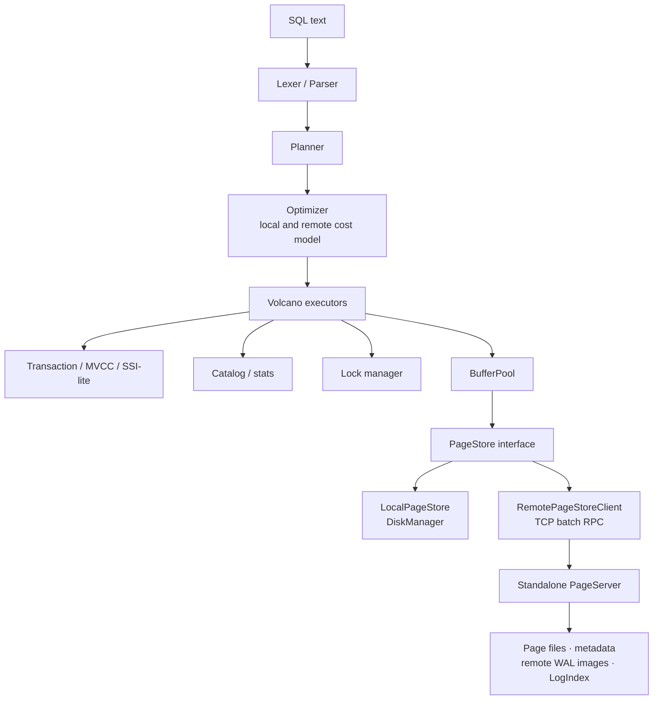

# MiniDB

**English** · [中文 README](README.zh-CN.md)

MiniDB is a C++20 relational database engine built from scratch for learning and experimentation. It follows a PostgreSQL-style storage model: 8 KB heap pages, MVCC tuple headers, WAL-first durability, B+ tree indexes, and a Volcano executor with a cost-based optimizer. The hot path avoids the C++ STL in favor of in-house containers (`Vector`, `HashMap`, `String`, …) so memory layout and allocation stay predictable.

The project ships two deployment shapes:

- **Single-node** — local `DiskManager` + `LocalPageStore`, interactive REPL, and TCP SQL server.
- **Shared-storage (experimental)** — compute node + standalone `minidb_pageserver` over TCP, inspired by PolarDB-style separation (single writer, read-only snapshot reads).

> **Status:** educational / prototype. Suitable for studying database internals, running the test matrix, and hacking on storage or SQL layers — not for production workloads.
>
> Test coverage has grown substantially (ACID harnesses, differential SQLite checks, crash recovery, remote PageServer paths), but concurrency edges, optimizer rewrites, index maintenance under extreme load, and distributed mode still deserve scrutiny. See [Known limitations](docs/KNOWN_LIMITATIONS.md) and the [capability gap checklist](docs/CAPABILITY_GAP_CHECKLIST.md).

## Why MiniDB?

If you want to *read* how a database works instead of only using one, MiniDB is a guided tour through the layers that matter:

| Layer | What you can study |
| --- | --- |
| SQL | Hand-written lexer/parser, planner, rule-assisted cost optimizer, executors |
| Transactions | MVCC snapshot isolation, optional SSI-lite serializable mode, undo rollback |
| Storage | Page format, buffer pool, double-write, checksums, heap FSM, visibility map hooks |
| Indexes | Unified `IndexKey`, composite B+ tree, bulk load, covering scans with heap recheck |
| Recovery | WAL records, group commit, checkpoints, lazy index rebuild after crash |
| Distribution | `PageStore` abstraction, TCP PageServer, batch RPC, RO snapshot reads |

Suggested reading order: [Architecture](docs/ARCHITECTURE.md) → [Build guide](BUILD.md) → run `bash tests/run_all_tests.sh ./build/minidb` → dive into `src/` by subsystem READMEs.

## Implemented Features

### SQL

| Area | Implemented support |
| --- | --- |
| DDL | `CREATE TABLE`, `DROP TABLE`, `ALTER TABLE ADD/DROP/RENAME COLUMN`, `CREATE INDEX`, `CREATE UNIQUE INDEX`, composite indexes, `DROP INDEX`; transactional DDL with rollback inside `BEGIN`/`ROLLBACK` (see [DDL semantics](docs/DDL_SEMANTICS.md)) |
| DML | Multi-row `INSERT`, `UPDATE ... WHERE`, `DELETE ... WHERE` |
| Queries | `SELECT`, `WHERE`, `INNER JOIN`, `LEFT JOIN`, `GROUP BY`, `HAVING`, `ORDER BY ASC/DESC`, `LIMIT/OFFSET`, `DISTINCT`, `UNION/UNION ALL` |
| Expressions | Arithmetic, boolean expressions, `CASE WHEN`, `LIKE`, `BETWEEN`, `IS NULL`, `IS NOT NULL`, `IN`, `NOT IN`, `CAST`, `COALESCE`, `NULLIF` |
| Subqueries | Scalar subqueries and `IN/NOT IN (SELECT ...)` paths covered by tests |
| Aggregates | `COUNT`, `SUM`, `AVG`, `MIN`, `MAX` |
| Constraints | `PRIMARY KEY`, `UNIQUE`, `NOT NULL`, `DEFAULT`, column-level `CHECK` (persisted and enforced on `INSERT`/`UPDATE`) |
| Transactions | `BEGIN`, `COMMIT`, `ROLLBACK`; `SET ISOLATION_LEVEL = SNAPSHOT` (default) or `SERIALIZABLE` (SSI-lite) |
| Prepared statements | `PREPARE`, `EXECUTE`, `DEALLOCATE` |
| Admin | `SHOW TABLES`, `DESCRIBE`, `EXPLAIN`, `EXPLAIN ANALYZE` for read-only statements, `ANALYZE`, `SHOW CONFIG`, `SHOW STATS` |
| Server cursor | `DECLARE CURSOR`, `FETCH`, `CLOSE` in TCP server mode |

### Data Types

`BOOL`/`BOOLEAN`, `INT`/`INTEGER`, `BIGINT`, `FLOAT`/`REAL`, `DOUBLE`/`DECIMAL`/`NUMERIC`, `VARCHAR(n)`, `TEXT`, and `NULL`.

Primary key and single-column unique constraints create unique indexes automatically. Composite unique constraints are validated via the unified binary-comparable `IndexKey` representation.

### Storage

- 8 KB pages with a compact page header and line pointer array (PostgreSQL-like `LP_NORMAL` / `LP_REDIRECT` / `LP_DEAD` flags).
- Heap files with a **free-space map (FSM)** for insert page selection and pruning hints.
- B+ tree indexes on unified `IndexKey`: multi-column composite keys, `TEXT`/`VARCHAR` with bytewise collation, prefix and range scans.
- Correct duplicate-key handling across leaf splits for non-unique indexes.
- `CREATE INDEX` bulk-load path: scan heap → sort `(IndexKey, RID)` → sequential leaf build.
- Index equality/range scans, covering-index path, index order optimization, MVCC-safe `IndexOnlyScan` with heap recheck fallback (no visibility map yet — see [known limitations](docs/KNOWN_LIMITATIONS.md)).
- Buffer pool: configurable size, partitioned page table/LRU locks, LRU replacement, sequential-scan anti-pollution, documented frame state machine.
- Double-write buffer and page checksums.
- File descriptor cache with configurable limit.
- `PageStore` abstraction:
  - `LocalPageStore` — single-node local storage.
  - `RemotePageStore` — in-process PageServer for tests.
  - `RemotePageStoreClient` — TCP PageServer access.

### Compute/Storage Separation

Experimental PolarDB-like shared storage:

- Standalone binary: `minidb_pageserver`.
- TCP binary protocol; batch read/write; connection pool, timeouts, retries.
- PageServer admission by max active connections.
- Remote WAL page-image file; persisted metadata and LogIndex rebuild on restart (checksum + end-marker integrity).
- Page LSN / durable LSN checks before accepting writes.
- Read-only compute with `storage_read_lsn`; future-page handling via LogIndex/WAL images.
- `page_server_replicas` — synchronous local replica directories (MVP, not independent followers).

**Not included:** Raft/quorum, automatic failover, multi-writer distributed transactions, distributed locks, compact physical WAL redo on remote storage.

### MVCC And Transactions

- Snapshot isolation (default); **SSI-lite serializable** via `SET ISOLATION_LEVEL = SERIALIZABLE` ([isolation levels](docs/ISOLATION_LEVELS.md)).
- Tuple `xmin`/`xmax` and version-chain traversal.
- MVCC-safe HOT-style same-page updates for non-indexed columns (version chains; index behavior still evolving — see gap checklist).
- Per-transaction undo records; savepoints with compensating WAL.
- Configurable transaction-slot admission (`max_active_transactions`).
- GC from active-transaction watermarks; version-chain pruning when safe.

### WAL And Recovery

- WAL-first page flushing; segment rotation; 8 KB buffered writes; group commit.
- Records for transactions, tuples, indexes, page allocation, checkpoints.
- Time- and size-triggered checkpoints; crash recovery from WAL.
- Lazy index rebuild after recovery (not full physical index redo from WAL).

### Index Maintenance And Build Path

- PK/unique constraints backed by unique B+ trees; secondary indexes maintained on `INSERT`, lazily cleaned by MVCC GC.
- New indexes: encodability check, uniqueness validation, bulk load from one heap scan.
- Range/equality scans use lower-bound positioning and batched cursors.
- Indexes built by older versions with duplicate-key bugs should be rebuilt via `DROP INDEX` / `CREATE INDEX`.

### Query Execution

Volcano iterators:

- `SeqScan` — MVCC visibility, version chains, RID skip-list, late materialization, optional parallel scan.
- `IndexScan`, covering scan, MVCC-safe `IndexOnlyScan` with heap recheck.
- `Filter` (compiled fast paths + fallback evaluator), `Project`, `NestedLoopJoin`.
- `HashJoin` (small-side build, Grace-hash spill under low `work_mem`).
- `IndexLookupJoin`, `Sort` (external merge, Top-N heap), `Aggregate` (grouped + spill), `Distinct`, `Limit`, `Union`, `SubqueryIn`, DML executors.

### Optimizer

- Rule-assisted cost-based scan/join selection; `ANALYZE` statistics (NDV, no full histograms yet).
- Predicate/projection pushdown, hash-join build-side pick, index lookup join, range/equality/covering paths, index order for compatible `ORDER BY`.
- Remote-storage cost model penalizing random remote index IO.
- `EXPLAIN` (estimates + notes); `EXPLAIN ANALYZE` on read-only statements.

### Concurrency And Server

- Table/record/key locks; DDL locks; wait-for graph deadlock detection.
- Admission limits: connections, queries, write queries, transactions.
- TCP SQL server with worker threads, output buffer limit, idle timeout.
- Session prepared statements and server-side cursors.

## Build

```bash
mkdir -p build
cmake -S . -B build -DCMAKE_BUILD_TYPE=Release -DBUILD_TESTS=ON
cmake --build build -j4
```

Optional AddressSanitizer:

```bash
cmake -S . -B build -DCMAKE_BUILD_TYPE=Debug -DBUILD_TESTS=ON -DMINIDB_SANITIZER=address
cmake --build build -j4
```

Build outputs:

```text
build/minidb             # Interactive shell and SQL TCP server
build/minidb_pageserver  # Standalone PageServer process
build/tests/*            # C++ unit tests
```

More detail: [BUILD.md](BUILD.md).

## Quick Start: Single Node

```bash
./build/minidb --dir ./mydata
```

```sql
CREATE TABLE users (id INT PRIMARY KEY, name TEXT, score INT CHECK (score >= 0));
INSERT INTO users VALUES (1, 'Alice', 90), (2, 'Bob', 85);
SELECT * FROM users WHERE id = 1;
EXPLAIN ANALYZE SELECT COUNT(*) FROM users;
```

SQL TCP server:

```bash
./build/minidb --dir ./mydata --server --port 5433
nc 127.0.0.1 5433
```

## Quick Start: Standalone PageServer

```bash
mkdir -p ./pageserver-data ./compute-data
cat > ./compute-data/minidb.conf <<'EOF'
storage_mode = remote
page_server_host = 127.0.0.1
page_server_port = 15433
remote_page_batch_size = 64
remote_flush_batch_size = 64
remote_connect_timeout = 1s
remote_io_timeout = 5s
remote_retry_count = 2
EOF

./build/minidb_pageserver --dir ./pageserver-data --host 127.0.0.1 --port 15433
```

In another shell:

```bash
./build/minidb --dir ./compute-data --config ./compute-data/minidb.conf
```

```sql
CREATE TABLE remote_t (id INT PRIMARY KEY, v TEXT);
INSERT INTO remote_t VALUES (1, 'one'), (2, 'two');
SELECT COUNT(*) FROM remote_t;
SHOW STATS;
```

`SHOW STATS` reports remote client counters (`remote_read_batches`, `remote_write_batches`, `remote_retries`, `remote_reconnects`, `remote_failures`, …).

## Configuration

`key=value` files with `#` comments. Units: `B`, `KB`, `MB`, `GB`, `MS`, `S`, `MIN`. Full reference: [CONFIGURATION_REFERENCE.md](docs/CONFIGURATION_REFERENCE.md).

Common single-node settings:

```ini
shared_buffers = 2MB
buffer_pool_partitions = 16
work_mem = 16MB
query_memory_limit = 512MB
temp_file_limit = 10GB
temp_dir = /tmp

wal_fsync = on
wal_group_commit = on
wal_group_commit_delay = 2ms
checkpoint_timeout = 60s
checkpoint_wal_size = 256MB

statement_timeout = 30s
enable_hashjoin = on
enable_indexscan = on
enable_indexonlyscan = on
enable_parallel_seqscan = on
parallel_workers = 4

gc_enabled = on
gc_ops_threshold = 10000
gc_max_pages_per_cycle = 128
gc_interval = 5s

max_connections = 64
max_active_queries = 64
max_active_write_queries = 8
max_active_transactions = 256
query_workers = 8
buffer_pool_wait_timeout = 5s
max_buffer_waiters = 1024

doublewrite = on
page_checksum = on
fd_cache_limit = 1024
```

Remote PageServer settings:

```ini
storage_mode = remote
page_server_host = 127.0.0.1
page_server_port = 15433
page_server_dir = ./pageserver-data
storage_read_only = off
storage_read_lsn = 0
page_server_replicas = 0
remote_page_batch_size = 64
remote_flush_batch_size = 64
remote_connect_timeout = 1s
remote_io_timeout = 5s
remote_retry_count = 2
remote_max_connections = 8
page_server_max_connections = 1024
```

```bash
./build/minidb --dir ./mydata --show-config
```

```sql
SHOW CONFIG;
SHOW STATS;
```

## Data Directory Layout

Single-node compute directory:

```text
mydata/
├── catalog.mdbc
├── minidb.control
├── doublewrite.bin
├── wal/
├── tables/
├── indexes/
└── minidb.conf
```

Standalone PageServer directory:

```text
pageserver-data/
├── page_server.meta
├── remote_wal_images.bin
├── doublewrite.bin
├── tables/
├── indexes/
└── replica_1/              # if page_server_replicas >= 1
```

In TCP remote mode, catalog/control/WAL live under the compute directory; table and index pages are served by PageServer.

## Tests

```bash
cmake -S . -B build -DBUILD_TESTS=ON
cmake --build build -j4

ctest --test-dir build --output-on-failure
bash tests/run_all_tests.sh ./build/minidb --suite main --seed 12648430
```

`run_all_tests.sh` writes `build/test-report.md` and per-test logs under `build/test-logs/`. See [tests/README.md](tests/README.md).

| Suite | Purpose |
| --- | --- |
| `pr` | Fast subset for pull requests (SQL regression, recovery, MVCC) |
| `main` | Full suite on push / manual runs |
| `nightly` | Same as `main` with `--stress` for heavier random testing |

Test layout:

```text
tests/
├── unit/          # C++ unit tests (lock manager, B+ tree, PageStore, WAL, …)
├── sql/           # SQL correctness, differential vs SQLite
├── ddl/           # ALTER TABLE, HOT/index semantics
├── index/         # Composite keys, persistence, rebuild
├── acid/          # atomicity · consistency · isolation · durability
├── concurrency/   # Multi-client TCP
├── storage/       # Remote PageServer
├── performance/   # Optimizer and bulk DML smoke
└── regression/    # End-to-end production regression
```

Targeted examples:

```bash
./build/tests/btree_property_test
./build/tests/index_key_btree_test
./build/tests/page_store_remote_test
bash tests/storage/remote_page_store.sh ./build/minidb
bash tests/regression/production_regression.sh ./build/minidb
bash tests/sql/join_optimizer.sh ./build/minidb
bash tests/performance/performance_paths.sh ./build/minidb
bash tests/acid/durability/recovery_smoke.sh ./build/minidb
python3 tests/sql/differential_sqlite.py ./build/minidb --seed 12648431
python3 tests/acid/durability/crash_recovery_harness.py ./build/minidb --seed 12648432
```

## Documentation

| Document | Topic |
| --- | --- |
| [ARCHITECTURE.md](docs/ARCHITECTURE.md) | System overview, page/tuple formats, containers |
| [BUILD.md](BUILD.md) | Build, run, troubleshoot |
| [STORAGE_INTERNALS.md](docs/STORAGE_INTERNALS.md) | Pages, heap, buffer pool |
| [INDEX_INTERNALS.md](docs/INDEX_INTERNALS.md) | B+ tree and `IndexKey` |
| [TRANSACTION_MVCC.md](docs/TRANSACTION_MVCC.md) | MVCC, undo, CLOG |
| [ISOLATION_LEVELS.md](docs/ISOLATION_LEVELS.md) | SI vs SSI-lite serializable |
| [WAL_RECOVERY_PROTOCOL.md](docs/WAL_RECOVERY_PROTOCOL.md) | WAL and crash recovery |
| [CONCURRENCY_CONTROL.md](docs/CONCURRENCY_CONTROL.md) | Locks and deadlock detection |
| [OPTIMIZER_COST_MODEL.md](docs/OPTIMIZER_COST_MODEL.md) | Planner/optimizer costs |
| [QUERY_EXECUTION.md](docs/QUERY_EXECUTION.md) | Executor behavior |
| [DDL_SEMANTICS.md](docs/DDL_SEMANTICS.md) | Transactional DDL, `ALTER` |
| [COMPUTE_STORAGE_SEPARATION.md](docs/COMPUTE_STORAGE_SEPARATION.md) | PageServer protocol |
| [KNOWN_LIMITATIONS.md](docs/KNOWN_LIMITATIONS.md) | Explicit non-goals and gaps |
| [CAPABILITY_GAP_CHECKLIST.md](docs/CAPABILITY_GAP_CHECKLIST.md) | README claims vs code |
| [ACID_TODO.md](docs/ACID_TODO.md) | ACID test matrix status |

## Architecture



## Source Layout

```text
src/
├── catalog/       # Table/index metadata and statistics
├── common/        # Config, locks, resource manager
├── concurrency/   # Lock manager and deadlock detection
├── container/     # In-house Vector, HashMap, String, …
├── database/      # Database lifecycle, catalog sync, GC, checkpoint
├── index/         # B+ tree
├── network/       # SQL TCP server
├── recovery/      # WAL and GC helpers
├── repl/          # Interactive shell
├── sql/           # Parser, planner, optimizer, executors
├── storage/       # Page, DiskManager, BufferPool, PageStore, PageServer
├── transaction/   # MVCC transaction manager
├── main.cpp       # minidb entrypoint
└── pageserver_main.cpp
```

## Requirements

- C++20 compiler (GCC, Clang)
- CMake 3.20+
- Python 3.8+ for tests and scripts
- POSIX system (Linux or macOS)

## License

MIT
