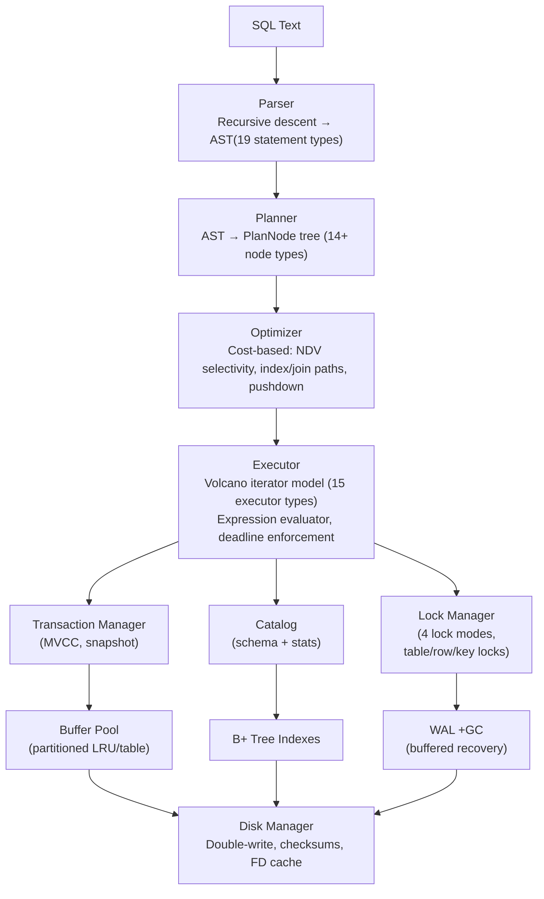

# MiniDB

A PostgreSQL-style relational database engine built in C++20, featuring MVCC snapshot isolation, WAL-first crash recovery, B+ tree indexing, cost-based query optimization, partitioned buffer management, low-memory spill paths, and a TCP server with admission control.

> Most of the code written by GPT-5.5

## Features

### SQL Support (19 statement types + 7 expression types)

| Category | Statements |
|----------|-----------|
| **DDL** | `CREATE TABLE` (columns, types, NOT NULL, PRIMARY KEY, UNIQUE, DEFAULT), `DROP TABLE`, `ALTER TABLE` (ADD/DROP/RENAME COLUMN), `CREATE INDEX` (unique, composite), `DROP INDEX` |
| **DML** | `INSERT` (multi-row VALUES), `UPDATE` (with WHERE), `DELETE` (with WHERE) |
| **Queries** | `SELECT` with WHERE, JOIN (INNER/LEFT), GROUP BY, HAVING, ORDER BY (ASC/DESC), LIMIT/OFFSET, DISTINCT, UNION/UNION ALL, subqueries (scalar, IN/NOT IN), CASE WHEN, LIKE, BETWEEN, IS NULL |
| **Aggregates** | `COUNT`, `SUM`, `AVG`, `MIN`, `MAX` |
| **Scalar** | `CAST`, `COALESCE`, `NULLIF`, arithmetic (+, -, *, /, %), boolean (AND, OR, NOT) |
| **Transactions** | `BEGIN`, `COMMIT`, `ROLLBACK` |
| **Prepared** | `PREPARE`, `EXECUTE`, `DEALLOCATE` |
| **Admin** | `SHOW TABLES`, `DESCRIBE TABLE`, `EXPLAIN`, `ANALYZE`, `SHOW CONFIG`, `SHOW STATS` |
| **Cursor** | `DECLARE CURSOR`, `FETCH`, `CLOSE` (server-side cursor for large result sets) |

### Storage Engine

- **8KB pages** with PostgreSQL-aligned page layout (LinePointer, slot array)
- **Buffer pool** — partitioned page table/LRU locks, LRU with anti-pollution (sequential scans don't pollute cache), configurable size
- **Double-write buffer** — prevents torn-page corruption on crash
- **Page checksums** — detects silent data corruption
- **Heap files** — linked-list data pages, page-level free space tracking
- **B+ Tree indexes** — single-column and composite indexes, equality + range scan, index-only scan, per-tree RwLock, bulk load O(n)
- **FD cache** — LRU file descriptor cache (configurable limit)

### MVCC & Transactions

- **Snapshot isolation** — each transaction sees a consistent snapshot
- **Version chains** — xmin/xmax, chain traversal for visibility
- **Undo records** — per-transaction rollback without REDO
- **HOT updates** — same-page version chain for index efficiency
- **256 transaction slots** — configurable via `max_active_transactions`
- **Garbage collection** — watermark-based, incremental, configurable interval/threshold
- **Active version pruning** — UPDATE/COMMIT can prune obsolete version chains before GC when safe

### Crash Recovery

- **WAL-first** — all modifications logged before page writes
- **10 WAL record types** — Begin, Commit, Abort, Insert, Delete, Update, IndexInsert, IndexDelete, PageAlloc, Checkpoint
- **WAL segments** — configurable segment size (default 64MB), keep count, auto-rotation
- **Buffered WAL writes** — WAL records are batched into 8KB pages before write/fsync
- **Group commit** — batches concurrent commits with configurable delay
- **Checkpoint** — time-based and WAL-size-based triggers
- **Crash recovery** — replay WAL from last checkpoint, lazy index rebuild

### Query Execution (15 executor types, Volcano iterator model)

| Executor | Capabilities |
|----------|-------------|
| **SeqScan** | Full table scan, MVCC visibility, version chain traversal, HOT redirect, RID skip-list, late materialization for projected columns |
| **IndexScan** | B+ Tree equality + range scan, MVCC visibility |
| **IndexOnlyScan** | Covered index-key reads without heap fetch when projection allows |
| **Filter** | Predicate evaluation on each tuple |
| **Project** | Column projection + computed expressions |
| **NestedLoopJoin** | INNER and LEFT OUTER join |
| **HashJoin** | Equi-join, small-side build selection, Grace hash join spill path, bucket hash table (8192 buckets) |
| **IndexLookupJoin** | Indexed equi-join for small outer side + indexed inner side |
| **Sort** | Materialize-sort, external merge sort with spill files, top-N optimization |
| **Aggregate** | COUNT/SUM/AVG/MIN/MAX, GROUP BY, HAVING, COUNT(*) join fast path, spill-to-disk support |
| **Distinct** | Deduplication, spill-to-disk support |
| **Limit** | LIMIT/OFFSET row counting |
| **Union** | UNION (dedup) and UNION ALL |
| **SubqueryIn** | x IN (SELECT ...), NOT IN, NULL semantics |
| **Insert/Update/Delete** | MVCC-aware, index maintenance, WAL logging |

### Cost-Based Optimizer

- **NDV-based cardinality estimation** — uses per-column distinct value counts
- **Index path selection** — chooses between seq scan, index scan, range scan, and index-only scan based on cost
- **Join algorithm selection** — compares nested loop, hash join, and index lookup join cost
- **Predicate pushdown** — single-table predicates are pushed below INNER JOIN into scan/index paths
- **Projection pushdown** — join/count queries read only required join/filter/output columns
- **COUNT(*) join fast path** — count-only joins avoid constructing full joined tuples
- **Hash join spill planning** — build side is chosen by estimated size and spills with Grace hash partitioning
- **Index order optimization** — removes redundant sort when index scan already satisfies ascending order
- **Statistics** — explicit `ANALYZE table`, `collect_statistics()` / `collect_all_statistics()`
- **Configurable** — `enable_seqscan`, `enable_indexscan`, `enable_indexonlyscan`, `enable_hashjoin`

### Concurrency Control

- **4 lock modes** — AccessShare (SELECT), RowExclusive (INSERT/UPDATE/DELETE), Exclusive (CREATE INDEX), AccessExclusive (DROP/ALTER)
- **Multi-granularity** — table-level locks, record-level locks, key-level locks
- **Deadlock detection** — wait-for graph, cycle detection, victim selection
- **Lock timeout** — configurable `lock_wait_timeout`, `deadlock_timeout`
- **Resource management** — connection/query/transaction admission, memory tracking, temp file tracking

### Network Server

- **TCP server** — port 5433, configurable listen address
- **Admission control** — query/connection/transaction admission queue with timeout
- **Worker pool** — fixed-size query worker threads (configurable)
- **Slow client protection** — output buffer limit, socket send timeout, client disconnect
- **Cursor protocol** — DECLARE CURSOR / FETCH / CLOSE for large result sets
- **Streaming execution** — results written directly to socket, no in-memory buffering
- **Prepared statements** — session-level PREPARE/EXECUTE
- **Admin commands** — SHOW CONFIG, SHOW STATS bypass admission control
- **Connection management** — idle timeout, TCP keepalive, max connections

### Data Types

`BOOL`/`BOOLEAN`, `INT`/`INTEGER` (32-bit), `BIGINT`, `FLOAT`/`REAL`, `DOUBLE`/`DECIMAL`/`NUMERIC`, `VARCHAR(n)`, `TEXT`, `NULL`

## Performance

Benchmarks on Apple M-series (single-user, subprocess mode — each statement is a separate process invocation):

### Batch INSERT Throughput

| Operation | Rows | Time | Throughput |
|-----------|------|------|-----------|
| Multi-value INSERT | 2000 | 0.107s | **18,674 rows/s** |
| Multi-value INSERT | 5000 | 0.436s | **11,467 rows/s** |
| Single-row INSERT | 1000 | 0.111s | 8,996 rows/s |
| Single-row INSERT | 100 | 0.109s | 916 rows/s |

### Query Latency (5000-row dataset)

| Query | Latency |
|-------|---------|
| `COUNT(*)` | 0.110s |
| `SUM(total)` | 0.109s |
| `AVG(age)` | 0.108s |
| `GROUP BY status` | 0.109s |
| `ORDER BY ... LIMIT 10` | 0.112s |
| `INNER JOIN ... LIMIT 100` | 0.113s |
| `DISTINCT status` | 0.108s |
| PK point query | 0.111s |
| Index scan (`WHERE customer_id = 42`) | 0.133s |
| Subquery `IN` | 0.108s |
| `UNION` | 0.107s |
| `CASE WHEN` | 0.106s |
| `LIKE` search | 0.111s |
| Range scan (`BETWEEN`) | 0.104s |

### Single-Operation Rates

| Operation | Ops/s (in-process batching) |
|-----------|-----------------------------|
| INSERT | 8,996 rows/s |
| UPDATE | 8,267 rows/s |
| SELECT | 7,810 rows/s |
| DELETE | 745 rows/s |
| Transaction (BEGIN+INSERT+COMMIT) | 743 txns/s |
| JOIN | 7 ops/s |

> **Note:** Subprocess mode adds ~0.1s overhead per invocation. Server mode eliminates this overhead for 10-100x higher throughput on small operations.

## Quick Start

```bash
# Build
mkdir build && cd build
cmake .. -DCMAKE_BUILD_TYPE=Release
cmake --build . -j4

# Interactive shell
./build/minidb --dir ./mydata

# TCP server
./build/minidb --dir ./mydata --server --port 5433

# Show effective configuration
./build/minidb --dir ./mydata --show-config
```

## Usage

### Interactive Shell

```bash
./build/minidb --dir ./mydata
```

```
Data directory: ./mydata
minidb> CREATE TABLE users (id INT PRIMARY KEY, name VARCHAR);
Table 'users' created.
minidb> INSERT INTO users VALUES (1, 'Alice');
affected_rows
1
minidb> SELECT * FROM users;
id | name
1  | Alice
minidb> exit
```

### TCP Server

```bash
./build/minidb --dir ./mydata --server --port 5433
```

```
MiniADB v0.3.0 — Server Mode
Data directory: ./mydata
MiniADB Server listening on port 5433
```

Connect via netcat:

```bash
nc localhost 5433
```

```
MiniADB v0.3.0 — Connected.
minidb> SELECT COUNT(*) FROM users;
agg_0
1
minidb> exit
```

Connect via Python:

```python
import socket
s = socket.socket(socket.AF_INET, socket.SOCK_STREAM)
s.connect(("127.0.0.1", 5433))
s.recv(4096)  # welcome banner
s.sendall(b"SELECT * FROM users WHERE id = 1;\nexit\n")
print(s.recv(4096).decode())
s.close()
```

### SQL Examples

```sql
-- DDL
CREATE TABLE orders (
    id INT PRIMARY KEY,
    customer_id INT NOT NULL,
    total DOUBLE DEFAULT 0.0,
    status VARCHAR DEFAULT 'pending',
    created_at VARCHAR
);
CREATE INDEX idx_cust ON orders (customer_id);
CREATE INDEX idx_status_total ON orders (status, total);

-- Multi-row INSERT
INSERT INTO orders VALUES
    (1, 100, 50.00, 'shipped', '2024-01-01'),
    (2, 101, 75.50, 'pending', '2024-01-02');

-- Query with filter, group by, having, order by, limit
SELECT status, COUNT(*), SUM(total), AVG(total)
FROM orders
WHERE total > 10
GROUP BY status
HAVING COUNT(*) > 1
ORDER BY SUM(total) DESC
LIMIT 10;

-- JOIN
SELECT c.name, o.total, o.status
FROM customers c
INNER JOIN orders o ON c.id = o.customer_id
WHERE o.total > 100;

-- Optimized count-only join with predicate pushdown and index lookup when possible
EXPLAIN SELECT COUNT(*)
FROM customers c
JOIN orders o ON c.id = o.customer_id
WHERE c.id < 100;

-- Subquery
SELECT name FROM customers
WHERE id IN (SELECT customer_id FROM orders WHERE status = 'shipped');

-- Transactions
BEGIN;
UPDATE orders SET status = 'processed' WHERE customer_id = 100;
INSERT INTO order_log VALUES (1, 'processed', '2024-01-01');
COMMIT;

-- ALTER TABLE
ALTER TABLE customers ADD COLUMN phone VARCHAR DEFAULT 'N/A';
ALTER TABLE customers RENAME COLUMN phone TO contact;
ALTER TABLE customers DROP COLUMN contact;

-- Cursor (server mode)
DECLARE c CURSOR FOR SELECT * FROM orders;
FETCH 100 FROM c;
CLOSE c;

-- Prepared statement
PREPARE find_user FROM 'SELECT * FROM users WHERE id = ?';
EXECUTE find_user(42);
DEALLOCATE find_user;

-- Refresh optimizer statistics
ANALYZE orders;
```

## Configuration

Configuration file (`<db_dir>/minidb.conf`) — key=value format, `#` comments, supports units (KB, MB, GB, MS, S, MIN).

```ini
# Memory
shared_buffers = 2MB          # Buffer pool size (default 2MB = 256 pages of 8KB)
work_mem = 16MB               # Per-query working memory for sort/hash/aggregate
query_memory_limit = 512MB    # Max memory per query
maintenance_work_mem = 256MB  # Memory for maintenance (index rebuild, etc.)
temp_file_limit = 10GB        # Max temp file space per query
temp_dir = /tmp               # Temp file directory

# WAL / Recovery
wal_segment_size = 64MB       # WAL segment file size
wal_keep_segments = 2         # Number of WAL segments to retain
wal_fsync = on                # Fsync WAL writes (off = higher perf, lower durability)
wal_group_commit = on         # Batch commit requests
wal_group_commit_delay = 2ms  # Max delay for group commit batching
checkpoint_timeout = 60s      # Time-based checkpoint interval
checkpoint_wal_size = 256MB   # WAL size that triggers checkpoint
recover_indexes = lazy        # 'lazy' = rebuild on first use, 'rebuild' = all at startup

# Query Execution
statement_timeout = 30s       # Max query execution time
enable_hashjoin = on          # Allow hash join
enable_indexscan = on         # Allow index scan
enable_indexonlyscan = on     # Allow index-only scan
enable_parallel_seqscan = on  # Allow parallel sequential scan
parallel_workers = 4          # Number of parallel workers
seqscan_prefetch_pages = 32   # Pages to prefetch in sequential scans

# Garbage Collection
gc_enabled = on               # Enable MVCC garbage collection
gc_ops_threshold = 10000      # Operations before GC triggers
gc_max_pages_per_cycle = 128  # Max pages scanned per GC cycle
gc_interval = 5s              # GC check interval
deleted_tuple_ratio_threshold = 20%  # Dead tuple % that triggers GC

# Network / Server
listen_addresses = 127.0.0.1  # Bind address
port = 5433                   # TCP port
max_connections = 64          # Max concurrent connections
max_active_queries = 64       # Max concurrent active queries
max_active_write_queries = 8  # Max concurrent write queries
max_active_transactions = 256 # Max concurrent transactions
admission_queue_size = 1024   # Admission queue capacity
admission_queue_timeout = 5s  # Admission queue wait timeout
transaction_slot_wait_timeout = 5s  # Wait for transaction slot
query_workers = 8             # Worker threads for query execution
io_workers = 2                # I/O worker threads
connection_idle_timeout = 5min      # Idle connection timeout
client_output_buffer_limit = 16MB   # Max output buffer per client
buffer_pool_wait_timeout = 5s      # Buffer pool wait timeout
max_buffer_waiters = 1024           # Max threads waiting for buffer
dirty_page_threshold = 70%          # Dirty page % that triggers flush
background_flush_pages = 64         # Pages per background flush
checkpoint_flush_after = 128        # Pages to flush before checkpoint
buffer_pool_partitions = 16         # Buffer pool page-table/LRU partitions

# Storage
doublewrite = on              # Double-write buffer protection
page_checksum = on            # Page checksums
fd_cache_limit = 1024         # Max cached file descriptors

# Limits
max_sql_size = 1MB            # Max SQL text length
max_result_rows = 1000000     # Max result rows
max_result_bytes = 256MB      # Max result size
```

View effective configuration via CLI:
```bash
./build/minidb --dir ./mydata --show-config
```

Or at runtime in server mode:
```sql
SHOW CONFIG;
SHOW STATS;
```

## Data Directory Layout

```
./mydata/
├── minidb.conf          # Runtime configuration
├── catalog.mdbc         # System catalog (serialized schema + metadata)
├── doublewrite.bin      # Double-write buffer
├── wal/                 # Write-Ahead Log segments
│   ├── wal.log
│   └── wal.00000001.log
├── tables/              # Heap files (one per table)
│   ├── 1.heap
│   ├── 2.heap
│   └── ...
├── indexes/             # B+ Tree index files (one per index)
│   ├── 1000.btree
│   ├── 1001.btree
│   └── ...
└── tmp/                 # Temp files (spilled sort/hash data)
```

## Tests

```bash
# Run all test suites
bash tests/run_all_tests.sh ./build/minidb

# Individual test suites
python3 tests/comprehensive_test.py ./build/minidb   # 191 SQL feature tests
python3 tests/consistency_test.py ./build/minidb      # 62 persistence tests
python3 tests/ultimate_test.py ./build/minidb         # 105 edge case tests
python3 tests/concurrent_test.py ./build/minidb       # 8 concurrency tests
python3 tests/bug_verify.py ./build/minidb            # 32 regression tests
bash tests/sql_regression.sh ./build/minidb           # ~60 SQL syntax tests
bash tests/resource_limits.sh ./build/minidb          # Resource management tests
bash tests/join_optimizer.sh ./build/minidb           # Join optimizer, spill, pushdown tests
bash tests/performance_optimizations.sh ./build/minidb # WAL/buffer/filter/projection tests

# Recovery tests
bash tests/recovery_smoke.sh ./build/minidb
bash tests/persistence_and_composite.sh ./build/minidb

# Performance tests
python3 tests/perf_test.py ./build/minidb
bash tests/performance_paths.sh ./build/minidb
bash tests/performance_delivery.sh ./build/minidb

# C++ unit tests
./build/tests/lock_manager_wait_test
./build/tests/tuple_value_edge_test
```

## Loading Data

```bash
# Small dataset (1K rows, instant)
python3 scripts/load_perf_data.py --bin ./build/minidb --dir ./mydata --preset smoke --clean

# Full dataset (1M+ rows, 8 tables)
python3 scripts/load_perf_data.py --bin ./build/minidb --dir ./mydata --preset full --clean

# Custom scale
python3 scripts/load_perf_data.py \
    --bin ./build/minidb \
    --dir ./mydata \
    --customers 50000 \
    --orders 500000 \
    --items 600000 \
    --clean
```

## Architecture



## Project Structure

```
src/             # C++20 source files
├── catalog/     # Table/Index metadata, ColumnStats (NDV)
├── common/      # Config, Mutex/RwLock, Status/Result, ResourceManager
├── concurrency/ # LockManager (table/row locks, deadlock detection)
├── container/   # Vector, HashMap, String, UniquePtr, LinkedList
├── database/    # Database lifecycle, flush, statistics, GC integration
├── index/       # BPlusTree (insert/remove/search, bulk load, tree latch)
├── network/     # TCP server, thread-per-connection, streaming execution
├── record/      # Value, Tuple, Schema, type system
├── recovery/    # WAL (checkpoint, log, GC, double-write)
├── repl/        # Interactive shell
├── sql/executor/# Volcano iterator executors (15 types)
├── sql/optimizer/# Cost optimizer, pushdown, index/join path selection
├── sql/parser/  # Lexer, Parser, AST (recursive descent)
├── sql/planner/ # Query planner (plan node construction)
├── storage/     # BufferPool, DiskManager, HeapFile, Page
├── transaction/ # MVCC TransactionManager, snapshot, commit/rollback
└── main.cpp     # Entry point (CLI parsing, server vs shell)

tests/           # Test scripts (400+ checks across SQL, storage, recovery, concurrency)
├── run_all_tests.sh     # Meta-runner for core suites
├── comprehensive_test.py  # 191 SQL variant tests
├── consistency_test.py    # 62 persistence/crash tests
├── ultimate_test.py       # 105 edge case tests
├── concurrent_test.py     # 8 server concurrency tests
├── bug_verify.py          # 32 regression tests
├── sql_regression.sh      # ~60 SQL syntax tests
├── join_optimizer.sh      # Join pushdown, count fast path, spill tests
├── performance_optimizations.sh # WAL/buffer/filter/projection tests
├── resource_limits.sh     # Resource management tests
├── perf_test.py           # Performance benchmarks
└── ...

scripts/
└── load_perf_data.py  # Data loading (smoke=1K, full=1M+ rows)
```

## Requirements

- **C++20** compiler
- **CMake** 3.20+
- **Python** 3.8+ (for scripts and tests)
- **POSIX** system (Linux, macOS)

## License

MIT
