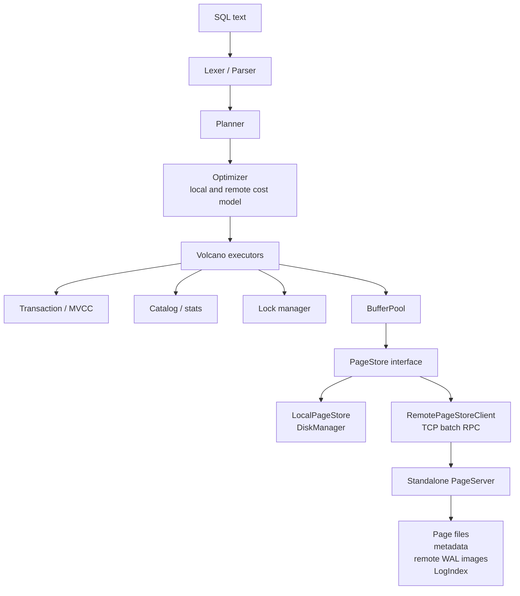

# MiniDB

MiniDB is a C++20 relational database engine with a PostgreSQL-style storage model. It supports a single-node database mode and an experimental shared-storage mode with a standalone PageServer process.

The project currently includes MVCC snapshot isolation, WAL-based crash recovery, B+ tree indexes, a cost-based optimizer, spill paths for memory pressure, a TCP SQL server, and a TCP PageServer/RemotePageStoreClient path for compute/storage separation.

> Status: educational/prototype database. The tested distributed mode supports a single writer compute and read-only snapshot reads over remote page storage. It is not a full production distributed database with Raft, multi-writer distributed transactions, automatic failover, or shard rebalancing.

## Implemented Features

### SQL

| Area | Implemented support |
| --- | --- |
| DDL | `CREATE TABLE`, `DROP TABLE`, `ALTER TABLE ADD/DROP/RENAME COLUMN`, `CREATE INDEX`, `CREATE UNIQUE INDEX`, composite indexes, `DROP INDEX` |
| DML | Multi-row `INSERT`, `UPDATE ... WHERE`, `DELETE ... WHERE` |
| Queries | `SELECT`, `WHERE`, `INNER JOIN`, `LEFT JOIN`, `GROUP BY`, `HAVING`, `ORDER BY ASC/DESC`, `LIMIT/OFFSET`, `DISTINCT`, `UNION/UNION ALL` |
| Expressions | Arithmetic, boolean expressions, `CASE WHEN`, `LIKE`, `BETWEEN`, `IS NULL`, `IS NOT NULL`, `IN`, `NOT IN`, `CAST`, `COALESCE`, `NULLIF` |
| Subqueries | Scalar subqueries and `IN/NOT IN (SELECT ...)` paths covered by tests |
| Aggregates | `COUNT`, `SUM`, `AVG`, `MIN`, `MAX` |
| Transactions | `BEGIN`, `COMMIT`, `ROLLBACK` |
| Prepared statements | `PREPARE`, `EXECUTE`, `DEALLOCATE` |
| Admin | `SHOW TABLES`, `DESCRIBE`, `EXPLAIN`, `EXPLAIN ANALYZE` for read-only statements, `ANALYZE`, `SHOW CONFIG`, `SHOW STATS` |
| Server cursor | `DECLARE CURSOR`, `FETCH`, `CLOSE` in TCP server mode |

### Data Types

`BOOL`/`BOOLEAN`, `INT`/`INTEGER`, `BIGINT`, `FLOAT`/`REAL`, `DOUBLE`/`DECIMAL`/`NUMERIC`, `VARCHAR(n)`, `TEXT`, and `NULL`.

Column constraints include `PRIMARY KEY`, `UNIQUE`, `NOT NULL`, and `DEFAULT`. Primary key and unique columns create unique indexes automatically.

### Storage

- 8KB pages with a compact page header and line pointer array.
- Heap files for table storage.
- B+ tree indexes for single-column and composite keys.
- Index equality scan, range scan, index-only scan, and index order optimization.
- Buffer pool with configurable size, partitioned page table/LRU locks, LRU replacement, and sequential-scan anti-pollution behavior.
- Double-write buffer and page checksums.
- File descriptor cache with configurable limit.
- `PageStore` abstraction with:
  - `LocalPageStore` for single-node local storage.
  - `RemotePageStore` for in-process PageServer tests.
  - `RemotePageStoreClient` for TCP PageServer access.

### Compute/Storage Separation

MiniDB includes an experimental PolarDB-like shared-storage path:

- Standalone PageServer binary: `minidb_pageserver`.
- TCP binary protocol between compute and PageServer.
- Remote page reads/writes through `RemotePageStoreClient`.
- Batch read/write requests over TCP.
- Client connection reuse, connect timeout, IO timeout, retry count, and connection-pool size.
- PageServer request admission by maximum active connections.
- Remote WAL page-image file for page reconstruction.
- Persistent PageServer metadata and LogIndex reconstruction after restart.
- Page LSN and durable LSN checks before accepting page writes.
- Read-only compute mode with `storage_read_lsn`.
- Future-page handling by using persisted LogIndex/WAL page images to return a page version at or before `read_lsn`.
- Synchronous replica-directory writes as a replication MVP for local testing.

Current distributed limitations:

- No Raft/quorum replication.
- No automatic PageServer failover.
- No multi-writer distributed transaction protocol.
- No distributed lock service.
- WAL redo is implemented as page-image based reconstruction for remote storage, not compact physical delta redo.
- PageServer replicas are local synchronous directory replicas, not independent follower processes.

### MVCC And Transactions

- Snapshot isolation.
- Tuple `xmin`/`xmax` metadata and version-chain traversal.
- HOT-style same-page update chains.
- Per-transaction undo records for rollback.
- Configurable transaction-slot admission.
- Garbage collection based on active transaction watermarks.
- Active version-chain pruning when old versions are no longer visible to active transactions.

### WAL And Recovery

- WAL-first page flushing.
- WAL records for transaction lifecycle, tuple changes, index changes, page allocation, and checkpoints.
- WAL segment rotation.
- 8KB buffered WAL writes.
- Group commit with configurable delay.
- Time-based and WAL-size-based checkpoints.
- Crash recovery from WAL.
- Lazy index rebuild after recovery.

### Query Execution

MiniDB uses a Volcano iterator model. Implemented executor paths include:

- `SeqScan`, including MVCC visibility, version-chain traversal, RID skip-list, projected-column late materialization, and optional parallel scan for larger tables.
- `IndexScan` and `IndexOnlyScan`.
- `Filter` with compiled fast paths for common expression shapes and fallback expression evaluation.
- `Project`.
- `NestedLoopJoin`.
- `HashJoin`, including small-side build selection and Grace-hash style spill path under low `work_mem`.
- `IndexLookupJoin`.
- `Sort`, including external merge sort and Top-N heap optimization.
- `Aggregate`, including grouped aggregation, `COUNT(*)` join fast path, and spill path.
- `Distinct` with spill path.
- `Limit`, `Union`, `SubqueryIn`, `Insert`, `Update`, and `Delete`.

### Optimizer

- Cost-based scan and join path selection.
- NDV/statistics-based selectivity estimates from `ANALYZE`.
- Predicate pushdown through inner joins when predicates can be evaluated on one side.
- Projection pushdown for scan and count-join paths.
- Hash join build-side selection.
- Index lookup join selection when the inner side has a usable index.
- Index range and equality path selection.
- Index-only scan selection when projection is covered by the index key.
- Index order scan optimization for compatible ascending `ORDER BY`.
- Remote-storage cost model that makes random remote index lookups more expensive than local page reads.
- `EXPLAIN` includes cost/row estimates and optimizer notes.
- `EXPLAIN ANALYZE` executes read-only statements and reports actual output rows and execution time.

### Concurrency And Server

- Table, record, and key lock support.
- Lock modes for reads, writes, index creation, and DDL.
- Wait-for graph deadlock detection.
- Transaction, query, write-query, and connection admission limits.
- TCP SQL server with worker threads.
- Output buffer limit and idle connection timeout.
- Session-level prepared statements.
- Server-side cursor commands for large result pagination.

## Build

```bash
mkdir -p build
cmake -S . -B build -DCMAKE_BUILD_TYPE=Release
cmake --build build -j4
```

Build outputs:

```text
build/minidb             # Interactive shell and SQL TCP server
build/minidb_pageserver  # Standalone PageServer process
build/tests/*            # C++ unit tests
```

## Quick Start: Single Node

```bash
./build/minidb --dir ./mydata
```

```sql
CREATE TABLE users (id INT PRIMARY KEY, name TEXT);
INSERT INTO users VALUES (1, 'Alice'), (2, 'Bob');
SELECT * FROM users WHERE id = 1;
EXPLAIN ANALYZE SELECT COUNT(*) FROM users;
```

SQL TCP server:

```bash
./build/minidb --dir ./mydata --server --port 5433
nc 127.0.0.1 5433
```

## Quick Start: Standalone PageServer

Start PageServer:

```bash
mkdir -p ./pageserver-data ./compute-data
cat > ./compute-data/minidb.conf <<'EOF'
storage_mode = remote
page_server_host = 127.0.0.1
page_server_port = 15433
remote_page_batch_size = 64
remote_flush_batch_size = 64
remote_connect_timeout = 1s
remote_io_timeout = 5s
remote_retry_count = 2
EOF

./build/minidb_pageserver --dir ./pageserver-data --host 127.0.0.1 --port 15433
```

In another shell, start the compute node:

```bash
./build/minidb --dir ./compute-data --config ./compute-data/minidb.conf
```

Example SQL:

```sql
CREATE TABLE remote_t (id INT PRIMARY KEY, v TEXT);
INSERT INTO remote_t VALUES (1, 'one'), (2, 'two');
SELECT COUNT(*) FROM remote_t;
SHOW STATS;
```

`SHOW STATS` reports remote client counters such as `remote_read_batches`, `remote_write_batches`, `remote_retries`, `remote_reconnects`, and `remote_failures`.

## Configuration

Configuration files use `key=value` lines and support comments with `#`. Units: `B`, `KB`, `MB`, `GB`, `MS`, `S`, and `MIN`.

Common single-node settings:

```ini
shared_buffers = 2MB
buffer_pool_partitions = 16
work_mem = 16MB
query_memory_limit = 512MB
temp_file_limit = 10GB
temp_dir = /tmp

wal_fsync = on
wal_group_commit = on
wal_group_commit_delay = 2ms
checkpoint_timeout = 60s
checkpoint_wal_size = 256MB

statement_timeout = 30s
enable_hashjoin = on
enable_indexscan = on
enable_indexonlyscan = on
enable_parallel_seqscan = on
parallel_workers = 4

gc_enabled = on
gc_ops_threshold = 10000
gc_max_pages_per_cycle = 128
gc_interval = 5s

max_connections = 64
max_active_queries = 64
max_active_write_queries = 8
max_active_transactions = 256
query_workers = 8
buffer_pool_wait_timeout = 5s
max_buffer_waiters = 1024

doublewrite = on
page_checksum = on
fd_cache_limit = 1024
```

Remote PageServer settings:

```ini
storage_mode = remote

# TCP PageServer mode. If page_server_host is empty, MiniDB uses an in-process
# PageServer for tests/local embedding.
page_server_host = 127.0.0.1
page_server_port = 15433
page_server_dir = ./pageserver-data

storage_read_only = off
storage_read_lsn = 0
page_server_replicas = 0
remote_page_batch_size = 64
remote_flush_batch_size = 64
remote_connect_timeout = 1s
remote_io_timeout = 5s
remote_retry_count = 2
remote_max_connections = 8
page_server_max_connections = 1024
```

Inspect effective configuration:

```bash
./build/minidb --dir ./mydata --show-config
```

At runtime:

```sql
SHOW CONFIG;
SHOW STATS;
```

## Data Directory Layout

Single-node compute directory:

```text
mydata/
├── catalog.mdbc
├── minidb.control
├── doublewrite.bin
├── wal/
├── tables/
├── indexes/
└── minidb.conf
```

Standalone PageServer directory:

```text
pageserver-data/
├── page_server.meta
├── remote_wal_images.bin
├── doublewrite.bin
├── tables/
├── indexes/
└── replica_1/              # if page_server_replicas >= 1
```

In TCP remote mode, compute-local catalog/control/WAL live under the compute directory, while table and index pages are read/written through PageServer.

## Tests

```bash
cmake -S . -B build -DBUILD_TESTS=ON
cmake --build build -j4

ctest --test-dir build --output-on-failure
bash tests/run_all_tests.sh ./build/minidb
```

Important targeted tests:

```bash
./build/tests/page_store_remote_test
bash tests/remote_page_store.sh ./build/minidb
bash tests/join_optimizer.sh ./build/minidb
bash tests/performance_optimizations.sh ./build/minidb
bash tests/recovery_smoke.sh ./build/minidb
bash tests/resource_limits.sh ./build/minidb
```

The PageServer tests cover local PageStore compatibility, TCP remote reads/writes, batch IO, PageServer restart recovery, persistent LogIndex/WAL image files, read-only snapshot reads, future-page handling, and replica directory writes.

## Architecture



## Source Layout

```text
src/
├── catalog/       # Table/index metadata and statistics
├── common/        # Config, locks, resource manager
├── concurrency/   # Lock manager and deadlock detection
├── database/      # Database lifecycle, catalog sync, GC, checkpoint
├── index/         # B+ tree
├── network/       # SQL TCP server
├── recovery/      # WAL and GC helpers
├── repl/          # Interactive shell
├── sql/           # Parser, planner, optimizer, executors
├── storage/       # Page, DiskManager, BufferPool, PageStore, PageServer
├── transaction/   # MVCC transaction manager
├── main.cpp       # minidb entrypoint
└── pageserver_main.cpp # minidb_pageserver entrypoint
```

## Requirements

- C++20 compiler
- CMake 3.20+
- Python 3.8+ for tests and scripts
- POSIX system such as Linux or macOS

## License

MIT
