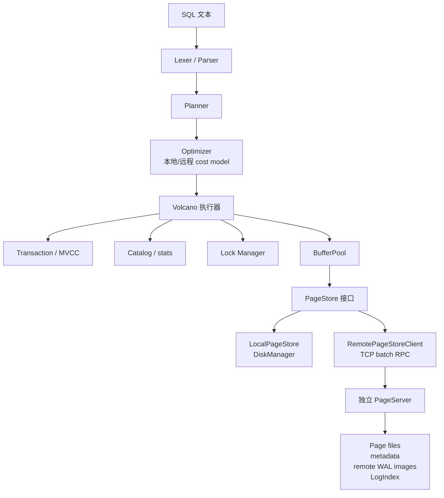

# MiniDB

MiniDB 是一个用 C++20 实现的 PostgreSQL 风格关系型数据库内核。项目同时支持单机模式，以及实验性的计算/存储分离模式：计算节点通过 TCP `RemotePageStoreClient` 访问独立 `PageServer` 进程。

当前已实现 MVCC 快照隔离、WAL 崩溃恢复、B+Tree 索引、代价优化器、低内存 spill 路径、SQL TCP Server、PageStore 抽象、独立 PageServer 和远程页读写协议。

> 当前定位：教学/原型数据库。分布式路径已支持单写 Compute + 远程 PageServer + RO 快照读的基础共享存储形态；还不是带 Raft、多写事务、自动 failover、分片重平衡的完整生产级分布式数据库。

## 已实现能力

### SQL

| 类别 | 已实现能力 |
| --- | --- |
| DDL | `CREATE TABLE`、`DROP TABLE`、`ALTER TABLE ADD/DROP/RENAME COLUMN`、`CREATE INDEX`、`CREATE UNIQUE INDEX`、复合索引、`DROP INDEX` |
| DML | 多行 `INSERT`、带 `WHERE` 的 `UPDATE` / `DELETE` |
| 查询 | `SELECT`、`WHERE`、`INNER JOIN`、`LEFT JOIN`、`GROUP BY`、`HAVING`、`ORDER BY ASC/DESC`、`LIMIT/OFFSET`、`DISTINCT`、`UNION/UNION ALL` |
| 表达式 | 算术、布尔表达式、`CASE WHEN`、`LIKE`、`BETWEEN`、`IS NULL`、`IS NOT NULL`、`IN`、`NOT IN`、`CAST`、`COALESCE`、`NULLIF` |
| 子查询 | 标量子查询、`IN/NOT IN (SELECT ...)` 路径有测试覆盖 |
| 聚合 | `COUNT`、`SUM`、`AVG`、`MIN`、`MAX` |
| 事务 | `BEGIN`、`COMMIT`、`ROLLBACK` |
| 预编译 | `PREPARE`、`EXECUTE`、`DEALLOCATE` |
| 管理 | `SHOW TABLES`、`DESCRIBE`、`EXPLAIN`、只读语句的 `EXPLAIN ANALYZE`、`ANALYZE`、`SHOW CONFIG`、`SHOW STATS` |
| Server 游标 | TCP Server 模式支持 `DECLARE CURSOR`、`FETCH`、`CLOSE` |

### 数据类型

支持 `BOOL`/`BOOLEAN`、`INT`/`INTEGER`、`BIGINT`、`FLOAT`/`REAL`、`DOUBLE`/`DECIMAL`/`NUMERIC`、`VARCHAR(n)`、`TEXT` 和 `NULL`。

字段约束支持 `PRIMARY KEY`、`UNIQUE`、`NOT NULL` 和 `DEFAULT`。Primary Key 和 Unique 字段会自动创建唯一索引。

## 存储引擎

- 8KB 页面，包含 PageHeader 和 line pointer 数组。
- Heap file 存储表数据。
- B+Tree 索引支持单列、复合、唯一索引。
- 支持索引等值扫描、范围扫描、Index-Only Scan 和索引有序输出优化。
- Buffer Pool 支持可配置大小、LRU、顺序扫描防污染，以及按 page id 分区的 page table/LRU 锁。
- Double-write buffer 用于降低 torn page 风险。
- Page checksum 用于检测页损坏。
- FD cache 用于限制打开文件描述符数量。
- PageStore 抽象包含：
  - `LocalPageStore`：单机本地存储。
  - `RemotePageStore`：in-process PageServer 测试路径。
  - `RemotePageStoreClient`：TCP PageServer 访问路径。

## 计算/存储分离

当前已落地一个实验性的共享存储路径：

- 独立 PageServer 二进制：`minidb_pageserver`。
- Compute 和 PageServer 之间使用 TCP 二进制协议。
- Compute 端通过 `RemotePageStoreClient` 读写页。
- 支持 TCP 批量读写页。
- 客户端支持连接复用、连接超时、IO 超时、重试次数、连接池上限。
- PageServer 支持最大活跃连接数限制。
- PageServer 持久化 remote WAL page image。
- PageServer 持久化 metadata，并在重启后重建 LogIndex。
- 写页前检查 page LSN 和 durable LSN。
- 支持 `storage_read_only` 和 `storage_read_lsn` 的 RO Compute 快照读。
- 遇到 future page 时，通过持久化 LogIndex/WAL image 返回不超过 `read_lsn` 的页版本。
- `page_server_replicas` 支持同步写本地 replica 目录，作为复制 MVP 测试路径。

当前分布式限制：

- 没有 Raft/quorum 复制。
- 没有自动 PageServer failover。
- 没有多写 Compute 的分布式事务协议。
- 没有分布式锁服务。
- 远程 WAL redo 当前以 page image 重构为主，不是紧凑 physical delta redo。
- PageServer replica 是本地同步目录副本，不是独立 follower 进程。

## MVCC 与 WAL

- 快照隔离。
- Tuple 包含 `xmin` / `xmax` 和版本链指针。
- 支持 HOT 风格同页版本链。
- 支持事务 undo record，回滚不依赖 REDO。
- GC 基于活跃事务水位线回收旧版本。
- UPDATE/COMMIT 路径会在安全时主动剪枝旧版本链。
- WAL-first 数据页刷盘。
- WAL 支持事务、tuple、index、page allocation 和 checkpoint 记录。
- WAL 写入支持 8KB buffer 和 group commit。
- 支持按时间和 WAL 大小触发 checkpoint。
- 崩溃恢复会从 WAL 恢复，索引支持 lazy rebuild。

## 查询执行器

MiniDB 使用 Volcano iterator 模型，已实现：

- `SeqScan`：MVCC 可见性、版本链遍历、RID skip-list、投影列 late materialization，大表可选 parallel scan。
- `IndexScan` / `IndexOnlyScan`。
- `Filter`：常见表达式编译快路径，回退通用表达式求值。
- `Project`。
- `NestedLoopJoin`。
- `HashJoin`：等值连接、小侧 build、低 `work_mem` 下 Grace-hash 风格 spill。
- `IndexLookupJoin`。
- `Sort`：内存排序、external merge sort、Top-N heap。
- `Aggregate`：普通/分组聚合、`COUNT(*) JOIN` 快路径和 spill 路径。
- `Distinct`：去重和 spill。
- `Limit`、`Union`、`SubqueryIn`、`Insert`、`Update`、`Delete`。

## 优化器

- 基于代价选择 scan/join 路径。
- 使用 `ANALYZE` 产生的行数、页数和 NDV 统计估算选择率。
- INNER JOIN 单表谓词下推。
- Scan/count-join 投影下推。
- HashJoin build 小侧选择。
- 内侧有索引时选择 IndexLookupJoin。
- 等值/范围索引路径选择。
- 投影只需要索引 key 时选择 IndexOnlyScan。
- 索引有序输出可消除兼容的升序 `ORDER BY`。
- 远程存储模式下使用 remote IO cost model，使随机远程索引查找成本高于本地页读。
- `EXPLAIN` 输出 cost、rows 和 optimizer note。
- `EXPLAIN ANALYZE` 对只读语句执行并输出实际行数和耗时。

## 构建

```bash
mkdir -p build
cmake -S . -B build -DCMAKE_BUILD_TYPE=Release
cmake --build build -j4
```

构建产物：

```text
build/minidb             # 交互 Shell 和 SQL TCP Server
build/minidb_pageserver  # 独立 PageServer 进程
build/tests/*            # C++ 单元测试
```

## 快速开始：单机

```bash
./build/minidb --dir ./mydata
```

```sql
CREATE TABLE users (id INT PRIMARY KEY, name TEXT);
INSERT INTO users VALUES (1, 'Alice'), (2, 'Bob');
SELECT * FROM users WHERE id = 1;
EXPLAIN ANALYZE SELECT COUNT(*) FROM users;
```

SQL TCP Server：

```bash
./build/minidb --dir ./mydata --server --port 5433
nc 127.0.0.1 5433
```

## 快速开始：独立 PageServer

启动 PageServer：

```bash
mkdir -p ./pageserver-data ./compute-data
cat > ./compute-data/minidb.conf <<'EOF'
storage_mode = remote
page_server_host = 127.0.0.1
page_server_port = 15433
remote_page_batch_size = 64
remote_flush_batch_size = 64
remote_connect_timeout = 1s
remote_io_timeout = 5s
remote_retry_count = 2
EOF

./build/minidb_pageserver --dir ./pageserver-data --host 127.0.0.1 --port 15433
```

另一个终端启动 Compute：

```bash
./build/minidb --dir ./compute-data --config ./compute-data/minidb.conf
```

示例：

```sql
CREATE TABLE remote_t (id INT PRIMARY KEY, v TEXT);
INSERT INTO remote_t VALUES (1, 'one'), (2, 'two');
SELECT COUNT(*) FROM remote_t;
SHOW STATS;
```

`SHOW STATS` 会展示 `remote_read_batches`、`remote_write_batches`、`remote_retries`、`remote_reconnects`、`remote_failures` 等远程存储指标。

## 配置

配置文件为 `key=value` 格式，支持 `#` 注释。单位支持 `B`、`KB`、`MB`、`GB`、`MS`、`S`、`MIN`。

常用单机配置：

```ini
shared_buffers = 2MB
buffer_pool_partitions = 16
work_mem = 16MB
query_memory_limit = 512MB
temp_file_limit = 10GB
temp_dir = /tmp

wal_fsync = on
wal_group_commit = on
wal_group_commit_delay = 2ms
checkpoint_timeout = 60s
checkpoint_wal_size = 256MB

statement_timeout = 30s
enable_hashjoin = on
enable_indexscan = on
enable_indexonlyscan = on
enable_parallel_seqscan = on
parallel_workers = 4

gc_enabled = on
gc_ops_threshold = 10000
gc_max_pages_per_cycle = 128
gc_interval = 5s

max_connections = 64
max_active_queries = 64
max_active_write_queries = 8
max_active_transactions = 256
query_workers = 8
buffer_pool_wait_timeout = 5s
max_buffer_waiters = 1024

doublewrite = on
page_checksum = on
fd_cache_limit = 1024
```

远程 PageServer 配置：

```ini
storage_mode = remote
page_server_host = 127.0.0.1
page_server_port = 15433
page_server_dir = ./pageserver-data

storage_read_only = off
storage_read_lsn = 0
page_server_replicas = 0
remote_page_batch_size = 64
remote_flush_batch_size = 64
remote_connect_timeout = 1s
remote_io_timeout = 5s
remote_retry_count = 2
remote_max_connections = 8
page_server_max_connections = 1024
```

查看配置：

```bash
./build/minidb --dir ./mydata --show-config
```

运行时：

```sql
SHOW CONFIG;
SHOW STATS;
```

## 数据目录

单机或 Compute 目录：

```text
mydata/
├── catalog.mdbc
├── minidb.control
├── doublewrite.bin
├── wal/
├── tables/
├── indexes/
└── minidb.conf
```

独立 PageServer 目录：

```text
pageserver-data/
├── page_server.meta
├── remote_wal_images.bin
├── doublewrite.bin
├── tables/
├── indexes/
└── replica_1/              # page_server_replicas >= 1 时存在
```

TCP remote 模式下，catalog/control/WAL 仍在 Compute 目录，表页和索引页通过 PageServer 读写。

## 测试

```bash
cmake -S . -B build -DBUILD_TESTS=ON
cmake --build build -j4

ctest --test-dir build --output-on-failure
bash tests/run_all_tests.sh ./build/minidb
```

专项测试：

```bash
./build/tests/page_store_remote_test
bash tests/remote_page_store.sh ./build/minidb
bash tests/join_optimizer.sh ./build/minidb
bash tests/performance_optimizations.sh ./build/minidb
bash tests/recovery_smoke.sh ./build/minidb
bash tests/resource_limits.sh ./build/minidb
```

PageServer 测试覆盖 Local PageStore 兼容性、TCP 远程读写、批量 IO、PageServer 重启恢复、持久化 LogIndex/WAL image、RO 快照读、future page 处理和 replica 目录写入。

## 架构



## 目录结构

```text
src/
├── catalog/       # 表、索引和统计信息
├── common/        # 配置、锁、资源管理
├── concurrency/   # LockManager 和死锁检测
├── database/      # 数据库生命周期、catalog 同步、GC、checkpoint
├── index/         # B+Tree
├── network/       # SQL TCP Server
├── recovery/      # WAL 和 GC 辅助
├── repl/          # 交互 Shell
├── sql/           # Parser、Planner、Optimizer、Executor
├── storage/       # Page、DiskManager、BufferPool、PageStore、PageServer
├── transaction/   # MVCC 事务管理
├── main.cpp       # minidb 入口
└── pageserver_main.cpp # minidb_pageserver 入口
```

## 运行要求

- C++20 编译器。
- CMake 3.20+。
- Python 3.8+。
- POSIX 系统，例如 Linux 或 macOS。

## License

MIT
