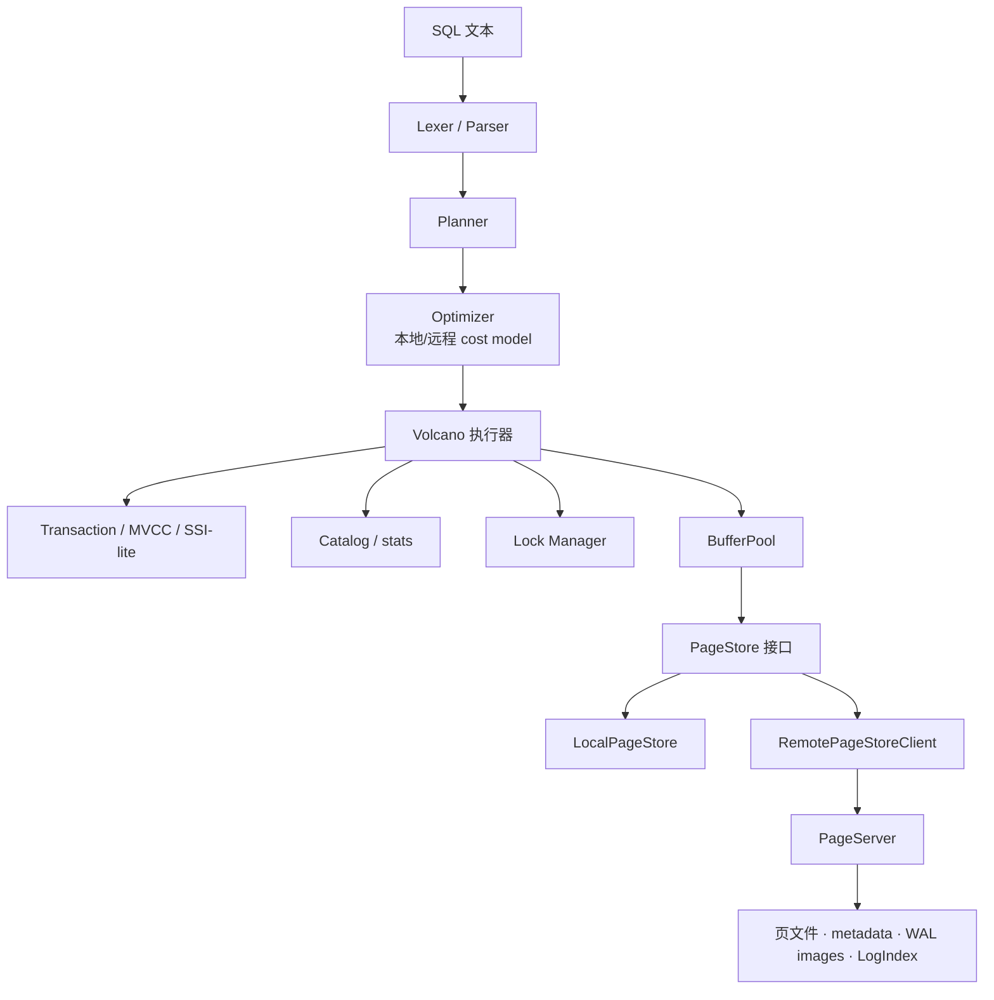

# MiniDB

**中文** · [English README](README.md)

MiniDB 是一个用 C++20 从零实现的关系型数据库内核，面向**学习与实验**：采用 PostgreSQL 风格的 8KB 堆页、MVCC 元组头、WAL 优先刷盘、B+Tree 索引，以及 Volcano 执行器 + 代价优化器。热路径不使用 C++ STL，而是自研容器（`Vector`、`HashMap`、`String` 等），便于控制内存布局与分配行为。

项目提供两种运行形态：

- **单机模式** — `LocalPageStore` + 本地磁盘，交互式 REPL 与 TCP SQL Server。
- **共享存储（实验性）** — Compute 通过 TCP 访问独立 `minidb_pageserver`，类似 PolarDB 的计算/存储分离（单写 + 只读快照读）。

> **定位：** 教学 / 原型数据库。适合阅读源码、跑通测试矩阵、改动存储或 SQL 层 — 请勿用于生产。
>
> 测试覆盖面已明显扩大（ACID 专项、与 SQLite 差分对比、崩溃恢复、远程 PageServer 等），但高并发边界、优化器改写、极端负载下的索引维护与分布式模式仍可能有缺陷。详见 [已知限制](docs/KNOWN_LIMITATIONS.md) 与 [能力差距清单](docs/CAPABILITY_GAP_CHECKLIST.md)。

## 为什么选 MiniDB？

如果你想**亲手看懂**数据库各层如何协作，而不是只会 `SELECT`，MiniDB 提供了一条可追踪的路径：

| 层次 | 可学习内容 |
| --- | --- |
| SQL | 手写词法/语法分析、Planner、规则辅助的代价优化器、各类 Executor |
| 事务 | MVCC 快照隔离、可选 SSI-lite 可串行化、`undo` 回滚 |
| 存储 | 页格式、Buffer Pool、双写、校验和、堆 FSM、可见性图相关基础设施 |
| 索引 | 统一 `IndexKey`、复合 B+Tree、批量建索引、覆盖索引 + heap recheck |
| 恢复 | WAL、组提交、检查点、崩溃后 lazy 重建索引 |
| 分布式 | `PageStore` 抽象、TCP PageServer、批量 RPC、RO 快照读 |

建议阅读顺序：[架构说明](docs/ARCHITECTURE.md) → [构建指南](BUILD.md) → 运行 `bash tests/run_all_tests.sh ./build/minidb` → 按 `src/` 子目录 README 深入。

## 已实现能力

### SQL

| 类别 | 已实现能力 |
| --- | --- |
| DDL | `CREATE TABLE`、`DROP TABLE`、`ALTER TABLE ADD/DROP/RENAME COLUMN`、`CREATE INDEX`、`CREATE UNIQUE INDEX`、复合索引、`DROP INDEX`；`BEGIN`/`ROLLBACK` 内事务性 DDL（见 [DDL 语义](docs/DDL_SEMANTICS.md)） |
| DML | 多行 `INSERT`、带 `WHERE` 的 `UPDATE` / `DELETE` |
| 查询 | `SELECT`、`WHERE`、`INNER JOIN`、`LEFT JOIN`、`GROUP BY`、`HAVING`、`ORDER BY ASC/DESC`、`LIMIT/OFFSET`、`DISTINCT`、`UNION/UNION ALL` |
| 表达式 | 算术、布尔、`CASE WHEN`、`LIKE`、`BETWEEN`、`IS NULL`、`IS NOT NULL`、`IN`、`NOT IN`、`CAST`、`COALESCE`、`NULLIF` |
| 子查询 | 标量子查询、`IN/NOT IN (SELECT ...)` 有测试覆盖 |
| 聚合 | `COUNT`、`SUM`、`AVG`、`MIN`、`MAX` |
| 约束 | `PRIMARY KEY`、`UNIQUE`、`NOT NULL`、`DEFAULT`、列级 `CHECK`（持久化并在 `INSERT`/`UPDATE` 时校验） |
| 事务 | `BEGIN`、`COMMIT`、`ROLLBACK`；`SET ISOLATION_LEVEL = SNAPSHOT`（默认）或 `SERIALIZABLE`（SSI-lite） |
| 预编译 | `PREPARE`、`EXECUTE`、`DEALLOCATE` |
| 管理 | `SHOW TABLES`、`DESCRIBE`、`EXPLAIN`、只读语句的 `EXPLAIN ANALYZE`、`ANALYZE`、`SHOW CONFIG`、`SHOW STATS` |
| Server 游标 | TCP Server 下 `DECLARE CURSOR`、`FETCH`、`CLOSE` |

### 数据类型

支持 `BOOL`/`BOOLEAN`、`INT`/`INTEGER`、`BIGINT`、`FLOAT`/`REAL`、`DOUBLE`/`DECIMAL`/`NUMERIC`、`VARCHAR(n)`、`TEXT`、`NULL`。

主键与单列唯一约束会自动建唯一索引；复合唯一约束通过二进制可比的 `IndexKey` 完整校验。

### 存储引擎

- 8KB 页面：紧凑页头 + 行指针数组（类 PostgreSQL 的 `LP_NORMAL` / `LP_REDIRECT` / `LP_DEAD`）。
- 堆表 + **空闲空间映射（FSM）** 辅助选页插入与剪枝。
- 基于统一 `IndexKey` 的 B+Tree：复合索引、变长键、字节序排序、前缀/范围扫描。
- 非唯一索引在叶子分裂后的重复键处理；`CREATE INDEX` 走批量排序建树路径。
- 等值/范围扫描、覆盖索引路径、索引有序优化；MVCC 安全的 `IndexOnlyScan`（无 visibility map 时通过 heap recheck 保证正确性）。
- Buffer Pool：可配置容量、分区锁、LRU、顺序扫描防污染、文档化的 Frame 状态机。
- 双写缓冲、页校验和、FD 缓存上限。
- `PageStore`：`LocalPageStore`、`RemotePageStore`（进程内测试）、`RemotePageStoreClient`（TCP）。

### 计算/存储分离

实验性共享存储路径：

- 独立进程 `minidb_pageserver`；TCP 二进制协议；批量读写；连接池、超时、重试。
- 持久化 remote WAL page image；重启后 metadata + LogIndex 重建（checksum + end-marker）。
- 写页前检查 page LSN / durable LSN；`storage_read_lsn` 只读快照；future page 通过 LogIndex/WAL image 回落版本。
- `page_server_replicas`：本地同步副本目录（MVP，非独立 follower）。

**尚未实现：** Raft/ quorum、自动 failover、多写分布式事务、分布式锁、远程紧凑 physical redo。

### MVCC 与 WAL

- 默认快照隔离；`SET ISOLATION_LEVEL = SERIALIZABLE` 启用 SSI-lite（[隔离级别](docs/ISOLATION_LEVELS.md)）。
- `xmin`/`xmax` 版本链；非索引列更新的 HOT 风格同页版本链（索引行为仍在持续校验，见能力清单）。
- 事务 `undo`、保存点及补偿 WAL。
- 可配置事务槽位；基于活跃事务水位的 GC 与版本链剪枝。
- WAL 优先刷盘、段轮转、8KB 写缓冲、组提交；按时间/大小 checkpoint；崩溃恢复 + lazy 重建索引。

### 查询执行器

Volcano 模型：`SeqScan`（含并行）、`IndexScan`/`IndexOnlyScan`、`Filter`、`Project`、`NestedLoopJoin`、`HashJoin`（含 spill）、`IndexLookupJoin`、`Sort`、`Aggregate`、`Distinct`、`Limit`、`Union`、`SubqueryIn`、DML 执行器。

### 优化器

规则辅助的代价优化；`ANALYZE` 统计（NDV，尚无完整直方图）；谓词/投影下推；HashJoin 小侧、IndexLookupJoin、索引路径与有序扫描消除；远程 IO 代价模型；`EXPLAIN` / `EXPLAIN ANALYZE`。

### 并发与 Server

表/记录/键锁、DDL 锁、死锁检测；连接/查询/写查询/事务准入；TCP Server、预编译、服务端游标。

## 构建

```bash
mkdir -p build
cmake -S . -B build -DCMAKE_BUILD_TYPE=Release -DBUILD_TESTS=ON
cmake --build build -j4
```

AddressSanitizer（可选）：

```bash
cmake -S . -B build -DCMAKE_BUILD_TYPE=Debug -DBUILD_TESTS=ON -DMINIDB_SANITIZER=address
cmake --build build -j4
```

产物：

```text
build/minidb             # 交互 Shell 与 SQL TCP Server
build/minidb_pageserver  # 独立 PageServer
build/tests/*            # C++ 单元测试
```

详见 [BUILD.md](BUILD.md)。

## 快速开始：单机

```bash
./build/minidb --dir ./mydata
```

```sql
CREATE TABLE users (id INT PRIMARY KEY, name TEXT, score INT CHECK (score >= 0));
INSERT INTO users VALUES (1, 'Alice', 90), (2, 'Bob', 85);
SELECT * FROM users WHERE id = 1;
EXPLAIN ANALYZE SELECT COUNT(*) FROM users;
```

TCP Server：

```bash
./build/minidb --dir ./mydata --server --port 5433
nc 127.0.0.1 5433
```

## 快速开始：独立 PageServer

```bash
mkdir -p ./pageserver-data ./compute-data
cat > ./compute-data/minidb.conf <<'EOF'
storage_mode = remote
page_server_host = 127.0.0.1
page_server_port = 15433
remote_page_batch_size = 64
remote_flush_batch_size = 64
remote_connect_timeout = 1s
remote_io_timeout = 5s
remote_retry_count = 2
EOF

./build/minidb_pageserver --dir ./pageserver-data --host 127.0.0.1 --port 15433
```

另一终端：

```bash
./build/minidb --dir ./compute-data --config ./compute-data/minidb.conf
```

```sql
CREATE TABLE remote_t (id INT PRIMARY KEY, v TEXT);
INSERT INTO remote_t VALUES (1, 'one'), (2, 'two');
SELECT COUNT(*) FROM remote_t;
SHOW STATS;
```

`SHOW STATS` 会展示 `remote_read_batches`、`remote_write_batches`、`remote_retries` 等远程指标。

## 配置

`key=value` 格式，`#` 注释；单位 `B`/`KB`/`MB`/`GB`/`MS`/`S`/`MIN`。完整说明：[CONFIGURATION_REFERENCE.md](docs/CONFIGURATION_REFERENCE.md)。

常用单机配置：

```ini
shared_buffers = 2MB
buffer_pool_partitions = 16
work_mem = 16MB
query_memory_limit = 512MB
temp_file_limit = 10GB
temp_dir = /tmp

wal_fsync = on
wal_group_commit = on
wal_group_commit_delay = 2ms
checkpoint_timeout = 60s
checkpoint_wal_size = 256MB

statement_timeout = 30s
enable_hashjoin = on
enable_indexscan = on
enable_indexonlyscan = on
enable_parallel_seqscan = on
parallel_workers = 4

gc_enabled = on
gc_ops_threshold = 10000
gc_max_pages_per_cycle = 128
gc_interval = 5s

max_connections = 64
max_active_queries = 64
max_active_write_queries = 8
max_active_transactions = 256
query_workers = 8
buffer_pool_wait_timeout = 5s
max_buffer_waiters = 1024

doublewrite = on
page_checksum = on
fd_cache_limit = 1024
```

远程 PageServer：

```ini
storage_mode = remote
page_server_host = 127.0.0.1
page_server_port = 15433
page_server_dir = ./pageserver-data
storage_read_only = off
storage_read_lsn = 0
page_server_replicas = 0
remote_page_batch_size = 64
remote_flush_batch_size = 64
remote_connect_timeout = 1s
remote_io_timeout = 5s
remote_retry_count = 2
remote_max_connections = 8
page_server_max_connections = 1024
```

```bash
./build/minidb --dir ./mydata --show-config
```

```sql
SHOW CONFIG;
SHOW STATS;
```

## 数据目录

单机 / Compute：

```text
mydata/
├── catalog.mdbc
├── minidb.control
├── doublewrite.bin
├── wal/
├── tables/
├── indexes/
└── minidb.conf
```

PageServer：

```text
pageserver-data/
├── page_server.meta
├── remote_wal_images.bin
├── doublewrite.bin
├── tables/
├── indexes/
└── replica_1/
```

TCP remote 模式下，catalog/control/WAL 在 Compute 目录，表页与索引页由 PageServer 提供。

## 测试

```bash
cmake -S . -B build -DBUILD_TESTS=ON
cmake --build build -j4

ctest --test-dir build --output-on-failure
bash tests/run_all_tests.sh ./build/minidb --suite main --seed 12648430
```

报告默认写入 `build/test-report.md`，日志在 `build/test-logs/`。详见 [tests/README.md](tests/README.md)。

| 套件 | 用途 |
| --- | --- |
| `pr` | PR 快速子集 |
| `main` | 推送到 main 或手动全量 |
| `nightly` | 带 `--stress` 的加压随机测试 |

目录结构：

```text
tests/
├── unit/          # C++ 单元测试
├── sql/           # SQL 正确性、与 SQLite 差分
├── ddl/           # ALTER、HOT/索引语义
├── index/         # 复合键、持久化、重建
├── acid/          # 原子性 · 一致性 · 隔离性 · 持久性
├── concurrency/   # 多客户端 TCP
├── storage/       # 远程 PageServer
├── performance/   # 优化器与批量 DML
└── regression/    # 端到端回归
```

示例：

```bash
./build/tests/btree_property_test
./build/tests/index_key_btree_test
./build/tests/page_store_remote_test
bash tests/storage/remote_page_store.sh ./build/minidb
bash tests/regression/production_regression.sh ./build/minidb
bash tests/sql/join_optimizer.sh ./build/minidb
bash tests/performance/performance_paths.sh ./build/minidb
bash tests/acid/durability/recovery_smoke.sh ./build/minidb
python3 tests/sql/differential_sqlite.py ./build/minidb --seed 12648431
python3 tests/acid/durability/crash_recovery_harness.py ./build/minidb --seed 12648432
```

## 文档索引

| 文档 | 主题 |
| --- | --- |
| [ARCHITECTURE.md](docs/ARCHITECTURE.md) | 系统总览、页/元组格式、容器 |
| [BUILD.md](BUILD.md) | 构建、运行、排错 |
| [STORAGE_INTERNALS.md](docs/STORAGE_INTERNALS.md) | 存储与 Buffer Pool |
| [INDEX_INTERNALS.md](docs/INDEX_INTERNALS.md) | B+Tree 与 IndexKey |
| [TRANSACTION_MVCC.md](docs/TRANSACTION_MVCC.md) | MVCC、undo、CLOG |
| [ISOLATION_LEVELS.md](docs/ISOLATION_LEVELS.md) | SI 与 SSI-lite |
| [WAL_RECOVERY_PROTOCOL.md](docs/WAL_RECOVERY_PROTOCOL.md) | WAL 与恢复 |
| [CONCURRENCY_CONTROL.md](docs/CONCURRENCY_CONTROL.md) | 锁与死锁 |
| [OPTIMIZER_COST_MODEL.md](docs/OPTIMIZER_COST_MODEL.md) | 优化器代价 |
| [QUERY_EXECUTION.md](docs/QUERY_EXECUTION.md) | 执行器行为 |
| [DDL_SEMANTICS.md](docs/DDL_SEMANTICS.md) | 事务性 DDL |
| [COMPUTE_STORAGE_SEPARATION.md](docs/COMPUTE_STORAGE_SEPARATION.md) | PageServer 协议 |
| [KNOWN_LIMITATIONS.md](docs/KNOWN_LIMITATIONS.md) | 已知限制 |
| [CAPABILITY_GAP_CHECKLIST.md](docs/CAPABILITY_GAP_CHECKLIST.md) | 文档与实现对照 |
| [ACID_TODO.md](docs/ACID_TODO.md) | ACID 测试矩阵 |

## 架构



## 目录结构

```text
src/
├── catalog/       # 元数据与统计
├── common/        # 配置、锁、资源管理
├── concurrency/   # 锁管理器、死锁检测
├── container/     # 自研容器
├── database/      # 生命周期、GC、checkpoint
├── index/         # B+Tree
├── network/       # TCP SQL Server
├── recovery/      # WAL、GC
├── repl/          # 交互 Shell
├── sql/           # Parser、Planner、Optimizer、Executor
├── storage/       # 页、BufferPool、PageStore、PageServer
├── transaction/   # MVCC
├── main.cpp
└── pageserver_main.cpp
```

## 运行要求

- C++20 编译器（GCC / Clang）
- CMake 3.20+
- Python 3.8+
- Linux 或 macOS

## License

MIT
