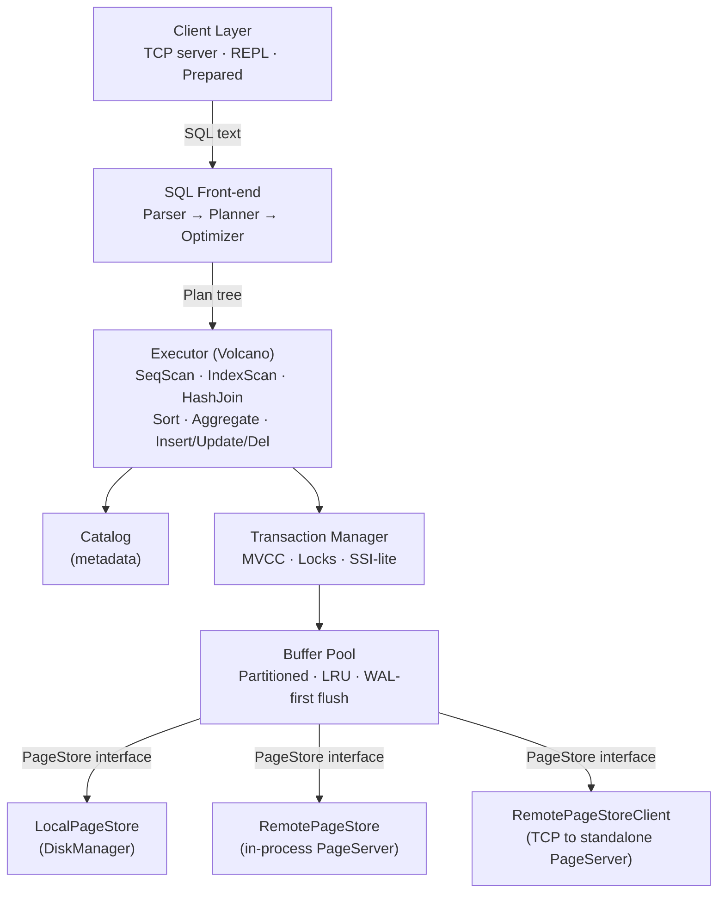

# MiniDB Architecture

MiniDB is a single-node relational database engine built from scratch in C++
with no STL on the hot path. It targets PostgreSQL-compatible core semantics
including MVCC, snapshot isolation, SSI-lite serializable mode, WAL-first
durability, transactional DDL, and optional compute-storage separation.

---

## System overview



---

## Directory structure

```
src/
  catalog/       Table/index metadata, column statistics, persistence
  common/        Config, type defs, locks, resource manager, containers
  concurrency/   Lock manager with deadlock detection
  database/      Database lifecycle, DDL, GC trigger, checkpoint
  index/         B+ tree with composite IndexKey
  network/       TCP SQL server, streaming execution
  record/        Schema, Column, Tuple, Value
  recovery/      WAL manager, garbage collector
  repl/          Interactive SQL shell
  sql/
    parser/      Recursive-descent SQL parser, AST
    planner/     Logical plan builder
    optimizer/   Cost-based plan selection
    executor/    Volcano iterators (SeqScan, HashJoin, Sort, …)
  storage/       Page, BufferPool, HeapFile, PageStore, PageServer
  transaction/   Transaction manager, MVCC, undo log, CLOG
docs/            Architecture docs, ACID checklist, cost model
tests/
  acid/          Atomicity, consistency, isolation, durability tests
  regression/    Bug-fix regression tests
  sql/           SQL correctness matrix
  unit/          C++ unit tests
```

---

## Compile-time constants

| Constant | Value | Location |
|----------|-------|----------|
| `kPageSize` | 8 192 B (8 KB) | `config.h` |
| `kPageHeaderSize` | 24 B | `config.h` |
| `kLinePointerSize` | 6 B | `config.h` |
| `kPageTailReserved` | 8 B (next_page_id) | `config.h` |
| `kDefaultPoolFrames` | 256 | `config.h` |
| `kMaxPoolFrames` | 65 536 | `config.h` |
| `kBTreeOrder` | 128 | `config.h` |
| `kMaxKeysPerNode` | 127 | `config.h` |
| `kWalBufferSize` | 8 192 B | `config.h` |
| `kMaxLogRecordSize` | 256 B | `config.h` |
| `kDefaultPort` | 5 433 | `config.h` |
| `kMaxConnections` | 64 | `config.h` |
| `kCacheLineSize` | 64 B | `config.h` |
| `kMaxPageChainHops` | 1 000 000 | `config.h` |
| `kWalRecordMagic` | `0xD8BA110C` | `wal.h` |

---

## In-house containers

The hot path avoids the C++ STL to keep allocation and memory layout
predictable. The following containers live in `src/container/`:

| Container | STL equivalent | Notes |
|-----------|---------------|-------|
| `String` | `std::string` | SSO, explicit `.c_str()` |
| `Vector<T>` | `std::vector<T>` | Growth factor 2× |
| `HashMap<K,V>` | `std::unordered_map` | Open-addressing, power-of-2 |
| `UniquePtr<T>` | `std::unique_ptr<T>` | Move-only, `.release()` |
| `Pair<A,B>` | `std::pair` | Trivial aggregate |

---

## Build

```bash
# macOS (Apple Clang)
mkdir -p build && cd build
cmake .. && cmake --build . -j$(sysctl -n hw.ncpu)

# Binaries
./minidb               # database + REPL
./minidb_pageserver    # standalone storage server
```

Test database files go into `--dir <path>` (default `minidb_data/`).

---

## Data types

| TypeId | Enum | Size (serialized) | Notes |
|--------|------|--------------------|-------|
| `kBool` | 0 | 1 B | `true` / `false` |
| `kInt32` | 1 | 4 B | Signed 32-bit integer |
| `kInt64` | 2 | 8 B | Signed 64-bit integer |
| `kFloat` | 3 | 4 B | IEEE 754 single |
| `kDouble` | 4 | 8 B | IEEE 754 double |
| `kVarchar` | 5 | 4 B length + data | `TEXT` and `VARCHAR(n)` both map here |
| `kNull` | 255 | 1 B (type tag only) | SQL NULL |

Value serialization format: `type_id (1 B) + payload`.  VARCHAR prepends a
`u32` length before the character data.

---

## Page format (8 KB)

```
 Offset   Size   Field
 ──────   ────   ─────────────────────────────────────────
 0        8      page_id          (u64)
 8        8      lsn              (u64, WAL Log Sequence Number)
 16       2      page_type        (u16, PageType enum)
 18       2      free_space_offset(u16, pd_lower equivalent)
 20       2      num_tuples       (u16, includes NORMAL + DEAD)
 22       2      reserved         (u16)
 ─── 24 B PageHeader ─────────────────────────────────────
 24       6×N    LinePointer[0..N-1]  (offset u16 + length u16 + flags u16)
 24+6N    ...    ← free space →
 ...      var    tuple data (grows downward from page end − 8)
 8184     8      next_page_id     (u64, page chain link)
 ──────── 8192 B ─────────────────────────────────────────
```

Line-pointer flags: `LP_UNUSED(0)`, `LP_NORMAL(1)`, `LP_REDIRECT(2)`,
`LP_DEAD(3)` — aligned with PostgreSQL `ItemIdData` semantics.

Max usable payload per page: `8192 − 24 (header) − 8 (tail) = 8160 B`.

See [`docs/STORAGE_INTERNALS.md`](STORAGE_INTERNALS.md) for byte-level
tuple format, heap file structure, and buffer pool details.

---

## Tuple in-page format

```
 Offset   Size       Field
 ──────   ────       ──────────────────────────
 0        8          xmin   (creator txn_id)
 8        8          xmax   (deleter txn_id, 0 = live)
 16       8          next_version_page (PageId)
 24       2          next_version_slot (SlotIdx)
 26       4          num_cols (u32)
 30       ⌈cols/8⌉   null bitmap
 30+bm    variable   serialized Value per column
```

The MVCC header (xmin/xmax/version-chain) is always present in the
on-disk representation. `next_version_page = 0` means the tuple is the
chain tail.

---

## MVCC and transactions

| Concept | Implementation |
|---------|----------------|
| Snapshot | Captured at `BEGIN`; holds list of all active txn_ids |
| Visibility | `xmin committed ∧ xmin < snapshot ∧ (xmax = 0 ∨ xmax uncommitted ∨ xmax ≥ snapshot)` |
| Own-write | `xmin = my_txn_id ∧ xmax = 0` → visible |
| Own-delete | `xmax = my_txn_id` → invisible |
| Commit ordering | Monotonic `commit_id` assigned at commit time |
| Status persistence | TxnStatusLog (CLOG equivalent) — `wal/txn_status.log` |
| Undo | In-memory undo log per transaction; reverse-applied on rollback |
| Savepoints | `undo_mark()` + `rollback_to_savepoint()` with compensating WAL records |

**Isolation levels:**

- **Snapshot Isolation (SI)** — default. Reads see a consistent snapshot;
  write-write conflicts detected; write skew permitted.
- **Serializable (SSI-lite)** — opt-in via `SET ISOLATION_LEVEL = SERIALIZABLE`.
  Adds read-set tracking; at commit, rw-conflict against concurrent
  committed write sets aborts the transaction.

See [`docs/TRANSACTION_MVCC.md`](TRANSACTION_MVCC.md) for full visibility
matrix, undo log format, and SSI-lite algorithm.

---

## WAL (Write-Ahead Log)

| Property | Detail |
|----------|--------|
| Record magic | `0xD8BA110C` (4 B) |
| Integrity | CRC32 over (header with crc zeroed + payload) |
| Record header | magic(4) + crc(4) + lsn(8) + txn_id(8) + type(2) + data_len(4) = 30 B |
| Buffer | 8 KB write buffer; flushed on commit or when full |
| Group commit | Configurable delay (default 2 ms) batches multiple commits |
| Checkpoint | Holds WAL latch, flushes dirty pages, then truncates log |
| LSN monotonicity | `ensure_next_lsn_at_least()` on restart from control file |

Record types: `kTxnBegin(1)`, `kTxnCommit(2)`, `kTxnAbort(3)`,
`kInsert(10)`, `kDelete(11)`, `kUpdate(12)`, `kIndexInsert(13)`,
`kIndexDelete(14)`, `kPageAlloc(20)`, `kCheckpoint(30)`, `kDdl(40)`,
`kSavepointUndoInsert(50)`, `kSavepointUndoDelete(51)`.

See [`docs/WAL_RECOVERY_PROTOCOL.md`](WAL_RECOVERY_PROTOCOL.md) for
ordering rules, replay semantics, and PageServer remote WAL recovery.

---

## B+ tree indexes

- Physical key: `IndexKey` — composite, binary-comparable, NULL-aware,
  max encoded size 512 B.
- Leaf slot: `[IndexKey 512 B | RecordId 10 B]` = 522 B.
- Internal slot: `[IndexKey 512 B | child PageId 8 B]` = 520 B.
- Max keys per node: computed from page size / slot size (minus overflow slot).
- Concurrency: per-tree `RwLock` (coarse — correct but limits write concurrency).
- State machine: `kValid` / `kInvalid` / `kRebuilding` — optimizer refuses
  non-valid indexes.
- Delete: proper leaf/internal borrow + merge, empty leaf unlinking.
- Unique enforcement: `insert()` returns false on duplicate key.

See [`docs/INDEX_INTERNALS.md`](INDEX_INTERNALS.md) for slot layout,
split/merge algorithms, and composite key encoding.

---

## DDL semantics

All DDL is **fully transactional** (PostgreSQL-style). Operations inside
`BEGIN..ROLLBACK` are fully undone via reverse-op undo records.

| Operation | Mechanism | Undo |
|-----------|-----------|------|
| `CREATE TABLE` | Catalog entry + heap file + auto-indexes | Drop all |
| `DROP TABLE` | Remove catalog; defer file delete to COMMIT | Restore catalog + rebuild indexes |
| `CREATE INDEX` | Catalog entry + B+ tree build from heap | Drop index + delete file |
| `DROP INDEX` | Remove catalog; defer file delete | Restore + rebuild from heap |
| `ADD COLUMN` | Metadata-only; old rows padded at read time | Remove column |
| `DROP COLUMN` | Metadata-only `is_dropped` flag (O(1)) | Clear flag |
| `RENAME COLUMN` | Update column name in schema | Rename back |

`DROP COLUMN` follows the PostgreSQL pattern: no heap rewrite, physical
tuple slots preserved, new rows store NULL in dropped slots.

See [`docs/DDL_SEMANTICS.md`](DDL_SEMANTICS.md) for lock protocol,
WAL records, crash recovery, and edge cases.

---

## Query execution pipeline


**Executor operators:**

| Operator | Description |
|----------|-------------|
| SeqScan | Full heap scan with MVCC visibility |
| IndexScan | B+ tree lookup → heap fetch → visibility check |
| IndexOnlyScan | Covering index scan with heap recheck (no VM) |
| Filter | Predicate evaluation |
| Project | Column selection + expression evaluation |
| HashJoin | Hash build/probe; INNER and LEFT JOIN |
| NestedLoopJoin | Fallback join; supports all predicates |
| IndexLookupJoin | Per-outer-row index probe on inner table |
| Sort | In-memory + external merge sort; top-N optimization |
| Aggregate | Hash aggregation; COUNT/SUM/AVG/MIN/MAX + GROUP BY |
| Distinct | Hash-based deduplication with spill |
| Limit | Row count + offset |
| Union | UNION ALL or UNION (with distinct) |
| Insert | Heap + index insert; constraint enforcement |
| Delete | MVCC soft-delete (stamp xmax) |
| Update | Materialized (Halloween-safe); new version + index maint |

All memory-intensive operators (HashJoin, Sort, Aggregate, Distinct)
spill to temp files when exceeding `work_mem`.

See [`docs/QUERY_EXECUTION.md`](QUERY_EXECUTION.md) for plan node types,
expression evaluation, and spill protocol.

---

## Compute-storage separation

MiniDB supports Neon-style compute-storage separation with three
deployment modes:

1. **Local** (`storage_mode = local`): traditional single-node; `LocalPageStore`
   wraps `DiskManager` for direct file I/O.
2. **In-process remote** (`storage_mode = remote`, no `page_server_host`):
   `PageServer` runs inside the compute process; `RemotePageStore` wraps it.
3. **TCP remote** (`storage_mode = remote`, `page_server_host` set):
   `RemotePageStoreClient` connects to standalone `minidb_pageserver` binary
   via binary RPC (magic `0x4D445250` / "MDRP").

The `PageServer` is 64-way sharded, maintains per-page version history
(WAL image log), and supports LSN-based point-in-time reads for read-only
compute replicas.

See [`docs/COMPUTE_STORAGE_SEPARATION.md`](COMPUTE_STORAGE_SEPARATION.md)
for protocol details, deployment configuration, and recovery.

---

## Concurrency control

See [`docs/CONCURRENCY_CONTROL.md`](CONCURRENCY_CONTROL.md) and
[`docs/TRANSACTION_MVCC.md`](TRANSACTION_MVCC.md).

Summary:

- **Lock modes:** AccessShare (SELECT), RowExclusive (DML), Exclusive
  (CREATE INDEX), AccessExclusive (DDL).
- **Deadlock detection:** wait-for graph DFS; youngest-aborts.
- **Buffer pool:** partitioned (default 16); per-partition RwLock; atomic
  pin count; WAL-first dirty flush.
- **Resource manager:** admission control for connections, queries, writes,
  memory, temp bytes, transactions.

---

## Garbage collection

Incremental MVCC garbage collector (`GarbageCollector`) runs in the
background maintenance thread:

- Scans heap pages in round-robin per table.
- A tuple is garbage when `xmax` is committed and no active snapshot can
  see the version (`xmax.commit_id < oldest_active_txn_snapshot`).
- Garbage tuples: slot marked `LP_DEAD`, space potentially reclaimable.
- Index entries cleaned lazily during GC (DELETE intentionally leaves
  index entries behind so older snapshots can still find rows).
- Configurable: `gc_enabled`, `gc_ops_threshold`, `gc_max_pages_per_cycle`,
  `gc_interval_ms`, `deleted_tuple_ratio_threshold_percent`.

---

## Configuration

All runtime parameters are in `DbConfig` (`src/common/db_config.h`).
Load from file via `DbConfigLoader::load_file()`.

See [`docs/CONFIGURATION_REFERENCE.md`](CONFIGURATION_REFERENCE.md) for
the complete parameter reference with defaults and descriptions.

---

## Documentation index

| Document | Content |
|----------|---------|
| [`ARCHITECTURE.md`](ARCHITECTURE.md) | This file — system overview |
| [`STORAGE_INTERNALS.md`](STORAGE_INTERNALS.md) | Page format, tuple layout, heap file, buffer pool |
| [`TRANSACTION_MVCC.md`](TRANSACTION_MVCC.md) | Transaction lifecycle, MVCC visibility, SSI-lite |
| [`DDL_SEMANTICS.md`](DDL_SEMANTICS.md) | Transactional DDL, DROP COLUMN, lock protocol |
| [`INDEX_INTERNALS.md`](INDEX_INTERNALS.md) | B+ tree, IndexKey, split/merge, state machine |
| [`QUERY_EXECUTION.md`](QUERY_EXECUTION.md) | Volcano iterators, optimizer, spill-to-disk |
| [`COMPUTE_STORAGE_SEPARATION.md`](COMPUTE_STORAGE_SEPARATION.md) | PageServer, RPC protocol, read-only compute |
| [`CONFIGURATION_REFERENCE.md`](CONFIGURATION_REFERENCE.md) | All runtime parameters |
| [`WAL_RECOVERY_PROTOCOL.md`](WAL_RECOVERY_PROTOCOL.md) | WAL ordering, replay, PageServer recovery |
| [`CONCURRENCY_CONTROL.md`](CONCURRENCY_CONTROL.md) | Locks, isolation, buffer pool concurrency |
| [`OPTIMIZER_COST_MODEL.md`](OPTIMIZER_COST_MODEL.md) | Statistics, selectivity, plan choices |
| [`ACID_TODO.md`](ACID_TODO.md) | Engineering checklist for ACID completeness |
| [`KNOWN_LIMITATIONS.md`](KNOWN_LIMITATIONS.md) | User-facing limitation summary |
| [`CAPABILITY_GAP_CHECKLIST.md`](CAPABILITY_GAP_CHECKLIST.md) | Implementation gap analysis |
