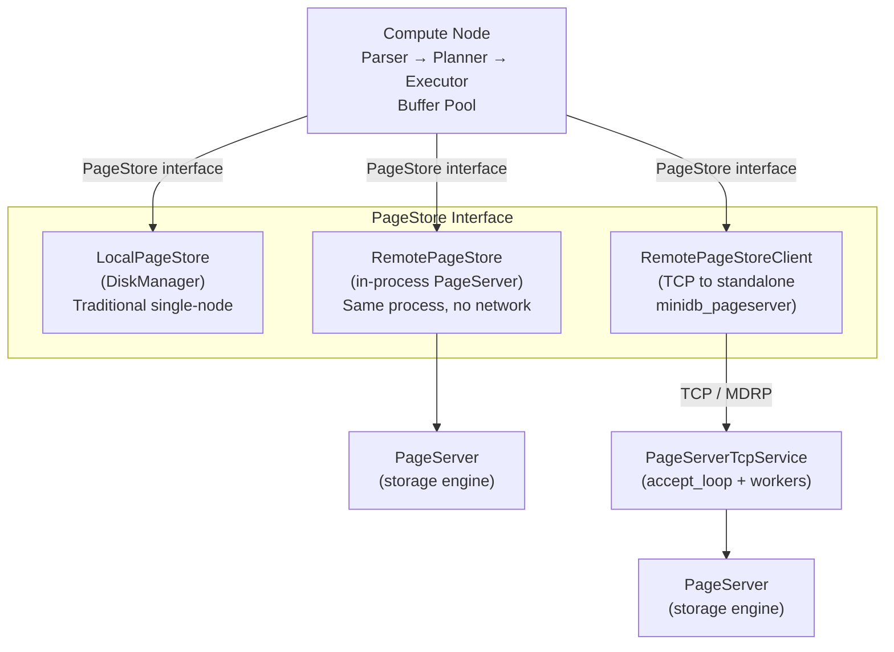
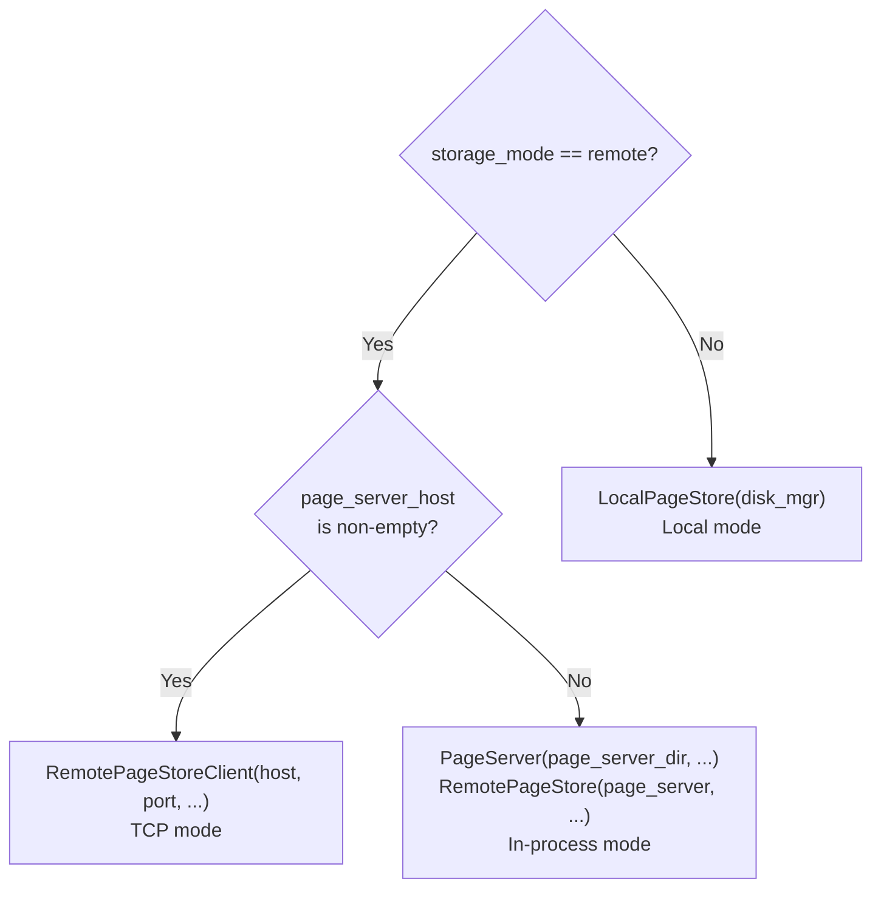
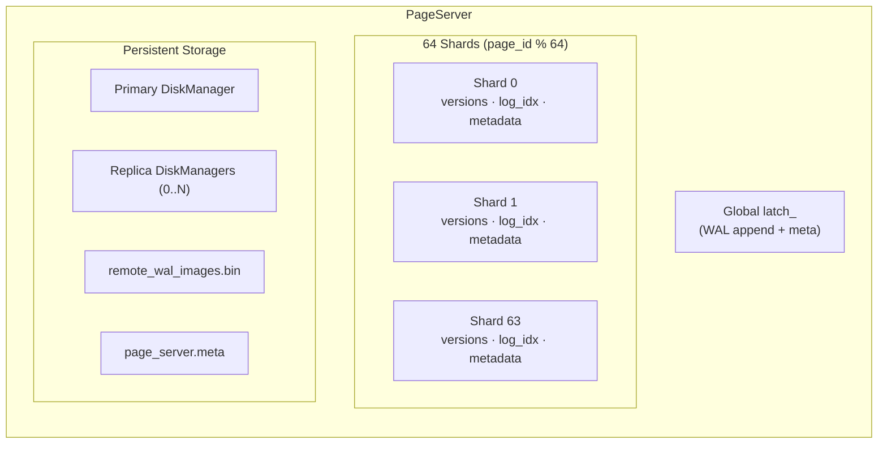
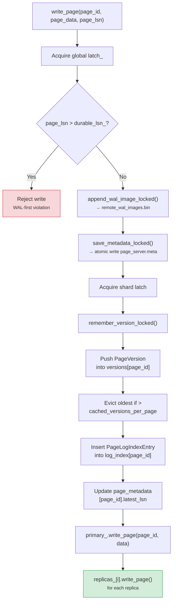
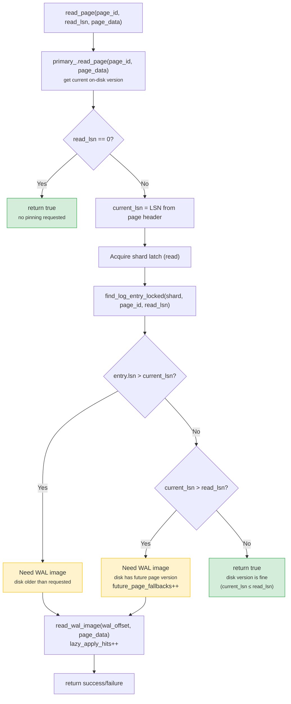
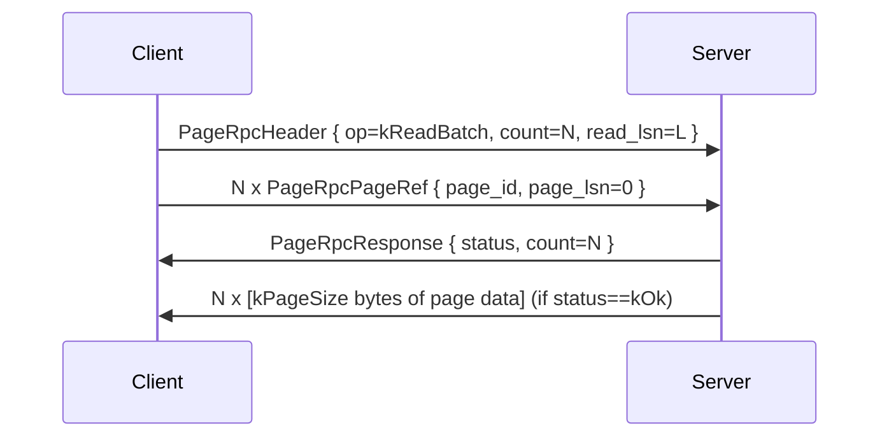
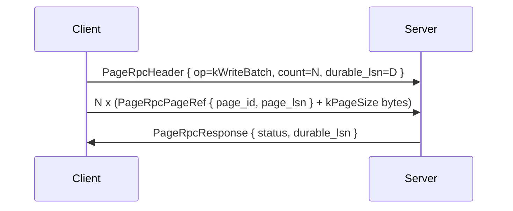
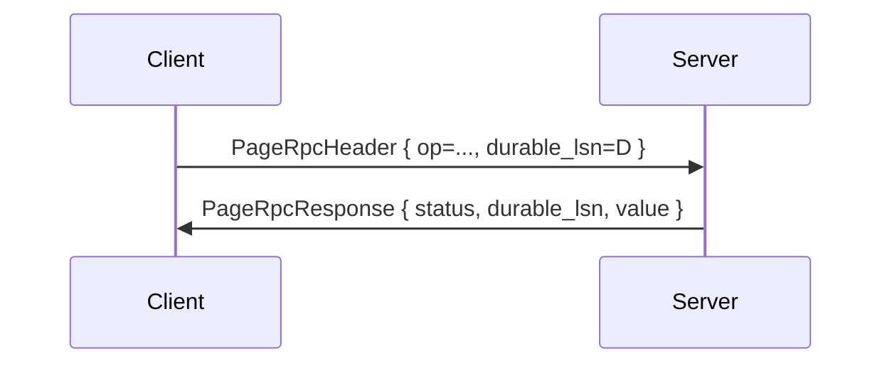
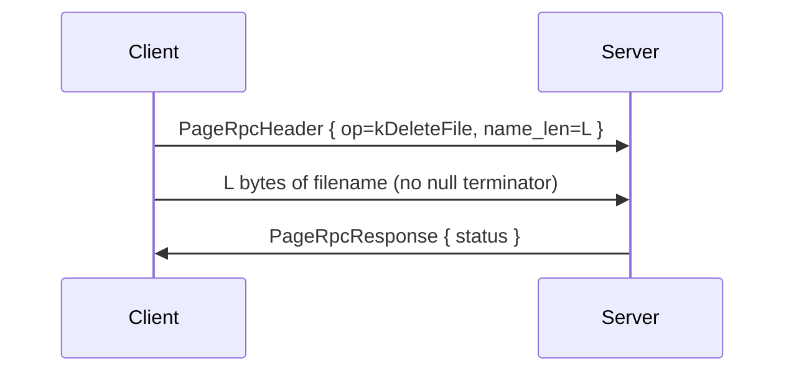
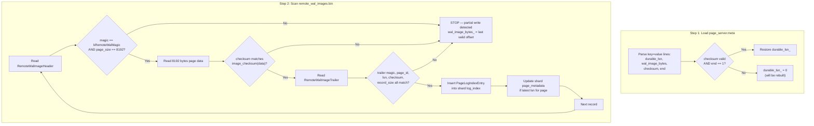

# Compute-Storage Separation in MiniDB

MiniDB implements a Neon-inspired compute-storage separation architecture that
decouples the SQL execution layer (compute) from the durable page storage layer
(storage). The design allows the same compute node to run against local files,
an in-process PageServer, or a standalone PageServer process reached over TCP --
all behind a single abstract interface.

---

## 1. Architecture Overview

The core idea, borrowed from [Neon](https://neon.tech/) (cloud-native
PostgreSQL storage), is that the **Buffer Pool never talks to disk directly**.
Instead it talks to a `PageStore`, and the concrete `PageStore` implementation
decides where pages actually live.



### Three deployment modes

| Mode | Config | PageStore impl | Network | Description |
|------|--------|----------------|---------|-------------|
| **Local** | `storage_mode=local` | `LocalPageStore` | None | Traditional single-node. DiskManager wraps local files directly. |
| **Remote in-process** | `storage_mode=remote`, `page_server_host` empty | `RemotePageStore` | None | PageServer runs inside the compute process. Same address space, zero network overhead. |
| **Remote TCP** | `storage_mode=remote`, `page_server_host` set | `RemotePageStoreClient` | TCP | PageServer runs as a standalone process (`minidb_pageserver` binary). Compute connects via TCP using the MDRP binary protocol. |

Mode selection happens in `Database::Database()` (`src/database/database.cpp`):



All three implementations satisfy the same `PageStore` abstract interface, so
the Buffer Pool, WAL manager, and every layer above are completely unaware of
where pages are stored.

---

## 2. PageStore Interface

**File:** `src/storage/page_store.h`

`PageStore` is the abstract base class. Every storage backend implements it.

```cpp
class PageStore : NonCopyable {
public:
    virtual ~PageStore() = default;

    // --- Single-page operations ---
    virtual Result<void> read_page(PageId page_id, byte* page_data) = 0;
    virtual Result<void> write_page(PageId page_id, const byte* page_data, LSN page_lsn) = 0;
    virtual Result<void> flush() = 0;
    virtual Result<void> delete_file(const String& filename) = 0;

    // --- Batch operations (default: loop over singles) ---
    virtual Vector<PageIOResult> read_pages(const Vector<PageReadRequest>& pages);
    virtual Vector<PageIOResult> write_pages(const Vector<PageWriteRequest>& pages);

    // --- LSN coordination ---
    virtual void set_durable_lsn(LSN durable_lsn);   // default no-op
    virtual LSN  durable_lsn() const;                 // default returns 0

    // --- Introspection ---
    virtual bool is_remote() const;                   // default returns false
};
```

### Supporting types

| Type | Fields | Purpose |
|------|--------|---------|
| `PageReadRequest` | `PageId page_id`, `byte* data` | Describes one page to read; caller provides the output buffer. |
| `PageWriteRequest` | `PageId page_id`, `const byte* data`, `LSN page_lsn` | Describes one page to write along with its WAL LSN. |
| `PageIOResult` | `PageId page_id`, `Status status` | Per-page success/failure status returned from batch operations. |

The base class provides default batch implementations that simply loop over the
single-page methods. `RemotePageStore` and `RemotePageStoreClient` override
these with their own chunked-batch logic.

### Concrete implementations

| Class | `is_remote()` | Backend |
|-------|---------------|---------|
| `LocalPageStore` | `false` | Delegates directly to `DiskManager` (local file I/O). Ignores `page_lsn` on writes. |
| `RemotePageStore` | `true` | In-process wrapper around `PageServer*`. Supports `read_only` mode and LSN-pinned reads. |
| `RemotePageStoreClient` | `true` | TCP client. Sends MDRP binary RPCs to a standalone `PageServerTcpService`. Supports connection pooling, retry, and batch chunking. |

---

## 3. PageServer Architecture

**Files:** `src/storage/page_server.h`, `src/storage/page_server.cpp`

The `PageServer` is the storage engine that manages versioned page images. It
serves both the in-process `RemotePageStore` and the TCP-fronted
`PageServerTcpService`.

### Constructor

```cpp
PageServer(const String& storage_dir,
           bool doublewrite_enabled,
           bool page_checksum_enabled,
           u32  fd_cache_limit,
           u32  replica_count = 0,
           u32  cached_versions_per_page = 32);
```

On construction it creates `storage_dir`, instantiates a primary `DiskManager`,
creates `replica_count` additional `DiskManager` instances (under
`storage_dir/replica_N/`), and calls `load_wal_index()` to recover WAL images.

### 64-way sharding

Page-level data structures are split across **64 shards**
(`kShardCount = 64`) to reduce lock contention. A page is assigned to shard
`page_id % 64`.

```cpp
static constexpr u32 kShardCount = 64;
std::array<PageServerShard, kShardCount> shards_;
```

Each `PageServerShard` contains:

```cpp
struct PageServerShard {
    mutable Mutex latch;
    HashMap<PageId, Vector<PageVersion>>        versions;       // cached page images
    HashMap<PageId, Vector<PageLogIndexEntry>>   log_index;      // LSN -> WAL offset index
    HashMap<PageId, PageMetadata>                page_metadata;  // latest LSN + offset
};
```



### Version history

`PageVersion` stores a full 8 KB page image at a particular LSN:

```cpp
struct PageVersion {
    LSN  lsn;
    u64  wal_offset;                 // offset into remote_wal_images.bin
    std::array<byte, kPageSize> data; // full 8 KB page image
};
```

Each page retains at most `cached_versions_per_page` (default **32**) versions
in memory. When this limit is exceeded, the oldest version is evicted from the
in-memory vector; however, all versions remain recoverable from the WAL image
file on disk.

### Page log index

`PageLogIndexEntry` maps an LSN to a WAL image file offset:

```cpp
struct PageLogIndexEntry {
    LSN lsn;
    u64 wal_offset;
};
```

The log index for each page is kept sorted by LSN. Lookups use binary search
(`upper_bound_lsn`) to find the latest entry whose LSN is at or below the
requested `read_lsn`.

### Write path



### Read path (simple)

Direct read of the latest on-disk version — no LSN pinning:

```
read_page(page_id, page_data)  →  primary_.read_page(page_id, page_data)
```

### Read path (LSN-pinned)



### Durable LSN synchronization

The compute node calls `set_durable_lsn(lsn)` to tell the PageServer the
highest LSN that the WAL has durably committed. The PageServer enforces:

```
if (durable_lsn_ != 0 && page_lsn > durable_lsn_) -> reject write
```

This prevents dirty pages that have not yet been WAL-committed from being
persisted to storage, preserving WAL-first semantics even across the
compute-storage boundary.

### Statistics

All counters are `std::atomic<u64>` with relaxed memory ordering:

| Counter | Description |
|---------|-------------|
| `read_ops` | Total single-page reads |
| `write_ops` | Total single-page writes |
| `batch_read_ops` | Total batch-read calls |
| `batch_write_ops` | Total batch-write calls |
| `wal_image_bytes` | Total bytes written to `remote_wal_images.bin` |
| `lazy_apply_hits` | Times a WAL image was used instead of the on-disk page |
| `future_page_fallbacks` | Times on-disk page was newer than requested LSN |
| `rejected_writes` | Times a write was rejected because `page_lsn > durable_lsn` |

---

## 4. TCP RPC Protocol (MDRP)

**File:** `src/storage/page_server_rpc.h`

The binary RPC protocol is called **MDRP** (MiniDB Remote Pages). It is a
simple request-response protocol over TCP with no framing beyond the fixed-size
headers.

### Constants

```
Magic:   0x4D445250  ("MDRP" in ASCII)
Version: 1
```

### Operations

| Op code | Name | Description |
|---------|------|-------------|
| 1 | `kReadBatch` | Read N pages, optionally at a specific `read_lsn` |
| 2 | `kWriteBatch` | Write N pages, each with its own `page_lsn` |
| 3 | `kFlush` | Flush all pending writes to disk |
| 4 | `kDeleteFile` | Delete a file by name |
| 5 | `kSetDurableLsn` | Update the durable LSN watermark |
| 6 | `kStats` | Request server statistics |

### Wire format

All structures are `#pragma pack(push, 1)` (no padding).

**Request header** (`PageRpcHeader`, 32 bytes):

```
 Offset  Size  Field         Description
 ──────  ────  ─────         ───────────
   0       4   magic         0x4D445250
   4       2   version       1
   6       2   op            PageRpcOp enum value
   8       4   count         Number of pages in this batch
  12       4   name_len      Filename length (kDeleteFile only)
  16       8   read_lsn      LSN for pinned reads (kReadBatch only)
  24       8   durable_lsn   Durable LSN to set on the server
```

**Response header** (`PageRpcResponse`, 28 bytes):

```
 Offset  Size  Field         Description
 ──────  ────  ─────         ───────────
   0       4   magic         0x4D445250
   4       2   version       1
   6       2   status        PageRpcStatus enum value
   8       4   count         Number of pages in response
  12       4   reserved      (unused)
  16       8   durable_lsn   Current durable LSN on the server
  24       8   value         Op-specific value (e.g., wal_image_bytes for kStats)
```

**Page reference** (`PageRpcPageRef`, 16 bytes):

```
 Offset  Size  Field         Description
 ──────  ────  ─────         ───────────
   0       8   page_id       PageId (u64 -- high 32 bits = file_id, low 32 = page_num)
   8       8   page_lsn      LSN associated with this page
```

### Status codes

| Code | Name | Meaning |
|------|------|---------|
| 0 | `kOk` | Success |
| 1 | `kError` | Generic error (e.g., read failure, bad magic) |
| 2 | `kRejected` | Write rejected (e.g., `page_lsn > durable_lsn`) |

### Wire sequences

**ReadBatch:**



**WriteBatch:**



**Flush / SetDurableLsn / Stats:**



**DeleteFile:**



---

## 5. PageServerTcpService

**Files:** `src/storage/page_server_tcp.h`, `src/storage/page_server_tcp.cpp`

This is the TCP server that wraps a `PageServer` for standalone deployment.
The standalone binary is `minidb_pageserver` (`src/pageserver_main.cpp`).

### Construction and configuration

```cpp
PageServerTcpService(PageServer* server,
                     const String& listen_host,
                     u16 port,
                     u32 max_connections = 1024,
                     u32 io_timeout_ms = 5000);
```

| Parameter | Default | Description |
|-----------|---------|-------------|
| `listen_host` | `"127.0.0.1"` (from main) | Bind address. Empty string binds to all interfaces. |
| `port` | `15433` | TCP port. If 0, the OS assigns an ephemeral port and `port()` returns the actual value. |
| `max_connections` | `1024` | Maximum simultaneous client connections. Excess connections are immediately closed. |
| `io_timeout_ms` | `5000` | Per-socket `SO_RCVTIMEO` / `SO_SNDTIMEO` timeout in milliseconds. |

### Threading model

```
┌──────────────────────────────────────────────────────┐
│                   accept_loop()                       │
│   runs in accept_thread_                              │
│   ┌───────────────────────────────────────────────┐  │
│   │  accept() -> spawn worker thread per client   │  │
│   └───────────────────────────────────────────────┘  │
│                                                       │
│   Worker thread pool (workers_latch_ protected)       │
│   ┌────────┐  ┌────────┐  ┌────────┐                │
│   │ client │  │ client │  │ client │  ...            │
│   │  fd=5  │  │  fd=7  │  │  fd=9  │                │
│   └────────┘  └────────┘  └────────┘                │
│   Each runs handle_client(fd) in a loop              │
└──────────────────────────────────────────────────────┘
```

- `start()` creates the listen socket with `SO_REUSEADDR`, binds, listens
  (backlog 128), and launches `accept_thread_`.
- `accept_loop()` accepts connections in a loop. Each accepted fd gets a
  dedicated worker thread that calls `handle_client(fd)`.
- `handle_client(fd)` runs a loop: read header, dispatch based on `op`,
  send response. The loop continues until the client disconnects, a protocol
  error is detected, or the service is stopping.
- `stop()` sets `running_ = false`, shuts down the listen socket and all
  active client fds (via `shutdown(fd, SHUT_RDWR)`), then joins all threads.
- `serve_forever()` calls `start()` then spins in a 200ms sleep loop until
  `running_` becomes false. Used by `minidb_pageserver` main.

### Standalone binary

```
Usage: minidb_pageserver [--dir path] [--host addr] [--port port] [--config file]
```

The binary (`src/pageserver_main.cpp`):
1. Parses CLI args (`--dir`, `--host`, `--port`, `--config`).
2. Loads `DbConfig` from `<dir>/pageserver.conf` or the `--config` path.
3. Installs `SIGTERM` / `SIGINT` handlers to set a stop flag.
4. Constructs `PageServer` and `PageServerTcpService`.
5. Calls `service.start()` and runs until signaled.
6. On shutdown: `service.stop()`, `server.flush()`.

---

## 6. RemotePageStoreClient

**Files:** `src/storage/remote_page_store_client.h`,
`src/storage/remote_page_store_client.cpp`

This is the TCP client that a compute node uses when `storage_mode=remote` and
`page_server_host` is set. It implements the full `PageStore` interface over
the MDRP binary protocol.

### Construction

```cpp
RemotePageStoreClient(const String& host, u16 port,
                      bool read_only = false, LSN read_lsn = 0,
                      u32 batch_size = 64,
                      u32 connect_timeout_ms = 1000,
                      u32 io_timeout_ms = 5000,
                      u32 retry_count = 2,
                      u32 max_connections = 8);
```

| Parameter | Default | Description |
|-----------|---------|-------------|
| `host` | (required) | PageServer hostname or IP |
| `port` | (required) | PageServer TCP port |
| `read_only` | `false` | If true, writes are rejected locally; reads use `read_lsn` |
| `read_lsn` | `0` | LSN for pinned reads (only used when `read_only=true`) |
| `batch_size` | `64` | Maximum pages per RPC batch |
| `connect_timeout_ms` | `1000` | Non-blocking connect timeout using `select()` |
| `io_timeout_ms` | `5000` | Socket send/recv timeout (`SO_RCVTIMEO`/`SO_SNDTIMEO`) |
| `retry_count` | `2` | Number of retries on RPC failure (total attempts = `retry_count + 1`) |
| `max_connections` | `8` | Maximum pooled idle connections |

### Connection pooling

```
┌─────────────────────────────────────────┐
│  idle_ : Vector<int>                     │
│  (protected by latch_)                   │
│                                          │
│  borrow_connection():                    │
│    if idle_ non-empty: pop_back          │
│    else: connect_once() -> new TCP fd    │
│                                          │
│  release_connection(fd, reusable):       │
│    if reusable && idle_.size() < max:    │
│      push_back(fd)                       │
│    else: close(fd)                       │
└─────────────────────────────────────────┘
```

`connect_once()` uses non-blocking connect with `select()` for the configurable
connect timeout. On success, the socket is switched back to blocking mode with
I/O timeouts applied.

### Batch chunking

When `read_pages()` or `write_pages()` receives more pages than `batch_size_`,
the client splits them into chunks of `batch_size_` and sends multiple RPCs
sequentially. Each chunk goes through the retry logic independently.

### Retry logic

The `with_retry()` template method wraps `rpc_read_batch` or `rpc_write_batch`:

```
for attempt in 0 .. retry_count:
    if rpc succeeds: return true
    if attempt < retry_count: stats_.retries++
    else: stats_.failures++
return false
```

On each retry, `borrow_connection()` is called again, which will either reuse
a pooled connection or open a fresh one (incrementing `stats_.reconnects`).

### Client statistics

| Counter | Description |
|---------|-------------|
| `read_batches` | Successful batch-read RPCs |
| `write_batches` | Successful batch-write RPCs |
| `retries` | Number of retry attempts (excluding the initial attempt) |
| `reconnects` | New TCP connections opened (including initial connects) |
| `failures` | Batches that failed after exhausting all retries |

---

## 7. Read-Only Compute Mode

MiniDB supports running a compute node in **read-only mode** with a frozen
snapshot, enabling read replicas, analytics workloads, and time-travel queries.

### Configuration

```
storage_mode       = remote
storage_read_only  = true
storage_read_lsn   = <LSN>     # e.g., 42000
```

### How it works

1. The compute node constructs a `RemotePageStore` (in-process) or
   `RemotePageStoreClient` (TCP) with `read_only=true` and
   `read_lsn=<LSN>`.
2. Every `read_page()` call passes `read_lsn` to the PageServer.
3. The PageServer uses its log index to find the page version at or before
   `read_lsn`, reading from the WAL image file if the on-disk page is too
   new or too old.
4. Write attempts are rejected at the `PageStore` layer with
   `kInvalidArgument`.
5. The compute node sees a **consistent frozen snapshot** of the database as
   of the specified LSN.

```mermaid
flowchart TD
    A["Compute (read-only, read_lsn=L)"] -->|read_page(page_id)| B["RemotePageStore /<br/>RemotePageStoreClient"]
    B -->|read_page(page_id, L, data)| C["PageServer"]
    C --> D["Read on-disk page<br/>(current_lsn = C)"]
    D --> E{"C <= L?"}
    E -->|Yes| F["Return on-disk page<br/>(it's old enough)"]
    E -->|No| G["'Future page' --<br/>look up WAL log index"]
    G --> H{"WAL entry with<br/>largest lsn <= L found?"}
    H -->|Yes| I["Read version from<br/>WAL image file"]
    H -->|No| J["Return error"]
```

### Use cases

- **Read replicas:** Multiple read-only compute nodes can connect to the same
  PageServer, each pinned to the latest durable LSN for consistent reads.
- **Time-travel queries:** Pin `read_lsn` to a past LSN to query historical
  data (limited by WAL image retention).
- **Analytics isolation:** Run heavy analytical queries without interfering
  with the primary writer.

---

## 8. Deployment Configuration

All configuration keys live in `DbConfig` (`src/common/db_config.h`).

### Configuration reference

| Key | Type | Default | Description |
|-----|------|---------|-------------|
| `storage_mode` | String | `"local"` | `"local"` or `"remote"`. Selects the PageStore backend. |
| `page_server_dir` | String | `""` | Directory for PageServer data. If empty, defaults to `<db_dir>/page_server`. Only used in remote in-process mode. |
| `page_server_host` | String | `""` | PageServer hostname/IP. If non-empty, enables TCP mode (`RemotePageStoreClient`). If empty, uses in-process mode (`RemotePageStore`). |
| `page_server_port` | u16 | `15433` | TCP port for PageServer. Used by both `PageServerTcpService` and `RemotePageStoreClient`. |
| `storage_read_only` | bool | `false` | Enable read-only mode. Writes are rejected at the PageStore layer. |
| `storage_read_lsn` | u64 | `0` | LSN for pinned reads. Only effective when `storage_read_only=true`. |
| `page_server_replicas` | u32 | `0` | Number of local replica DiskManagers in the PageServer. Each replica receives a copy of every written page. |
| `remote_page_batch_size` | u32 | `64` | Maximum pages per batch for `RemotePageStore` and `RemotePageStoreClient`. |
| `remote_flush_batch_size` | u32 | `64` | Batch size used by the Buffer Pool when flushing dirty pages to a remote store. |
| `remote_connect_timeout_ms` | u32 | `1000` | TCP connect timeout for `RemotePageStoreClient`. |
| `remote_io_timeout_ms` | u32 | `5000` | Socket I/O timeout for both `RemotePageStoreClient` and `PageServerTcpService`. |
| `remote_retry_count` | u32 | `2` | Number of retries on RPC failure in `RemotePageStoreClient`. |
| `remote_max_connections` | u32 | `8` | Maximum pooled idle connections in `RemotePageStoreClient`. |
| `page_server_max_connections` | u32 | `1024` | Maximum simultaneous client connections for `PageServerTcpService`. |
| `page_server_cached_versions_per_page` | u32 | `32` | Number of page versions to keep in memory per page in the PageServer. |

### Example: local mode (default)

```
storage_mode = local
```

No PageServer is involved. `LocalPageStore` wraps `DiskManager` directly.

### Example: remote in-process mode

```
storage_mode      = remote
page_server_dir   = /data/minidb/page_server
page_server_replicas = 1
page_server_cached_versions_per_page = 64
```

PageServer runs in the same process. One local replica is maintained.

### Example: remote TCP mode

```
storage_mode              = remote
page_server_host          = 10.0.1.50
page_server_port          = 15433
remote_page_batch_size    = 128
remote_connect_timeout_ms = 2000
remote_io_timeout_ms      = 10000
remote_retry_count        = 3
remote_max_connections    = 16
```

Compute connects to a standalone PageServer over TCP.

### Example: read-only replica

```
storage_mode      = remote
page_server_host  = 10.0.1.50
page_server_port  = 15433
storage_read_only = true
storage_read_lsn  = 50000
```

---

## 9. WAL Image Recovery

The PageServer persists every written page image to a WAL image file
(`remote_wal_images.bin`) and metadata to `page_server.meta`. On restart,
`load_wal_index()` reconstructs the in-memory log index from these files.

### WAL image file format

Each record in `remote_wal_images.bin` consists of a header, the full page
image, and a trailer:

```
┌─────────────────────────────────┐
│  RemoteWalImageHeader (28 B)    │
│    magic:      0x4D44425057414C31  ("MDBPWAL1")
│    page_id:    PageId (u64)     │
│    lsn:        LSN (u64)        │
│    page_size:  u32 (8192)       │
│    checksum:   u32 (FNV-based)  │
├─────────────────────────────────┤
│  Page Image (8192 bytes)        │
├─────────────────────────────────┤
│  RemoteWalImageTrailer (28 B)   │
│    magic:      0x4D444250574C5431  ("MDBPWLT1")
│    page_id:    PageId (u64)     │
│    lsn:        LSN (u64)        │
│    checksum:   u32              │
│    record_size: u32             │
│    (= sizeof(header) + 8192    │
│       + sizeof(trailer))       │
└─────────────────────────────────┘
```

The checksum is computed using an FNV-1a variant:

```cpp
static u32 image_checksum(const byte* data) {
    u32 sum = 0x9E3779B9u;    // golden ratio constant
    for (u32 i = 0; i < kPageSize; i++) {
        sum ^= data[i];
        sum *= 16777619u;     // FNV prime
    }
    return sum == 0 ? 1 : sum;  // never returns 0
}
```

The trailer mirrors the header's `page_id`, `lsn`, and `checksum` and adds
`record_size` to enable backward scanning. The dual magic values
(`kRemoteWalMagic` for headers, `kRemoteWalTrailerMagic` for trailers) allow
detection of partial writes.

### Recovery procedure (`load_wal_index()`)



### Metadata file format (`page_server.meta`)

Written atomically via rename (`page_server.meta.tmp` -> `page_server.meta`):

```
version=2
durable_lsn=<value>
wal_image_bytes=<value>
checksum=<FNV-1a hash of durable_lsn and wal_image_bytes>
end=1
```

The metadata checksum uses 64-bit FNV-1a:

```cpp
static u64 metadata_checksum(LSN durable_lsn, u64 wal_image_bytes) {
    u64 h = 1469598103934665603ULL;   // FNV offset basis
    // mix each byte of durable_lsn, then each byte of wal_image_bytes
    // multiply by 1099511628211ULL (FNV-1a 64-bit prime) after each XOR
    return h == 0 ? 1 : h;
}
```

The `end=1` marker acts as a sentinel -- if the process crashed mid-write of
the metadata file, the `end` key will be absent, and the metadata is discarded
in favor of rebuilding from the WAL images.

---

## 10. Limitations

### Single-writer constraint

Only one compute node may write to a PageServer at a time. There is no
distributed locking, lease mechanism, or fencing token to prevent split-brain
if two writers connect simultaneously. The `durable_lsn` check provides a
weak ordering guarantee but does not replace proper distributed coordination.

### No consensus protocol

The PageServer does not use Raft, Paxos, or any consensus protocol for its
metadata or page data. There is no distributed state machine replication.
The system is fundamentally a single-node storage engine with a network
interface.

### Best-effort local replicas

The `page_server_replicas` configuration creates local `DiskManager` copies
under `storage_dir/replica_N/`. These are **synchronous local copies**, not
consensus-based replicas:

- Writes go to the primary first, then to each replica sequentially.
- There is no quorum -- a replica failure does not block writes.
- Replicas are not independently addressable for reads.
- No automatic failover from primary to replica.

### Network timeout semantics

When a TCP write RPC times out after the compute node has already committed
the transaction in its WAL:

- The compute node does not know whether the PageServer received and persisted
  the page.
- Retry may result in a duplicate write (which is idempotent for pages but
  wastes a WAL image record).
- If all retries fail, the compute node reports an I/O error, but the
  transaction may already be WAL-committed. This creates an "unknown outcome"
  window that requires manual recovery (replay from WAL).

### No page eviction from WAL images

The `remote_wal_images.bin` file grows without bound. There is no garbage
collection, compaction, or truncation of old WAL image records. In a long-
running deployment, this file must be managed externally (e.g., periodic
backup and truncation during maintenance windows).

### No parallel shard I/O

Batch read and write operations iterate sequentially over pages. While the
64-shard design reduces lock contention for concurrent clients, a single
batch operation does not parallelize across shards.

---

## Source file reference

| File | Purpose |
|------|---------|
| `src/storage/page_store.h` | `PageStore` abstract interface, `LocalPageStore`, request/result types |
| `src/storage/page_store.cpp` | Default batch implementations for `PageStore` |
| `src/storage/page_server.h` | `PageServer`, `RemotePageStore`, shard types, stats |
| `src/storage/page_server.cpp` | `PageServer` implementation, WAL image I/O, recovery |
| `src/storage/page_server_rpc.h` | MDRP binary protocol definitions |
| `src/storage/page_server_tcp.h` | `PageServerTcpService` declaration |
| `src/storage/page_server_tcp.cpp` | TCP server implementation, per-client handler |
| `src/storage/remote_page_store_client.h` | `RemotePageStoreClient` declaration, stats |
| `src/storage/remote_page_store_client.cpp` | TCP client implementation, connection pool, retry |
| `src/pageserver_main.cpp` | Standalone `minidb_pageserver` binary entrypoint |
| `src/database/database.cpp` | Mode selection logic in `Database::Database()` |
| `src/common/db_config.h` | All configuration keys with defaults |
| `tests/unit/page_store_remote_test.cpp` | Integration tests for all three modes |
