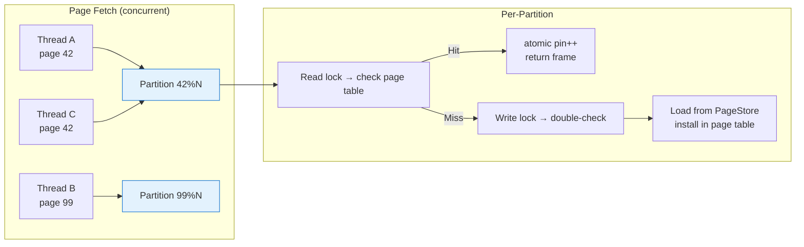
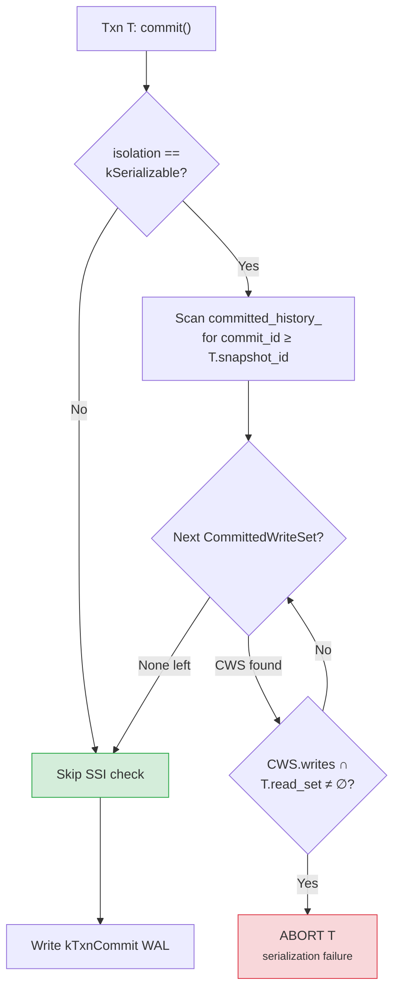
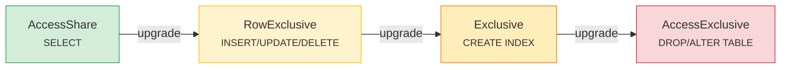

# Concurrency Control

MiniDB combines local MVCC snapshots, lock-manager coordination for writes, and bounded admission control.

## Transaction Slots

Active transactions are stored in a dynamically sized slot array controlled by `max_active_transactions`. The same setting is used by `ResourceManager` admission, so slot capacity and admission capacity stay aligned. A value of `0` disables the admission cap but the transaction manager still creates at least one slot.

Snapshots capture the active transaction ids at `BEGIN`. Visibility follows:

- A version is visible if its creator committed before the reader snapshot and was not active in the reader snapshot.
- A deleted version remains visible when the deleting transaction is uncommitted, aborted, or committed after the reader snapshot.
- Commit ids are assigned monotonically by the transaction manager.

## Locks and Resources

The lock manager owns tuple/table waits and deadlock handling. `ResourceManager` separately limits connections, queries, writes, memory reservations, temp bytes, and active transactions.

## Buffer Pool Concurrency

The buffer pool is partitioned by page id. Each partition has its own page table and LRU lock. Pin counts use standard C++ atomics. Cache misses are double-checked under the partition write lock so another thread cannot install the same page between read and write phases without being observed.

Dirty page flushes obey WAL-first ordering before the page store write.

## Isolation Level Guarantees

MiniDB supports two isolation levels:

### Snapshot Isolation (SI) — default

- Each transaction reads from a snapshot taken at `BEGIN`. Reads see a
  consistent view as of that snapshot for the entire transaction.
- Two transactions writing the same row are detected: the second writer
  receives `Error: could not serialize access due to concurrent update`.
  This prevents the lost-update anomaly.
- Two transactions writing **different** rows whose values depend on the
  same predicate (the classic write-skew anomaly) are not detected and
  both will commit. Snapshot isolation permits this.

`tests/acid/isolation/write_skew.py` documents the SI anomaly as
intentional behaviour under the default isolation level.

### Serializable (SSI-lite) — opt-in

Enabled per-session via `SET ISOLATION_LEVEL = SERIALIZABLE`. Uses
read-set tracking and commit-time rw-conflict detection to eliminate
write skew:

1. **Read tracking.** Every visible tuple emitted by SeqScan or IndexScan
   is recorded in the transaction's `read_set_` via `record_read()`.
   This is a no-op for SI transactions, so the serializable overhead is
   strictly opt-in.

2. **Commit-time conflict check.** `ssi_check_conflict()` scans the
   `committed_history_` vector, which holds the write sets of recently
   committed transactions. For each concurrent committed write set
   (those with `commit_id > txn.snapshot_id`), it checks whether any
   write intersects the current transaction's read set.

3. **Abort on conflict.** If a rw-conflict is found, the committing
   transaction is aborted with a serialization failure error.

4. **Bounded history.** `prune_committed_history()` removes entries
   whose `commit_id` is older than the minimum active snapshot, keeping
   the history vector bounded to the concurrency window.

`tests/acid/isolation/write_skew_serializable.py` verifies that
write-skew is properly detected and aborted under SERIALIZABLE.

## Lock Compatibility Matrix

|                     | AccessShare | RowExclusive | Exclusive | AccessExclusive |
|---------------------|:-----------:|:------------:|:---------:|:---------------:|
| **AccessShare**     | ✓           | ✓            | ✓         | ✗               |
| **RowExclusive**    | ✓           | ✓            | ✗         | ✗               |
| **Exclusive**       | ✓           | ✗            | ✗         | ✗               |
| **AccessExclusive** | ✗           | ✗            | ✗         | ✗               |

Lock escalation from weakest (AccessShare) to strongest (AccessExclusive):

| Lock Mode | Acquired By |
|-----------|-------------|
| AccessShare | `SELECT` (read queries) |
| RowExclusive | `INSERT` / `UPDATE` / `DELETE` |
| Exclusive | `CREATE INDEX` (allows concurrent reads) |
| AccessExclusive | `DROP TABLE` / `ALTER TABLE` (fully exclusive) |

The lock manager supports table-level, record-level, and key-level locks.
Deadlock detection uses a wait-for graph DFS with youngest-aborts victim
selection for table locks.

## Current Boundaries

- Transaction management is local to one compute process.
- Distributed writes require an external timestamp/transaction service or single-writer ownership model.
- Long-running snapshots can delay version pruning until their snapshot is gone.
