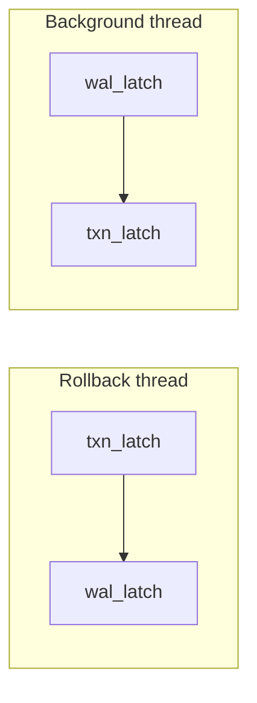

# DDL Semantics

MiniDB implements PostgreSQL-style transactional DDL. Every DDL operation
participates in the active transaction, can be rolled back with `ROLLBACK`,
and interleaves correctly with DML undo records during rollback. This
document covers the implementation in precise technical detail.

---

## 1. Transactional DDL Overview

All DDL operations (CREATE TABLE, DROP TABLE, CREATE INDEX, DROP INDEX,
ALTER TABLE ADD/DROP/RENAME COLUMN) participate in transactions. A DDL
statement issued inside `BEGIN .. ROLLBACK` is fully undone.

**Implementation.** DDL uses a reverse-operation undo log. Each DDL
operation pushes two records into the active `Transaction`:

1. A `DdlUndoInfo` struct into the `ddl_undo_infos_` vector, which holds
   all metadata needed to reverse the operation (saved schemas, saved
   indexes, file paths, column positions, original names).
2. An `UndoRecord` into the shared `undo_records_` vector (the same vector
   that holds DML inserts/deletes). The `UndoRecord` carries a `ddl_info_idx`
   that indexes into the `ddl_undo_infos_` vector.

DDL changes are applied immediately to the in-memory catalog. On rollback,
the transaction manager walks the undo log in reverse order, calling the
appropriate `Database::undo_*` helper for each DDL record. Because DDL and
DML undo records share the same log, rollback processes them in the correct
interleaved order.

### UndoType enum values

| Constant                        | Value | Undo action                                 |
|---------------------------------|-------|----------------------------------------------|
| `kDdlCreateTable`               | 10    | Drop table + auto-indexes + delete files     |
| `kDdlDropTable`                 | 11    | Restore catalog entries from saved data      |
| `kDdlCreateIndex`               | 12    | Drop index + delete file                     |
| `kDdlDropIndex`                 | 13    | Restore index + rebuild from heap            |
| `kDdlAlterAddColumn`            | 14    | Remove the added column from schema          |
| `kDdlAlterDropColumn`           | 15    | Clear `is_dropped` flag on the column        |
| `kDdlAlterRenameColumn`         | 16    | Rename column back to original name          |

### DdlUndoInfo fields

```
table_name         — table involved
saved_schema       — DROP TABLE: full Schema to restore
saved_indexes      — DROP TABLE: Vector<DdlSavedIndex> to restore
auto_index_ids     — CREATE TABLE: auto-created index IDs (PRIMARY KEY / UNIQUE)
single_index       — CREATE/DROP single INDEX metadata
column_position    — ALTER: column ordinal in the schema
rename_from        — ALTER RENAME: original column name
deferred_deletes   — file paths to delete on COMMIT (not rollback)
```

---

## 2. CREATE TABLE

**Entry point:** `Database::create_table(name, schema)`

### Steps

1. `Catalog::create_table` allocates a `table_id` (starting from 10,
   monotonically incrementing) and creates a `TableEntry` with the sanitized
   schema. Returns 0 if the name already exists or the schema is empty.

2. A new `HeapFile` is created for the table (`HeapFile::create()` writes
   the meta page). The heap file path is `tables/<table_id>.heap`.

3. The schema is scanned for columns marked `is_primary` or `is_unique`.
   For each such column, a unique B+ tree index is auto-created with name
   `<table>_<column>_pkey` (primary) or `<table>_<column>_key` (unique).
   The index IDs are collected into `auto_index_ids`.

4. `save_catalog()` persists the updated catalog to `catalog.mdbc`.

5. WAL: `log_ddl(DdlOp::kCreateTable, table_id, 0, table_name)` emits a
   `kDdl` audit record. The record is flushed to disk before returning.

6. If inside a transaction, a `DdlUndoInfo` with `table_name` and
   `auto_index_ids` is pushed to the undo log via `record_ddl`.

### Undo (on rollback): `undo_create_table`

1. Drops each auto-created index (catalog entry + B+ tree file).
2. Erases the `HeapFile` from the in-memory cache.
3. Deletes the physical heap file via `page_store_->delete_file()`.
4. Drops the table entry from the catalog.
5. `save_catalog()`.

---

## 3. DROP TABLE

**Entry point:** `Database::drop_table(name)`

### Steps

1. Looks up the `TableEntry` by name. Fails if not found.

2. **Before modifying the catalog**, saves a complete `DdlUndoInfo`:
   - `table_name`
   - `saved_schema` — full copy of the table's `Schema`
   - `saved_indexes` — `DdlSavedIndex` for every index on the table
     (index_id, index_name, table_id, key_columns, is_unique)
   - `deferred_deletes` — file paths for every index
     (`indexes/<index_id>.btree`) and the heap (`tables/<table_id>.heap`)

3. Drops all indexes for the table via `Catalog::drop_indexes_for_table`.
4. Drops the table entry via `Catalog::drop_table`.
5. Erases in-memory `HeapFile` and `BPlusTree` caches.
6. **Physical file deletion is deferred.** If there is an active
   transaction, files are NOT deleted yet. If there is no transaction
   (autocommit mode), files are deleted immediately.
7. `save_catalog()`.
8. WAL: `log_ddl(DdlOp::kDropTable, table_id, 0, name)`.

### Undo (on rollback): `undo_drop_table`

1. `Catalog::restore_table(table_id, name, saved_schema)` recreates the
   `TableEntry` with the original table_id and schema.
2. For each `DdlSavedIndex`, `Catalog::restore_index` recreates the
   `IndexEntry` with the original index_id.
3. Physical files were never deleted (deferred), so the heap and index
   files are still on disk. `get_heap_file()` and `get_index_tree()` will
   lazily re-open them on next access.
4. `save_catalog()`.

### On commit: `commit_ddl_deferred`

After `TransactionManager::commit` completes the commit protocol, it calls
`Database::commit_ddl_deferred(ddl_undo_infos)` which iterates every
`DdlUndoInfo` and deletes each file path in `deferred_deletes` via
`page_store_->delete_file()`.

---

## 4. CREATE INDEX

**Entry point:** `Database::create_index(name, table_name, columns, unique)`

### Steps

1. Resolves the table by name. Resolves each column name to a column index.
   Rejects columns whose `TypeId` is not supported by the B+ tree
   (`kBool`, `kInt32`, `kInt64`, `kFloat`, `kDouble`, `kVarchar`, `kNull`).

2. **Key size validation.** Scans the entire heap to verify that every
   live tuple's projected key fits within `kIndexKeyMaxEncodedSize` (512
   bytes). Rejects the CREATE if any key would overflow.

3. **Uniqueness pre-check** (if `unique=true`). Scans the heap a second
   time, building a `HashMap<String, bool>` of projected tuple keys. If
   any duplicate is found, the CREATE is rejected before modifying the
   catalog.

4. `Catalog::create_index` allocates an `index_id` (starting from 1000)
   and creates an `IndexEntry`.

5. `rebuild_index(entry)` creates a new `BPlusTree`, scans the heap, and
   inserts every live tuple into the tree. The index transitions through
   states: `kInvalid` -> `kRebuilding` -> `kValid`.

6. `save_catalog()`.
7. WAL: `log_ddl(DdlOp::kCreateIndex, table_id, index_id, name)`.

### Composite indexes

Multi-column composite indexes are supported. `IndexEntry::key_columns` is
a `Vector<u32>` of column ordinals. `IndexKey` holds a `Vector<Value>` and
comparison is lexicographic across all key columns.

### IndexKey encoding

`IndexKey::encode` produces a binary-comparable byte sequence supporting:
BOOL, INT32, INT64, FLOAT, DOUBLE, VARCHAR, NULL. Keys are compared via
`IndexKey::compare` which walks columns left-to-right. The `IndexKeySchema`
optionally specifies per-column `descending`, `nulls_first`, and
`collation_id`.

### Undo (on rollback): `undo_create_index`

1. Erases the `BPlusTree` from the in-memory cache.
2. Drops the catalog entry via `Catalog::drop_index`.
3. Deletes the physical index file via `page_store_->delete_file`.
4. `save_catalog()`.

---

## 5. DROP INDEX

**Entry point:** `Database::drop_index(name)`

### Steps

1. Looks up the `IndexEntry` by name.

2. Saves a `DdlUndoInfo` with `single_index` metadata and a
   `deferred_deletes` entry for the index file
   (`indexes/<index_id>.btree`).

3. Drops the catalog entry via `Catalog::drop_index`.
4. Erases the in-memory `BPlusTree` cache entry.
5. **Physical file deletion is deferred** (same pattern as DROP TABLE).
6. `save_catalog()`.
7. WAL: `log_ddl(DdlOp::kDropIndex, table_id, index_id, name)`.

### Undo (on rollback): `undo_drop_index`

1. `Catalog::restore_index` recreates the `IndexEntry` with the original
   index_id.
2. `rebuild_index(entry)` scans the heap and repopulates the B+ tree.
3. `save_catalog()`.

### On commit

`commit_ddl_deferred` deletes the physical index file.

---

## 6. ALTER TABLE ADD COLUMN

**Entry point:** `Database::alter_table_add_column(table_name, column, error)`

### Steps

1. Looks up the `TableEntry` by name.
2. Rejects if a column with the same name already exists (checked via
   `get_column_index`, which skips dropped columns).
3. **NOT NULL check.** If the new column is `NOT NULL` and has no
   `DEFAULT`, the heap is scanned to check for live rows. If any exist,
   the operation is rejected ("cannot add NOT NULL column without DEFAULT
   to non-empty table").
4. Records the `column_position` (the index of the newly appended column).
5. `Schema::add_column(column)` appends the `Column` to the schema.
6. `save_catalog()` + `checkpoint()`.
7. WAL: `log_ddl(DdlOp::kAlterAddColumn, table_id, column_position, "table.column")`.

### Metadata-only operation

This is a metadata-only change. No heap rewrite occurs. Existing tuples
on disk have fewer columns than the new schema. At read time, tuple
deserialization pads missing columns with NULL (or the declared DEFAULT
value). This makes ADD COLUMN O(1) regardless of table size.

### Column struct fields

```cpp
String name;
String table_name;
TypeId type;            // kNull, kBool, kInt32, kInt64, kFloat, kDouble, kVarchar
bool   not_null;
bool   is_primary;
bool   is_unique;
bool   is_dropped;      // PostgreSQL-style logical deletion flag
u32    varchar_length;   // 0 = unbounded (TEXT)
String default_value;   // textual representation, parsed at INSERT/UPDATE time
String check_expr;      // SQL text of CHECK constraint
```

### Undo (on rollback): `undo_alter_add_column`

1. `Schema::remove_column(column_position)` removes the appended column.
2. `save_catalog()`.
3. **No `checkpoint()` call** — see Section 11 (deadlock avoidance).

---

## 7. ALTER TABLE DROP COLUMN

**Entry point:** `Database::alter_table_drop_column(table_name, column_name, error)`

### Steps

1. Looks up the `TableEntry` and resolves the column index via
   `get_column_index` (which already skips `is_dropped` columns, so
   re-dropping a previously dropped column is rejected as "column not
   found").

2. **Index guard.** Rejects the drop if the column participates in any
   index — the user must `DROP INDEX` first, matching PostgreSQL behavior.

3. Sets `Column::is_dropped = true` on the resolved column. This is the
   only mutation.

4. `save_catalog()` + `checkpoint()`.
5. WAL: `log_ddl(DdlOp::kAlterDropColumn, table_id, col_idx, "table.column")`.

### PostgreSQL-style metadata-only deletion

This is an O(1) operation regardless of table size. No heap rewrite
occurs. Physical tuple slots are preserved:

- **Existing rows** still carry the old value in the dropped column's slot.
- **New rows** store NULL in the dropped column's slot.
- Column positions (used by indexes, tuple layout) do NOT shift.

### Effects on query processing

| Subsystem                     | Behavior                                              |
|-------------------------------|-------------------------------------------------------|
| `SELECT *`                    | Planner inserts an explicit `ProjectionPlan` that skips dropped columns (`planner.cpp:481`) |
| `INSERT` implicit column list | Planner builds `target_columns` skipping dropped columns (`planner.cpp:588`) |
| `get_column_index(name)`      | Skips `is_dropped` columns during name lookup (`schema.cpp:92`) |
| `DESC TABLE`                  | Skips dropped columns in output (`repl.cpp:494`, `server.cpp:747`) |
| CHECK constraint evaluation   | `check_constraint_violation` skips dropped columns (`insert.cpp:56`) |
| `validate_row()`              | Skips NOT NULL and VARCHAR length checks on dropped columns (`schema.cpp:60`) |

### Schema serialization

The `is_dropped` flag is stored as bit 3 of the per-column flags byte:

```
flags = (not_null ? 1 : 0)
      | (is_primary ? 2 : 0)
      | (is_unique ? 4 : 0)
      | (is_dropped ? 8 : 0)
```

This ensures the flag round-trips through catalog persistence and survives
restarts.

### Undo (on rollback): `undo_alter_drop_column`

1. Clears `Column::is_dropped = false` on the column at `column_position`.
2. `save_catalog()`.
3. **No `checkpoint()` call** — see Section 11 (deadlock avoidance).

---

## 8. ALTER TABLE RENAME COLUMN

**Entry point:** `Database::alter_table_rename_column(table_name, old_name, new_name, error)`

### Steps

1. Looks up the `TableEntry` and resolves the old column index via
   `get_column_index`. Rejects if not found or if `new_name` already
   exists.
2. `Schema::rename_column(col_pos, new_name)` updates `Column::name`.
3. `save_catalog()` + `checkpoint()`.
4. WAL: `log_ddl(DdlOp::kAlterRenameColumn, table_id, col_pos, "table.old->new")`.

### Undo (on rollback): `undo_alter_rename_column`

1. `Schema::rename_column(column_position, rename_from)` restores the
   original name.
2. `save_catalog()`.
3. **No `checkpoint()` call** — see Section 11 (deadlock avoidance).

---

## 9. DDL Lock Protocol

MiniDB's lock manager provides four lock modes (PostgreSQL-aligned):

| Mode                | Value | Purpose                          |
|---------------------|-------|----------------------------------|
| `kAccessShare`      | 0     | SELECT (read)                    |
| `kRowExclusive`     | 1     | INSERT / UPDATE / DELETE (write) |
| `kExclusive`        | 2     | CREATE INDEX (allows reads)      |
| `kAccessExclusive`  | 3     | DROP TABLE / ALTER TABLE (fully exclusive) |

DDL lock acquisition is done at the executor/dispatch level for DML
operations. The `Database::create_table`, `drop_table`, `create_index`,
`drop_index`, and `alter_table_*` functions do not themselves acquire
table-level locks — they operate directly on the catalog under the
assumption that the caller serializes DDL appropriately. In MiniDB's
single-session REPL and single-threaded per-connection server model, DDL
serialization is implicit.

The INSERT executor acquires `kExclusive` on the table when performing
bulk inserts that touch indexes, ensuring DDL-like exclusion during
index population.

---

## 10. DDL WAL Records

All DDL operations emit a `kDdl` type WAL record (type value 40) as an
audit trail. The record is written ON SUCCESS, meaning its presence in the
log confirms the operation reached its in-memory completion point.

### DdlOp discriminator

| DdlOp                  | Value |
|------------------------|-------|
| `kCreateTable`         | 1     |
| `kDropTable`           | 2     |
| `kCreateIndex`         | 3     |
| `kDropIndex`           | 4     |
| `kAlterAddColumn`      | 5     |
| `kAlterDropColumn`     | 6     |
| `kAlterRenameColumn`   | 7     |

### Wire format

```
struct DdlHdr {           // packed
    u8  op;               // DdlOp
    u32 table_id;         // affected table
    u32 aux;              // context-dependent:
                          //   ALTER: column index
                          //   CREATE/DROP INDEX: index_id
                          //   otherwise: 0
    u16 name_len;         // length of object_name
};
// followed by name_len bytes of object_name (table, index, or column name)
```

The `txn_id` field in the enclosing `WalRecord` is set to 0 for DDL
records (DDL is logged independently of the DML transaction WAL stream).

### Durability

`log_ddl` calls `flush()` after writing the record, so DDL audit records
are durable by the time the DDL call returns to the user.

### Recovery

DDL WAL records are currently audit-only. Recovery (`WalManager::recover`)
does not act on `kDdl` records. A future repair pass could use them to
detect orphaned files or half-finished schema changes (referenced as
`ACID_TODO D7` in the source).

---

## 11. DDL Undo Deadlock Avoidance

The DDL undo functions for ALTER operations (`undo_alter_add_column`,
`undo_alter_drop_column`, `undo_alter_rename_column`) must NOT call
`checkpoint()`.

### Reason

`TransactionManager::rollback()` holds the `TransactionManager::latch_`
mutex. `Database::checkpoint()` calls `WalManager::checkpoint()`, which
acquires the `WalManager::latch_` mutex. The background maintenance thread
periodically calls `checkpoint()` while NOT holding the transaction latch.
If rollback called checkpoint, the lock ordering would be:



This is a classic ABBA deadlock.

### Solution

DDL undo functions call `save_catalog()` only (which writes to the
`catalog.mdbc` file directly without acquiring WAL or transaction latches).
The next regular checkpoint cycle, triggered by the background maintenance
thread, will persist the updated catalog state along with the WAL
truncation.

The forward-path ALTER operations (`alter_table_add_column`,
`alter_table_drop_column`, `alter_table_rename_column`) DO call
`checkpoint()` because they run outside the transaction latch.

---

## 12. Catalog Persistence

### Save path

`Catalog::save(path)` serializes all table and index metadata to a binary
file. The write follows a crash-safe pattern:

1. Write to `<path>.tmp`
2. `fflush` + `fsync` the temp file
3. `rename` atomically replaces the target file
4. `fsync` the parent directory

### File format

```
"MDBC"              — 4-byte magic
version(u32)        — currently 1
next_table_id(u32)
next_index_id(u32)

table_count(u32)
  for each table:
    table_id(u32)
    name_len(u32) + name
    first_page_id(u64)
    num_pages(u32)
    num_tuples(u64)
    schema_size(u32) + serialized_schema

index_count(u32)
  for each index:
    index_id(u32)
    name_len(u32) + name
    table_id(u32)
    num_keys(u32) + key_columns[](u32 each)
    root_page_id(u64)
    is_unique(u8)
```

### Schema serialization (per column)

```
name_len(u16) + name
table_name_len(u16) + table_name
type(u8)                          — TypeId
flags(u8)                         — bit 0: not_null
                                    bit 1: is_primary
                                    bit 2: is_unique
                                    bit 3: is_dropped
default_value_len(u16) + default_value
varchar_length(u32)               — 0 = unbounded / TEXT
check_expr_len(u16) + check_expr  — empty when no CHECK
```

### Load

`Catalog::load(path)` deserializes the file, sanitizing schemas (removing
parser-artifact column names like "unexpected token"). Index entries are
validated: key column indices must be within the table's schema range.

---

## 13. Column-Level CHECK Constraints

### Storage

The CHECK predicate is stored as a raw SQL text string in
`Column::check_expr`, without surrounding parentheses.

### Evaluation

At INSERT (and UPDATE) time, `check_constraint_violation()` iterates every
column:

1. Skips columns with `is_dropped == true`.
2. Skips columns with empty `check_expr`.
3. Wraps the expression as `SELECT <check_expr>`, parses it, and evaluates
   it against the candidate row.
4. NULL result (SQL UNKNOWN) passes — matching PostgreSQL/SQL standard
   semantics.
5. Boolean FALSE rejects the row.

### Persistence

The `check_expr` string is serialized as a length-prefixed field in the
schema binary format (see Section 12). It survives restarts.

---

## 14. Edge Cases and Limitations

### Crash between DDL execution and COMMIT/ROLLBACK

If the process crashes after a DDL operation has modified the catalog but
before the transaction commits or rolls back, the catalog is in the
post-DDL state on restart. The in-memory undo log is lost. This is a
documented limitation — DDL WAL records exist as an audit trail but are
not yet used for physical redo/undo during recovery.

### No deferred file deletion for autocommit DDL

When DDL runs outside an explicit transaction (autocommit mode), DROP
TABLE / DROP INDEX delete physical files immediately. Only transactional
DDL defers deletion until commit.

### No catalog cache invalidation

There is no schema version bumping or catalog cache invalidation protocol.
In-flight queries that cached schema information before a DDL change may
see stale metadata. This is acceptable in MiniDB's single-session-per-
connection model.

### No prepared statement invalidation

Schema changes do not invalidate prepared statements. MiniDB does not
currently have a prepared statement cache, so this is a non-issue in
practice.

### DDL WAL records are audit-only

Recovery does not replay or undo DDL operations from WAL records. A
future implementation (tracked as ACID_TODO D7) could use DDL markers
to detect and repair orphaned files or incomplete schema changes after
a crash.

### Index state machine during recovery

After WAL replay, all index entries are flipped to `IndexState::kInvalid`.
A full `rebuild_all_indexes()` pass scans every heap and repopulates every
B+ tree, transitioning each index through `kRebuilding` to `kValid`. The
optimizer refuses to emit index scan plans for any index not in `kValid`
state.

### ALTER TABLE DROP COLUMN and indexes

Dropping a column that participates in any index is rejected. The user
must `DROP INDEX` first. This matches PostgreSQL behavior and avoids
corrupting index key layout.

### table_id and index_id allocation

Table IDs start at 10 and increment monotonically. Index IDs start at
1000. On catalog restore (DDL undo), `next_table_id_` and
`next_index_id_` are bumped to at least `restored_id + 1` to prevent
ID collisions.
