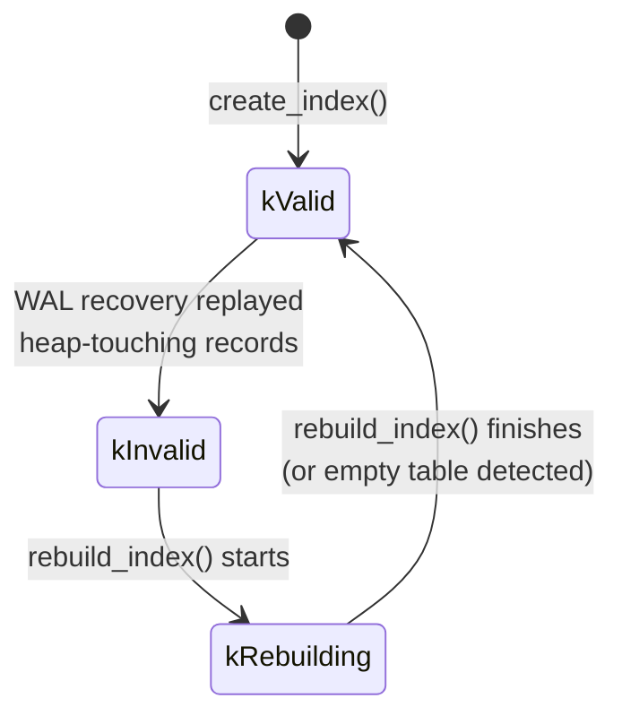

# B+ Tree Index Internals

This document describes the physical layout, algorithms, and system integration
of MiniDB's B+ tree index implementation. All constants, layouts, and
behaviours are derived directly from the source in `src/index/btree.h`,
`src/index/btree.cpp`, `src/index/index_key.h`, `src/index/index_key.cpp`,
and their call-sites in the executor, WAL, GC, and catalog subsystems.

---

## 1. B+ Tree Structure

### Page geometry

Every B+ tree node occupies exactly one 8 KB page (`kPageSize = 8192`).

```
Page layout (8192 bytes):

 Offset 0        24       32                                          8184  8192
 +---------------+--------+--------------------------------------------+------+
 |  PageHeader   |  Node  |              Key Slots ...                 | tail |
 |   (24 B)      | Header |                                           |      |
 |               | (8 B)  |                                           |      |
 +---------------+--------+--------------------------------------------+------+
                  ^                                                     ^
          kPageHeaderSize                                     next_leaf / rightmost_child
          + kIndexNodeHeaderSize                              stored as PageId (u64)
          = kIndexKeyStart = 32                               at kPageSize - 8
```

**PageHeader** (24 bytes) is the standard MiniDB page header shared by all page
types (heap, index-meta, index-data). It stores the page ID, page type
discriminator, LSN, num_tuples counter, and free-space offset.

**NodeHeader** (8 bytes, starting at byte 24):

| Offset | Size | Field |
|--------|------|-------|
| 0      | 1    | `is_leaf` flag (1 = leaf, 0 = internal) |
| 1      | 2    | `num_keys` |
| 3      | 5    | reserved (zeroed) |

### Slot layouts

Each slot holds a fixed-size encoded `IndexKey` followed by either a RecordId
(leaf) or a child PageId (internal):

**Leaf slot** -- `kIndexLeafSlotSize = 522 bytes`:

```
[ encoded IndexKey (512 B) | page_id (u64, 8 B) | slot_idx (u16, 2 B) ]
  <--- kIndexKeyDataSize ---> <---------- kRecordIdSize = 10 ---------->
```

**Internal slot** -- `kIndexInternalSlotSize = 520 bytes`:

```
[ encoded IndexKey (512 B) | child PageId (u64, 8 B) ]
  <--- kIndexKeyDataSize ---> <--- sizeof(PageId) ---->
```

### Order and capacity

The tree order is computed at compile time from the page size and slot sizes.
The goal is to fit the maximum number of slots while reserving one physical
slot as a temporary overflow buffer (insert writes first, then splits).

```cpp
kIndexLeafPhysicalMaxKeys =
    (kPageSize - kIndexKeyStart - sizeof(PageId)) / kIndexLeafSlotSize
    = (8192 - 32 - 8) / 522
    = 15

kIndexInternalPhysicalMaxKeys =
    (kPageSize - kIndexKeyStart - sizeof(PageId)
     - kIndexKeyDataSize - sizeof(PageId)) / kIndexInternalSlotSize
    = (8192 - 32 - 8 - 512 - 8) / 520
    = 14

kIndexMaxKeys = min(15, 14) - 1 = 13
```

A node overflows when `num_keys > kIndexMaxKeys` (i.e., 14 entries in the
overflow slot). Underflow threshold for rebalancing is `kIndexMaxKeys / 2 = 6`.

### Leaf chain

Leaf nodes are linked into a singly-linked list via a `next_leaf` PageId
stored at the last 8 bytes of the page (`kPageSize - sizeof(u64)`). This
enables efficient range scans: after locating the starting leaf, the scan
follows the chain forward without re-traversing internal nodes.

### Internal node child pointers

In an internal node with `n` keys (key[0] .. key[n-1]):

- `child[i]` (for `i` in `0..n`) is stored inline in slot `i` at the
  child-PageId position of each internal slot.
- `child[i]` covers keys in the range `(key[i-1], key[i]]` (key[-1] = -inf,
  key[n] = +inf).
- The rightmost child `child[n]` lives in the slot position of key index `n`,
  which is the overflow slot space. For duplicate-key splits, the leftmost
  child for equal separators is chosen so leaf-chain scans see all duplicates.

### Meta page

Every B+ tree has a meta page at page number 0 within its file-id namespace
(`make_page_id(index_id, 0)`). The meta page stores:

```cpp
struct BTreeMetaPage {      // packed, stored at kPageHeaderSize
    PageId root_page_id;    // 8 bytes
    u32    next_page_num;   // 4 bytes
    u32    reserved;        // 4 bytes
};
```

The meta page is updated on every structural change (split, merge, new root).

---

## 2. IndexKey -- Composite Physical Key

`IndexKey` is the unified key representation used throughout the index
subsystem. It stores a `Vector<Value>` and supports encoding to / decoding
from a fixed-size binary slot.

### Supported types

`TypeId::kBool`, `TypeId::kInt32`, `TypeId::kInt64`, `TypeId::kFloat`,
`TypeId::kDouble`, `TypeId::kVarchar`, `TypeId::kNull`.

The `btree_supports_type()` helper in `insert.cpp`, `update.cpp`, and
`database.cpp` enforces this set; columns of unsupported types cannot
participate in an index.

### Binary encoding format

Maximum encoded size: `kIndexKeyMaxEncodedSize = 512 bytes`.

```
Offset  Size   Field
------  -----  -----
0       2      magic (0x494B, "IK")
2       2      column count (u16)
4       2      payload size (u16, = encoded_size - 6)
6..     var    per-column data:
                 type_id  (u8)
                 value    (type-dependent, see below)
```

Per-column encoded value sizes:

| Type    | Encoding |
|---------|----------|
| kNull   | 0 bytes (type byte only) |
| kBool   | 1 byte |
| kInt32  | 4 bytes |
| kInt64  | 8 bytes |
| kFloat  | 4 bytes |
| kDouble | 8 bytes |
| kVarchar | 2-byte length prefix (u16) + raw bytes |

The slot is zero-padded to `kIndexKeyMaxEncodedSize` on encode. Decode reads
only `6 + payload` bytes, making it safe even if trailing bytes are dirty.

### IndexKeySchema

Per-column metadata controlling comparison behaviour:

```cpp
struct IndexKeyColumn {
    TypeId type;
    bool   descending;     // invert comparison result
    bool   nulls_first;    // NULL sorts before non-NULL (default true)
    u32    collation_id;   // reserved for future collation support
};
```

### Comparison semantics

`IndexKey::compare(other, schema)` proceeds column-by-column:

1. If either value is NULL: `nulls_first` determines ordering. Two NULLs
   compare equal.
2. Otherwise delegate to `Value::compare()`.
3. If `descending`, negate the comparison result.
4. If all compared columns are equal but column counts differ, the shorter
   key sorts first.

Operator overloads (`<`, `<=`, etc.) call `compare()` with no schema, which
defaults to ascending / nulls-first for all columns.

### Prefix matching

`starts_with(prefix, schema)` returns true if the first `prefix.column_count()`
columns of `this` match the prefix exactly (respecting descending and
nulls_first). Used for composite prefix scans where the search key has fewer
columns than the stored key.

### Size guard

`fits(slot_size)` returns true iff `encoded_size() <= slot_size` and the key
has at most 255 columns. Every insert path calls `fits()` before attempting a
tree insertion; oversized keys are rejected at the caller level.

---

## 3. Search Operations

### Point lookup: `search(key)`

```
ReadGuard(tree_latch_)
leaf_id = find_leaf(key)
while leaf_id != null:
    for each entry in leaf:
        if key.column_count < entry_key.column_count:
            if entry_key.starts_with(key):  // prefix match
                collect entry RID
            else if entry_key > key:
                return results
        else:
            if entry_key == key:
                collect entry RID
            else if entry_key > key:
                return results
    leaf_id = leaf_next(leaf)
return results
```

The prefix-match branch enables a single-column search key to match
multi-column composite entries, which is needed for covering-index lookups
on a leading prefix.

### Range search: `range_search(low, high)`

```
ReadGuard(tree_latch_)
leaf_id = find_leaf(low)
while leaf_id != null:
    for each entry in leaf:
        if entry_key >= low and entry_key <= high:
            collect entry RID
        if entry_key > high:
            return results
    leaf_id = leaf_next(leaf)
return results
```

### Iterator-based scan: `scan_next` / `scan_next_entry`

These are stateful cursor-style interfaces. The caller maintains a `leaf_id`
and `slot_idx` across calls; on first call both are initialized to
`kNullPageId` / 0 and the method finds the starting leaf internally.

```cpp
bool scan_next(const IndexKey& low, const IndexKey& high,
               PageId* leaf_id, u16* slot_idx,
               const RecordId* skip_rid, RecordId* rid);
```

- Returns true and populates `*rid` when a matching entry is found.
- Advances `*leaf_id` / `*slot_idx` so the next call resumes from the
  following position.
- `skip_rid`: if non-null, the entry matching this RID is skipped. This is
  used by the executor to avoid returning a row that has already been
  visibility-checked and rejected in the current iteration.
- Prefix mode activates when `low == high` and `low.column_count() <
  entry.column_count()`: the scan matches any entry whose leading columns
  equal the search key.

`scan_next_entry` is identical but also populates an `IndexKey* key` output
parameter, used for index-only scans that need the stored key values without
fetching the heap tuple.

### find_leaf

Despite the name suggesting a top-down tree traversal, the current
implementation uses a linear leaf-chain scan:

1. Start from `leftmost_leaf()` (descend from root following child[0] at
   every internal level).
2. Walk the leaf chain, tracking the last leaf whose maximum key is >= the
   search key.
3. Return that leaf.

`find_leaf_with_parent` performs a true top-down traversal through internal
nodes using binary comparison at each level, and also returns the parent
PageId. It is used by `insert` for split operations.

---

## 4. Insert

### Algorithm

```
WriteGuard(tree_latch_)
if key does not fit in slot: return false
if tree is empty: create root leaf

leaf_id = find_leaf(key)
parent_id = find_parent(root, leaf_id)
insert_into_leaf(leaf_id, key, rid)

if num_keys > kIndexMaxKeys:
    split_leaf(leaf_id, parent_id)
```

### insert_into_leaf

Finds the sorted insertion position via linear scan, shifts entries right by
one slot using `memmove`, writes the new key and RID, and increments
`num_keys`.

### split_leaf

1. Compute `mid = num_keys / 2`.
2. Allocate a new page; initialize it as a leaf.
3. Copy entries `[mid .. n-1]` from the old leaf to the new leaf using
   `memcpy`.
4. Update old leaf: `num_keys = mid`.
5. Link: `new_leaf.next = old_leaf.next; old_leaf.next = new_leaf_id`.
6. Promote `new_leaf.key[0]` to the parent via `insert_into_parent`.
7. If the parent is null (root was a leaf): create a new root with one key
   and two children.

### insert_into_parent

If `parent_id == kNullPageId`, creates a new root:

```
new_root.is_leaf = 0
new_root.num_keys = 1
new_root.key[0] = promoted_key
new_root.child[0] = left
new_root.child[1] = right
root_page_id_ = new_root_id
save_meta()
```

Otherwise, inserts the promoted key into the parent's sorted key array,
shifts keys and children right, and checks for overflow. If
`num_keys > kIndexMaxKeys`, calls `split_internal`.

### split_internal

1. Compute `mid = num_keys / 2`.
2. The key at position `mid` is promoted to the grandparent.
3. Entries `[mid+1 .. n-1]` and children `[mid+1 .. n]` move to a new
   internal node.
4. Old node retains entries `[0 .. mid-1]` and children `[0 .. mid]`.
5. `insert_into_parent` is called recursively for the grandparent. If the
   grandparent is null, a new root is created.

This recursive splitting can propagate all the way to the root, increasing
the tree height by one.

---

## 5. Delete

### Algorithm

```
WriteGuard(tree_latch_)
Traverse from root to find the target leaf (internal-node binary search)
Scan leaves via chain for matching (key, rid) pair
If found: remove_from_leaf(leaf_id, key, rid)
```

### remove_from_leaf

1. Find the entry in the leaf by matching both key and RID. If
   `rid.page_id == kNullPageId`, any RID with the matching key is removed.
2. Shift entries left using `memmove`.
3. Decrement `num_keys`.
4. If the removed entry was at position 0 and the leaf is not now empty,
   update the parent's separator key to reflect the new first key.
5. If the leaf is now empty and it is the root: set `root_page_id_ = null`.
6. If the leaf is now empty and it is not the root: call `unlink_empty_leaf`.
7. Call `refresh_internal_separators` from the root to ensure all parent
   keys accurately reflect the first key of each right subtree.

### rebalance_after_remove

Triggered when a node's `num_keys` drops below `kIndexMaxKeys / 2 = 6`:

1. **Borrow from left sibling**: if the left sibling has more than `kMinKeys`
   entries, move its last entry to the front of the underflowing node and
   update the parent separator.

2. **Borrow from right sibling**: if the right sibling has more than
   `kMinKeys` entries, move its first entry to the end of the underflowing
   node and update the parent separator.

3. **Merge**: if both siblings are at minimum occupancy, merge the
   underflowing node with a sibling:
   - `merge_leaves`: copies all entries from the right leaf to the end of
     the left leaf, updates `next_leaf`, and removes the separator from the
     parent.
   - `merge_internal_nodes`: pulls the parent separator down as the middle
     key, copies all keys and children from the right node, and removes the
     separator from the parent.
   - After merge, if the parent is underfull, propagate rebalancing upward
     recursively.
   - If the parent has 0 keys after merge and is not the root, its sole
     remaining child becomes the new subtree root.

### unlink_empty_leaf

When a leaf becomes completely empty:

1. Walk the leaf chain from `leftmost_leaf()` to find the predecessor.
2. Relink: `predecessor.next = empty_leaf.next`.
3. Find the empty leaf's position in its parent's child array.
4. Remove the child pointer and its associated separator key from the parent.
5. If the parent has 0 keys and is the root, the parent's only remaining
   child becomes the new root.

### refresh_internal_separators

A post-deletion fixup that recursively walks the entire tree from the root
and recomputes every internal separator key to be the first key in the
corresponding right subtree. This is a correctness safeguard that ensures
separator keys remain accurate after complex structural changes.

---

## 6. Concurrency Control

The B+ tree uses a per-tree reader-writer lock (`tree_latch_` of type
`RwLock`):

- **All mutations** (`insert`, `remove`) acquire a `WriteGuard` (exclusive
  lock) for the duration of the entire operation, including any splits,
  merges, and meta-page updates.
- **All reads** (`search`, `range_search`, `scan_next`, `scan_next_entry`,
  `validate_structure`) acquire a `ReadGuard` (shared lock).

This is a coarse-grained locking strategy. It is correct but limits
write-heavy concurrency to serial execution per tree. There is no latch
crabbing, lock coupling, or B-link tree protocol.

Read-only callers (`find_leaf`, `leftmost_leaf`, `find_parent`,
`first_key_in_subtree`) use `const_cast<BufferPool*>(pool_)` to call
`fetch_page` from `const` methods, since the buffer pool's fetch is not
const-qualified.

---

## 7. Index State Machine

The `IndexState` enum (defined in `catalog.h`) controls whether the query
optimizer is allowed to generate index-scan plans:

```cpp
enum class IndexState : u8 {
    kValid      = 0,   // safe for the optimizer
    kInvalid    = 1,   // rebuild needed before use
    kRebuilding = 2,   // rebuild in progress
};
```

State is stored in the `IndexEntry` struct and persisted with the catalog.

### State transitions



### Optimizer guards

The optimizer checks `index->state == IndexState::kValid` before emitting
`IndexScan`, `IndexOnlyScan`, or `IndexLookupJoin` plan nodes. Indexes in
`kInvalid` or `kRebuilding` state are silently skipped, causing the optimizer
to fall back to sequential scans.

### Crash recovery flow

1. `WalManager::recover()` replays WAL records against the heap.
2. After `recover()` returns, `Database` constructor flips **every** index
   to `kInvalid` via `catalog_.for_each_index(...)`.
3. `rebuild_all_indexes()` iterates every index entry and calls
   `rebuild_index()` on each.
4. `rebuild_index()`:
   - Sets state to `kRebuilding`.
   - Creates a fresh `BPlusTree` (new meta + root page).
   - Full-table scans the heap; for every live tuple (`xmax == kInvalidTxnId`)
     whose key fits, inserts into the tree.
   - Sets state to `kValid`.
5. `flush()` is called to persist all rebuilt index pages.

A fault-injection hook (`MINIDB_FAULT=skip_index_rebuild`) allows tests to
verify the optimizer refuses invalid indexes.

---

## 8. Index Maintenance (DML)

### INSERT

`Database::insert_index_entries(table_id, tuple, rid)`:

For every index on the table:
1. Build an `IndexKey` from the tuple's indexed columns.
2. Check `key.fits()`. Skip if oversized.
3. Write a WAL `kIndexInsert` record.
4. Call `tree->insert(key, rid)`.
5. If insert fails (e.g., key too large after encoding), return false. The
   caller surfaces an error and the transaction's undo path removes the heap
   row plus any partial index entries.

### DELETE

Index entries are **not** removed at DELETE time. The heap tuple's `xmax` is
stamped, but the B+ tree entry remains. This is the "lazy cleanup" strategy:

- Older snapshots under snapshot isolation (SI) may still need to find and
  visibility-check the row via the index.
- The `GarbageCollector::run_gc()` method is the sole path that removes stale
  index entries. When a tuple becomes invisible to all active transactions
  (`is_garbage()` returns true), GC calls
  `Database::delete_index_entries(table_id, tuple, rid)`, which:
  1. Builds the `IndexKey`.
  2. Writes a WAL `kIndexDelete` record.
  3. Calls `tree->remove(key, rid)`.

### UPDATE

The update path checks whether the modification is HOT-eligible:

- **HOT update** (Heap-Only Tuple): if none of the modified columns
  participate in any index (`Catalog::any_column_indexed` returns false), the
  new tuple version is written to the same heap page and linked via the
  version chain. No index entries are added or removed.

- **Non-HOT update**: a new heap tuple is inserted on a potentially different
  page. `insert_index_entries` is called for the new version. The old
  version's index entry is **not** removed -- it stays until GC, preserving
  SI visibility. After all updates complete,
  `rebuild_indexes_for_table(table_id)` is called to rebuild every index on
  the table (a brute-force correctness measure for the non-HOT path).

---

## 9. Unique Index Enforcement

### Insert path

`InsertExecutor::violates_unique_constraints()`:

1. Collect all uniqueness groups: columns marked `is_primary` or `is_unique`
   in the schema, plus `key_columns` from any unique index entries in the
   catalog.
2. For each group, attempt an index-accelerated check:
   - Build a lookup key from the candidate row.
   - Call `tree->search(lookup_key)` to find existing entries.
   - For each match, read the heap tuple and call
     `tuple_live_for_unique_check()` to determine visibility. If any live
     match exists, the insert is rejected.
3. If no index covers a particular unique group, fall back to a full heap
   scan comparing projected column values.
4. Within a multi-row INSERT, a `pending_unique_keys` hash map detects
   intra-batch duplicates.

### Update path

`UpdateExecutor::violates_unique_constraints(row, self_rid)` works
identically but skips the row's own RID (`self_rid`) to avoid a
false-positive self-conflict.

### Concurrency

Key-level locks (`LockManager::lock_key`) serialize concurrent inserts of the
same unique key value. The first transaction to acquire the lock proceeds; the
second blocks or receives a conflict error.

### Composite unique indexes

Uniqueness is checked on the full composite key. Two rows that share some
but not all key columns are not considered duplicates.

---

## 10. WAL Integration

### Record types

| WalType         | Value | Description |
|-----------------|-------|-------------|
| `kIndexInsert`  | 13    | Index entry added |
| `kIndexDelete`  | 14    | Index entry removed |

### WAL record format for index operations

Both `log_index_insert` and `log_index_delete` use the same packed layout:

```
struct __attribute__((packed)) {
    u32 index_id;     // which index
    u64 page_id;      // RID page
    u16 slot_idx;     // RID slot
    u16 key_size;     // length of serialized key value
};
// followed by key_size bytes of serialized Value
```

The key payload is dynamically sized but bounded by the `u16 key_size` field
(max 65535 bytes). A `key_size` of 0 or greater than 0xFFFF causes the log
call to return 0 (failure).

### Recovery strategy

MiniDB uses a **lazy rebuild** strategy for indexes:

1. During WAL replay, `kIndexInsert` and `kIndexDelete` records are present
   in the log but are **not directly replayed** against the B+ tree.
2. After replay completes, `rebuild_all_indexes()` reconstructs every index
   from scratch by scanning the heap.
3. This makes index WAL records primarily an audit trail and a foundation
   for future incremental recovery.

The advantage is simplicity: no partial-state index recovery logic is needed.
The cost is that recovery time is proportional to the total heap size, not
just the WAL size.

---

## 11. Structural Validation

`validate_structure(String* error)` performs a comprehensive integrity check
on the B+ tree. It acquires a `ReadGuard` and runs two passes:

### Pass 1: Recursive node validation (`validate_node`)

Starting from the root, recursively visits every node:

- **Null child detection**: any null child pointer in an internal node is an
  error.
- **Cycle detection**: a `HashMap<PageId, bool>` tracks visited pages. If a
  page is visited twice, a cycle is reported.
- **Key ordering**: within each leaf, keys must be in non-decreasing order.
- **Leaf depth uniformity**: all leaves must be at the same depth.
- **Capacity check**: `num_keys <= kIndexMaxKeys` for every node.

### Pass 2: Leaf chain validation

Starting from `leftmost_leaf()`, walks the entire leaf chain:

- **Chain cycle detection**: separate visited set.
- **Non-leaf detection**: every page in the chain must have `is_leaf == 1`.
- **Global key ordering**: keys across the entire leaf chain must be in
  non-decreasing order.

Errors are reported via a `String*` parameter. If multiple errors exist, only
the first is captured.

---

## 12. Edge Cases

### Empty tree

`root_page_id_ == kNullPageId`. All search operations return empty results.
The first `insert()` call triggers `create()`, which allocates a meta page
and a root leaf page with 0 keys.

### Single-key tree

Root is a leaf with `num_keys == 1`. No internal nodes exist. Searches either
find the one key or return empty.

### Maximum key size

`kIndexKeyMaxEncodedSize = 512 bytes`. The `fits()` check also requires
`column_count <= 255`. A VARCHAR value that causes the encoded form to exceed
512 bytes will be rejected by `fits()`, and the insert will either skip that
index entry or fail depending on the caller's error handling.

For a single-column VARCHAR index, the maximum storable string length is
approximately `512 - 6 (header) - 1 (type) - 2 (length prefix) = 503 bytes`.

### NULL keys

NULL values are stored in the index and compared according to the
`nulls_first` setting (default: true, meaning NULLs sort before all non-NULL
values). Two NULL values in the same column compare as equal. For unique
index enforcement, if any key column is NULL, the unique check is skipped
(following SQL semantics where NULL != NULL).

### Duplicate keys in non-unique indexes

Multiple entries with the same `IndexKey` but different `RecordId` values
coexist in the tree. They occupy consecutive slots in leaf nodes. `search()`
follows the leaf chain to collect all matching RIDs. `remove()` uses the
`(key, rid)` pair to identify the exact entry to delete.

### Chain-hop protection

All leaf-chain and tree-traversal loops are bounded by
`kMaxPageChainHops = 1,000,000` to prevent infinite loops in case of data
corruption. The loops also use visited-page hash maps as a secondary cycle
guard.

---

## Appendix: Key Constants

| Constant | Value | Source |
|----------|-------|--------|
| `kPageSize` | 8192 | `config.h` |
| `kPageHeaderSize` | 24 | `config.h` |
| `kIndexNodeHeaderSize` | 8 | `btree.h` |
| `kIndexKeyStart` | 32 | `btree.h` |
| `kIndexKeyMaxEncodedSize` | 512 | `index_key.h` |
| `kIndexKeyDataSize` | 512 | `btree.h` (= `kIndexKeyMaxEncodedSize`) |
| `kRecordIdSize` | 10 | `btree.h` |
| `kIndexLeafSlotSize` | 522 | `btree.h` |
| `kIndexInternalSlotSize` | 520 | `btree.h` |
| `kIndexLeafPhysicalMaxKeys` | 15 | `btree.h` (computed) |
| `kIndexInternalPhysicalMaxKeys` | 14 | `btree.h` (computed) |
| `kIndexMaxKeys` | 13 | `btree.h` (computed) |
| `kMaxPageChainHops` | 1,000,000 | `config.h` |

## Appendix: Source Files

| File | Role |
|------|------|
| `src/index/btree.h` | B+ tree class, constants, slot layout |
| `src/index/btree.cpp` | All tree algorithms |
| `src/index/index_key.h` | IndexKey class, IndexKeySchema, encoding constants |
| `src/index/index_key.cpp` | Comparison, encoding, decoding, to_string |
| `src/index/index_iterator.h/.cpp` | Materialized iterator over search/range_search results |
| `src/catalog/catalog.h` | IndexState enum, IndexEntry struct |
| `src/database/database.cpp` | insert_index_entries, delete_index_entries, rebuild_index |
| `src/recovery/wal.h/.cpp` | log_index_insert, log_index_delete |
| `src/recovery/gc.cpp` | Lazy index cleanup on garbage collection |
| `src/sql/executor/insert.cpp` | Unique constraint checking via index |
| `src/sql/executor/update.cpp` | HOT eligibility, non-HOT index maintenance |
| `src/sql/optimizer/optimizer.cpp` | IndexState::kValid guards on plan generation |
