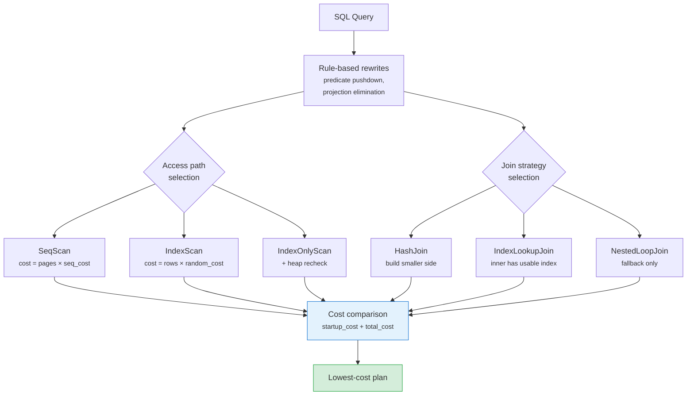

# Optimizer Cost Model

MiniDB uses a rule-assisted cost model. Rules apply semantic rewrites first; costs choose among access and join alternatives.

## Statistics

`ANALYZE` persists table-level row/page counts and per-column statistics:

- NDV
- null count
- numeric min/max

Statistics are considered fresh when analyzed rows are within 20% of current table row count. Stale or missing statistics fall back to current catalog row/page counts and conservative selectivity defaults.

NDV collection uses typed value encoding, so `VARCHAR`, numeric, boolean, and null values do not collapse into the same key. Exact NDV collection is capped per column to bound memory use on very high-cardinality columns.

## Selectivity

- Equality predicates use `1 / NDV` when fresh stats exist.
- Range predicates use min/max when available.
- Unknown predicates fall back to conservative defaults.
- Join equality selectivity uses `1 / max(left_ndv, right_ndv)` after clamping NDV to side cardinality.
- Cross joins use full Cartesian cardinality.
- Left joins preserve at least left-side cardinality in estimates.

## Plan Choices

The optimizer can choose:

- sequential scan
- index scan / index-only scan
- hash join with build-side choice
- index lookup join when the inner side has a usable index
- nested loop only when no better equi-join strategy applies
- projection and predicate pushdown where semantics allow it

For `LEFT JOIN`, right-side `WHERE` predicates are not pushed below the join because that would change null-extension semantics.

## Remote Storage Costing

When remote storage mode is enabled, scan and lookup costs include remote page and round-trip constants. Random index lookups are therefore not always preferred over sequential access.

## Predicate Pushdown Safety

Predicates are pushed below joins when semantically safe:

- **INNER JOIN**: predicates referencing only one side are pushed below
  the join to the scan level, reducing rows before the join.
- **LEFT JOIN**: right-side `WHERE` predicates are **not** pushed below
  the join, because doing so would change null-extension semantics.
  Only `ON` conditions filter during the join; `WHERE` filters after.
- **HAVING**: pushed only when semantically equivalent to a `WHERE`
  predicate (no aggregate references).
- **Subquery decorrelation**: `NOT IN` with NULL is handled carefully
  to avoid unsafe rewrites.

## Projection Pushdown

The optimizer eliminates unnecessary columns early in the plan tree:

- Columns needed by `ORDER BY`, `GROUP BY`, `HAVING`, `DISTINCT`, and
  `UNION` are preserved through the plan.
- Covering-index projection is separated from MVCC visibility proof —
  IndexOnlyScan always does a heap recheck (no visibility map yet).
- Dropped columns (`is_dropped` flag) are excluded from `SELECT *`
  expansion in the planner via an explicit `ProjectionPlan`.

## Plan Cost Fields

Every `PlanNode` carries cost annotations used by the optimizer:

| Field | Type | Meaning |
|-------|------|---------|
| `startup_cost` | `double` | Cost before first row is emitted |
| `total_cost` | `double` | Total cost to produce all rows |
| `plan_rows` | `double` | Estimated row count |
| `optimizer_note` | `String` | Textual explanation of optimiser choice |

`EXPLAIN` displays these fields for each node in the plan tree.

## Current Boundaries

- Multi-column MCV/histogram statistics are not complete.
- Adaptive execution feedback is not yet used to retrain costs.
- Bushy join enumeration is limited compared with production CBOs.
- No query plan caching — every execution re-plans from scratch.
- No parameterized plans — bind variables are inlined.
