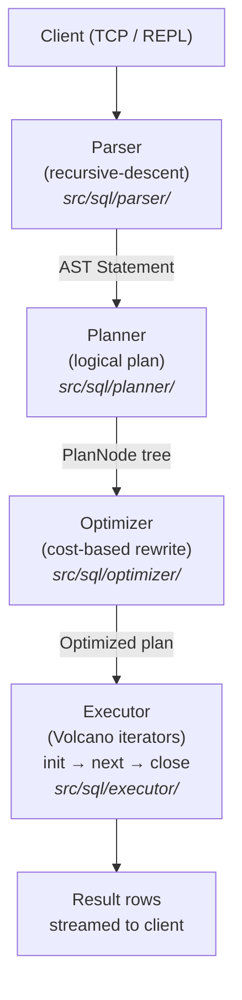
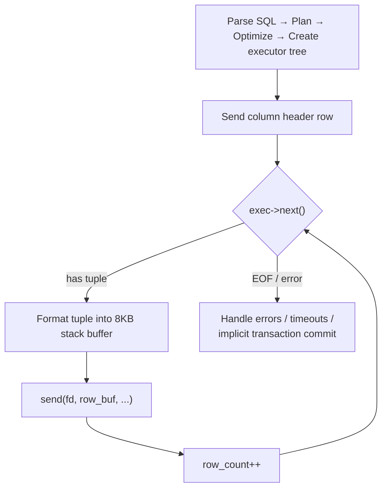

# Query Execution Pipeline

This document describes MiniDB's query execution pipeline in precise technical
detail. MiniDB is a from-scratch C++ database engine that follows the classical
Volcano-style iterator model found in PostgreSQL and similar systems.

---

## 1. SQL Pipeline Overview

A SQL statement flows through four sequential stages before any data is
returned to the client:



### 1.1 Parser

The parser (`Parser` in `src/sql/parser/parser.h`) is a hand-written
recursive-descent parser that produces an AST rooted at a `Statement` node.
The lexer (`Lexer` in `src/sql/parser/lexer.h`) tokenises the input first.

Supported statement types (`StmtType` enum):

| Category | Types |
|---|---|
| DML | `kSelect`, `kInsert`, `kUpdate`, `kDelete` |
| DDL | `kCreateTable`, `kDropTable`, `kCreateIndex`, `kDropIndex`, `kAlterTable` |
| Transaction | `kBegin`, `kCommit`, `kRollback` |
| Utility | `kShowTables`, `kDescTable`, `kExplain`, `kAnalyze` |
| Prepared | `kPrepare`, `kExecute`, `kDeallocate` |

Expressions are represented by the `Expression` struct with variants
distinguished by `ExprType`: `kLiteral`, `kColumnRef`, `kBinaryOp`,
`kUnaryOp`, `kStar`, `kSubquery`, `kCase`.

### 1.2 Planner

The planner (`Planner` in `src/sql/planner/planner.h`) converts the parsed AST
into a tree of `PlanNode` objects. Each `plan()` call also immediately invokes
the optimizer on the resulting tree before returning:

```cpp
UniquePtr<PlanNode> Planner::plan(const Statement& stmt) {
    // ... build logical plan ...
    return optimize_plan(catalog_, optimizer_config_, logical_plan);
}
```

The planner resolves table names against the `Catalog`, builds `SeqScanPlan`
nodes for table accesses, constructs `JoinPlan` trees for multi-table queries,
and layers `FilterPlan`, `ProjectPlan`, `SortPlan`, `LimitPlan`,
`DistinctPlan`, `AggregatePlan`, and `UnionPlan` on top as needed.

### 1.3 Optimizer

The optimizer (`Optimizer` in `src/sql/optimizer/optimizer.h`) performs a
single recursive pass over the plan tree. It makes cost-based decisions about
access paths (sequential scan vs. index scan vs. index-only scan), join
algorithms (nested loop vs. hash join vs. index lookup), and applies rule-based
rewrites such as predicate pushdown and projection pushdown. See Section 5 for
full details.

### 1.4 Executor Factory

`ExecutorFactory` (`src/sql/executor/executor_factory.h`) walks the optimised
`PlanNode` tree and creates the corresponding `Executor` iterator tree. It also
handles table-level locking (acquiring `AccessShare` or `RowExclusive` locks
via the lock manager) and materialises scalar subqueries into literal values
before handing expressions to filter executors.

---

## 2. Plan Node Types

All plan nodes inherit from `PlanNode` and carry common cost metadata:

```cpp
struct PlanNode {
    PlanNodeType type;
    Schema       output_schema;   // columns produced by this node
    double       startup_cost;    // cost before first row is returned
    double       total_cost;      // cost to return all rows
    double       plan_rows;       // estimated output cardinality
    String       optimizer_note;  // human-readable optimisation decision
};
```

### 2.1 PlanNodeType Enum

```cpp
enum class PlanNodeType {
    kOneRow, kSeqScan, kInsert, kDelete, kUpdate, kFilter, kProject,
    kJoin, kLimit, kSort, kDistinct, kAggregate, kUnion,
    kIndexScan, kIndexOnlyScan,
};
```

### 2.2 Leaf Nodes (Table Access)

| Node | Key Fields | Description |
|---|---|---|
| `OneRowPlan` | (none) | Produces a single empty tuple. Used for `SELECT 1+1` style queries with no FROM clause. |
| `SeqScanPlan` | `table_id`, `table_name`, `projected_columns` | Full sequential scan of a heap file. `projected_columns` is populated by the optimiser when late materialisation is applied. |
| `IndexScanPlan` | `table_id`, `index_id`, `search_key`, `is_range`, `range_high` | B+ tree lookup followed by heap tuple fetch. `is_range=false` for equality, `is_range=true` for range scans using `[search_key, range_high]`. |
| `IndexOnlyScanPlan` | `table_id`, `index_id`, `search_key`, `is_range`, `range_high` | Same key structure as `IndexScanPlan` but returns data directly from the index leaf entries. Still performs a heap visibility recheck (MiniDB does not maintain a visibility map). |

### 2.3 DML Nodes

| Node | Key Fields | Description |
|---|---|---|
| `InsertPlan` | `table_id`, `values` (`Vector<Vector<Value>>`) | Multi-row `VALUES` insert. Each inner vector is one row. |
| `DeletePlan` | `table_id`, `child` | `child` is a scan that produces rows to delete. |
| `UpdatePlan` | `table_id`, `set_clauses` (`Vector<Pair<String, Expression>>`), `where_clause`, `child` | `child` scans rows; `set_clauses` are column-name + expression pairs applied to each matching row. |

### 2.4 Relational Operator Nodes

| Node | Key Fields | Description |
|---|---|---|
| `FilterPlan` | `predicate`, `child` | Evaluates a boolean expression; passes through rows where predicate is TRUE. |
| `ProjectPlan` | `column_indices`, `expressions`, `child` | Produces output columns by index selection or expression evaluation. |
| `JoinPlan` | `left`, `right`, `on_condition`, `join_type`, `algorithm`, `hash_build_left`, `lookup_inner_table_id`, `lookup_inner_index_id`, `hint_weight` | Binary join. `join_type` is `kInner` or `kLeft`. `algorithm` is `kNestedLoop`, `kHash`, `kIndexLookup`, or `kMerge`. `hash_build_left` controls which side builds the hash table. `hint_weight > 0` favours hash; `< 0` favours nested loop. |
| `LimitPlan` | `limit`, `offset`, `child` | `-1` means unlimited/no offset. |
| `SortPlan` | `keys` (`Vector<SortKey>`), `child`, `top_n` | Each `SortKey` is an expression + ascending flag. `top_n >= 0` activates the bounded-heap optimisation when LIMIT is small. |
| `DistinctPlan` | `child` | Eliminates duplicate rows. |
| `AggregatePlan` | `aggregates` (`Vector<AggregateColumn>`), `group_by`, `having`, `child` | Each `AggregateColumn` has `func` (COUNT/SUM/AVG/MIN/MAX), `argument` expression, `alias`, and `distinct` flag. |
| `UnionPlan` | `left`, `right`, `all` | `all=true` for UNION ALL; `all=false` applies deduplication. |

---

## 3. Executor Iterators (Volcano Model)

### 3.1 Interface

Every executor implements the `Executor` base class:

```cpp
class Executor {
public:
    virtual void init() = 0;           // reset state, prepare to scan
    virtual ExecResult next() = 0;     // return next tuple, or empty
    virtual const Schema& output_schema() const = 0;
    virtual bool fast_count(u64* count);      // optional short-circuit
    virtual bool last_record_id(RecordId*);   // optional RID tracking
};
```

`next()` returns an `ExecResult`: either `{has_tuple=true, tuple}` or
`{has_tuple=false}` signalling end-of-data. This is a pure pull-based
pipeline: every operator calls `child->next()` to demand the next tuple.

Cancellation is cooperative. A global `atomic<bool>` (`g_executor_interrupted`)
is set by the SIGINT handler and polled on every `executor_cancelled()` call in
the per-row hot path. Timeouts are checked via `g_executor_deadline`.

### 3.2 Scan Executors

**SeqScanExecutor** (`src/sql/executor/seq_scan.h`)

Scans all data pages of a heap file sequentially. For each slot on each page:
1. Reads the `LinePointer` to find the tuple.
2. Applies MVCC visibility checks (inspects `xmin`/`xmax` against the current
   transaction snapshot).
3. Follows version chains via `next_version` pointers when necessary
   (`follow_version_chain`, `follow_latest_committed`).
4. If `projected_columns` is non-empty, returns only the requested columns
   (late materialisation optimisation).

Also supports a `ParallelSeqScanExecutor` variant that partitions pages across
multiple workers when `enable_parallel_seqscan` is true, the scan has no
projected columns, and the heap has enough pages to justify parallelism
(at least `parallel_workers * 4` data pages).

**IndexScanExecutor** (`src/sql/executor/index_scan_executor.h`)

Uses a B+ tree to find matching `RecordId`s:
- Equality scan: calls `tree->search(search_key)` for exact match.
- Range scan: iterates the B+ tree leaf level from `search_key` up to
  `range_high`.

For each RID found, fetches the full tuple from the heap file and applies
MVCC visibility. Returns tuples one at a time. Tracks `last_rid_` for use
by DELETE/UPDATE executors that need to know which physical row was returned.

**IndexOnlyScanExecutor** (`src/sql/executor/index_scan_executor.h`)

Returns data extracted directly from index leaf entries, avoiding a full heap
tuple fetch. However, because MiniDB does not maintain a visibility map, it
still performs a **heap visibility recheck**: it fetches the heap tuple header
to verify the row is visible to the current transaction. The data values
returned come from the index, not the heap.

### 3.3 DML Executors

**InsertExecutor** (`src/sql/executor/insert.h`)

Inserts one or more tuples into the heap file. For each row:
1. Validates schema constraints: NOT NULL, VARCHAR length, CHECK expressions.
2. Checks UNIQUE constraints (via index probe if available, otherwise heap
   scan).
3. Serialises the tuple and calls `heap->insert()`.
4. Inserts corresponding entries into all indexes on the table.
5. Logs the operation to WAL (write-ahead log).
6. Records undo information in the transaction for rollback.

Returns a single result tuple with an `affected_rows` integer column.

**DeleteExecutor** (`src/sql/executor/delete.h`)

Marks tuples as deleted by setting `xmax` to the current transaction ID:
1. Pulls tuples from `child` (typically a filtered scan).
2. For each tuple, acquires a row-level exclusive lock.
3. Sets `xmax` on the heap tuple (logical delete; physical removal is
   deferred to garbage collection).
4. Logs to WAL and records undo information.

Returns `affected_rows`.

**UpdateExecutor** (`src/sql/executor/update.h`)

Implements **Halloween protection**: all target rows are materialised into
a `Vector<RecordId>` (the "frozen RID list") before any mutations begin.
This prevents the classic Halloween problem where a scan would re-encounter
its own writes.

For each materialised target:
1. Re-reads the current tuple from the heap.
2. Applies SET clause expressions via `ExpressionEvaluator`.
3. Acquires a row-level exclusive lock.
4. Performs a write-write conflict check (re-reads `xmax` after locking to
   detect concurrent modifications).
5. Validates the new row against schema constraints and CHECK constraints.
6. Checks UNIQUE constraints.
7. Attempts a **HOT (Heap-Only Tuple) update** when no indexed columns are
   modified: writes the new version on the same page and chains it from the
   old version via `next_version`. Falls back to a standard insert + delete
   when HOT is not possible.
8. Updates indexes (for non-HOT path), logs to WAL, records undo.

### 3.4 Relational Operator Executors

**FilterExecutor** (`src/sql/executor/filter.h`)

Evaluates a predicate expression on each tuple from `child`. Uses a fast path
(`ExpressionEvaluator::fast_evaluate`) for simple `column op literal`
predicates, falling back to full recursive evaluation. Only tuples where the
predicate evaluates to TRUE (not FALSE, not NULL) are passed through.

**ProjectExecutor** (`src/sql/executor/project.h`)

Produces output tuples with a new schema by:
- Selecting columns by index (`column_indices`), or
- Evaluating arbitrary expressions (`expressions`).

The optimiser may eliminate `ProjectPlan` nodes entirely by pushing projection
into the scan (late materialisation).

**HashJoinExecutor** (`src/sql/executor/hash_join_executor.h`)

Implements a hash join for equi-join conditions (`ON a.x = b.y`):

1. **Build phase**: materialises one side (chosen by the optimiser based on
   estimated cardinality) into an in-memory hash table. The hash table uses
   8192 buckets with chained entries (`HashJoinEntry` linked lists).
2. **Probe phase**: for each tuple from the other side, hashes the join key
   and probes the hash table for matches.
3. Supports `INNER` and `LEFT` join. For LEFT join, tracks whether each
   probe-side tuple found a match; emits a NULL-padded row if not.
4. **Spill-to-disk**: when the build side exceeds `work_mem`, switches to a
   Grace hash join strategy with 32 partitions. Both sides are partitioned
   to temp files by hash value, then processed one partition at a time.

**NestedLoopJoinExecutor** (`src/sql/executor/nested_loop_join.h`)

For each tuple from the left (outer) side, scans all tuples from the right
(inner) side and evaluates the join predicate. Supports INNER and LEFT join.
The right side is re-initialised (`init()`) for each new left tuple. This is
the fallback algorithm when hash join or index lookup is not applicable.

**IndexLookupJoinExecutor** (`src/sql/executor/index_lookup_join.h`)

For each tuple from the outer (left) side:
1. Extracts the join key value.
2. Performs a B+ tree index lookup on the inner table.
3. Fetches matching heap tuples and applies MVCC visibility.
4. Joins matching tuples.

This is chosen when the inner side has a usable index on the join column and
the outer side is small enough that repeated index lookups are cheaper than
building a hash table.

**SortExecutor** (`src/sql/executor/sort_executor.h`)

Materialises all input tuples, then sorts them:

- **In-memory path**: collects all tuples into a `Vector<Tuple>`, sorts using
  O(n log n) comparison sort.
- **Top-N optimisation**: when `top_n >= 0` (set when LIMIT is small), uses a
  bounded max-heap of size `top_n`. Only keeps the best N tuples in memory,
  discarding worse candidates immediately. Final output is the heap contents
  sorted.
- **External merge sort**: when accumulated tuple memory exceeds `work_mem`,
  writes sorted runs to temp files. At read time, performs a k-way merge
  across all run cursors, picking the smallest tuple at each step.

Comparison uses `ExpressionEvaluator` to evaluate sort key expressions on
each tuple, then compares values. NULLs sort last in ascending order (NULLs
compare greater than all non-NULL values via `Value::compare`).

**DistinctExecutor** (`src/sql/executor/distinct_executor.h`)

Materialises all input tuples and deduplicates them. Compares tuples
column-by-column for equality. NULL values are considered equal to each
other (NULLs collapse to one group, per SQL standard). Accepts
`work_mem_bytes` and `temp_dir` parameters for spill support.

**AggregateExecutor** (`src/sql/executor/aggregate_executor.h`)

Computes aggregates (COUNT, SUM, AVG, MIN, MAX) with optional GROUP BY
and HAVING:

- **No GROUP BY**: treats the entire input as one group. A single output row
  is always produced. If no input rows exist, COUNT returns 0 and
  SUM/AVG/MIN/MAX return NULL.
- **With GROUP BY**: uses hash aggregation. Evaluates GROUP BY expressions to
  compute a group key string, maps each group to a set of `AggState` accumulators.
- **DISTINCT aggregates**: (e.g., `COUNT(DISTINCT x)`) track seen values in a
  per-accumulator `HashMap<String, bool>` to skip duplicates.
- **Fast-count optimisation**: for `COUNT(*)` without GROUP BY or HAVING,
  delegates to `child->fast_count()` which can return the heap's tuple count
  directly without scanning.
- **Spill-to-disk**: when `work_mem` is set and the in-memory hash table
  grows too large, falls back to sort-based aggregation. Input tuples are
  written to sorted runs (sorted by group key), then merged with a k-way
  merge that aggregates groups as they stream in.

AVG is computed as `SUM / COUNT` and always produces a `double` result to
avoid integer truncation.

**LimitExecutor** (`src/sql/executor/limit_executor.h`)

Skips the first `offset` tuples (if offset > 0), then passes through up to
`limit` tuples. Subsequent `next()` calls return empty.

**UnionExecutor** (`src/sql/executor/union_executor.h`)

- **UNION ALL**: passes through all tuples from the left side, then all from
  the right side (simple concatenation, no deduplication).
- **UNION** (distinct): produces all tuples from both sides, then applies
  deduplication (same logic as DistinctExecutor).

**SubqueryInExecutor** (`src/sql/executor/subquery_in_executor.h`)

Evaluates `IN (subquery)` and `NOT IN (subquery)` predicates. Materialises
the subquery result set, then for each tuple from the outer child, checks
membership.

---

## 4. Expression Evaluation

The `ExpressionEvaluator` class (`src/sql/executor/expression_evaluator.h`)
evaluates `Expression` AST nodes against a `Tuple`.

### 4.1 Supported Operations

| Category | Operations |
|---|---|
| Column references | `table.column` or `column` (resolved by schema lookup) |
| Literals | Integer, float, string, boolean, NULL |
| Arithmetic | `+`, `-`, `*`, `/`, `%` |
| Comparison | `=`, `<>` / `!=`, `<`, `>`, `<=`, `>=` |
| Logical | `AND`, `OR`, `NOT` |
| NULL tests | `IS NULL` (`IS_NULL`), `IS NOT NULL` (`IS_NOT_NULL`) |
| Pattern matching | `LIKE` (with `%` and `_` wildcards) |
| Conditionals | `CASE WHEN ... THEN ... ELSE ... END` |
| Functions | `COALESCE(a, b)`, `NULLIF(a, b)`, `LENGTH(s)` |
| Subqueries | `IN (subquery)`, `NOT IN (subquery)`, scalar subqueries |
| Type coercion | Implicit numeric promotion across Bool/Int32/Int64/Float/Double |
| Unary | `-expr` (negation), `NOT expr` |

### 4.2 Three-Valued NULL Logic

MiniDB follows the SQL standard's three-valued logic:

**Comparison with NULL**: any comparison operator (`=`, `<>`, `<`, `>`, `<=`,
`>=`) returns NULL (UNKNOWN) when either operand is NULL.

**AND truth table** (with NULL/UNKNOWN):

| AND | TRUE | FALSE | NULL |
|---|---|---|---|
| **TRUE** | TRUE | FALSE | NULL |
| **FALSE** | FALSE | FALSE | FALSE |
| **NULL** | NULL | FALSE | NULL |

Key rule: `FALSE AND NULL = FALSE` (FALSE is absorbing for AND).

**OR truth table**:

| OR | TRUE | FALSE | NULL |
|---|---|---|---|
| **TRUE** | TRUE | TRUE | TRUE |
| **FALSE** | TRUE | FALSE | NULL |
| **NULL** | TRUE | NULL | NULL |

Key rule: `TRUE OR NULL = TRUE` (TRUE is absorbing for OR).

**NOT NULL = NULL**.

**Arithmetic with NULL**: any arithmetic operation where either operand is
NULL produces NULL (NULL propagation).

### 4.3 Filter Semantics

`FilterExecutor` only passes through tuples where the predicate evaluates to
`TRUE`. Both `FALSE` and `NULL` (UNKNOWN) are rejected. This follows the SQL
standard WHERE clause semantics.

### 4.4 Fast Evaluation Path

For the common pattern `column op literal` (where op is a comparison), the
evaluator provides `fast_evaluate()` which skips the full AST recursion.
This handles both `col = 42` and `42 = col` (reversed operands, with
comparison operator flipped). Also handles `column IS NULL` and
`column IS NOT NULL` on the fast path.

---

## 5. Optimizer Decisions

The optimizer (`Optimizer` in `src/sql/optimizer/optimizer.h`) is configured
via `OptimizerConfig`:

```cpp
struct OptimizerConfig {
    bool   enable_seqscan         = true;
    bool   enable_indexscan       = true;
    bool   enable_indexonlyscan   = true;
    bool   enable_hashjoin        = true;
    bool   remote_storage         = false;
    double local_seq_page_cost    = 0.03;
    double local_random_page_cost = 0.08;
    double remote_seq_page_cost   = 0.20;
    double remote_random_page_cost = 0.65;
    double remote_round_trip_cost = 0.50;
};
```

### 5.1 Access Path Selection

When a `FilterPlan` sits above a `SeqScanPlan`, the optimizer attempts to
replace the sequential scan with an index scan:

1. **Composite prefix key**: for multi-column indexes, collects equality
   predicates from AND conjuncts and builds the longest prefix key that
   matches the index's column order.
2. **Single-column equality** (`col = literal`): extracts column index and
   literal value; looks for a matching single-column index.
3. **Range predicates**: recognises patterns like `col >= lo AND col <= hi`
   or single-bound predicates (`col > lo`), filling the missing bound with
   the type's min/max sentinel value.

The index is only used if it is in `kValid` state (not being rebuilt) and
the indexed column type is B+ tree compatible (Bool, Int32, Int64, Float,
Double, Varchar).

**Index-Only Scan promotion**: when a `ProjectPlan` above an `IndexScanPlan`
requests only the indexed column, the optimizer converts it to an
`IndexOnlyScanPlan` with estimated cost reduced by 35% (`total_cost * 0.65`).

**Sort elimination**: when a `SortPlan` orders by the same column as an
underlying index scan (ascending, single-column), the sort node is removed
entirely and the index scan's `optimizer_note` is annotated with
`"+ order-preserving"`.

### 5.2 Cost Estimation

**Sequential scan cost**:
```
total_cost = pages * page_cost + rows * 0.05
```
Where `page_cost` is `local_seq_page_cost` (0.03) or `remote_seq_page_cost`
(0.20). Row count comes from `ANALYZE` statistics if fresh (within 20%
drift), otherwise from the catalog's live `num_tuples` counter, with a
fallback of 1000.

**Index scan cost**:
```
startup_cost = 0.15  (or remote_round_trip_cost for remote)
total_cost   = startup_cost + estimated_rows * (0.02 + random_page_cost)
```

**Selectivity estimation** (used for both index scans and filter nodes):

| Predicate | Selectivity |
|---|---|
| `col = literal` | `1 / NDV` (with fresh stats), else `0.01` |
| `col <> literal` | `1 - 1/NDV` (with fresh stats), else `0.99` |
| `col > literal` (and `>=`, `<`, `<=`) | `0.33` |
| `IS NULL` | `null_count / num_tuples` (with stats), else `0.1` |
| `IS NOT NULL` | `1 - selectivity(IS NULL)` |
| `AND` | `sel(left) * sel(right)` (independence assumption) |
| `OR` | `sel(left) + sel(right) - sel(left) * sel(right)` |
| Unique index equality | `1 / total_rows` (exactly 1 row) |
| Default | `0.1` |

Statistics freshness: stats are considered fresh when the drift between
`stat_num_tuples` (from last ANALYZE) and current `num_tuples` is within 20%.

### 5.3 Join Algorithm Selection

The optimizer computes costs for three join strategies and picks the cheapest:

**Nested Loop Join**:
```
cost = left_cost + left_rows * right_cost + left_rows * right_rows * 0.02
```

**Hash Join** (only for equi-joins, `ON a.x = b.y`):
```
cost = left_cost + right_cost + right_rows * 0.04 + left_rows * 0.02
```
Where 0.04 is the hash build rate and 0.02 is the probe rate.

**Index Lookup Join** (when inner side has a usable index):
```
cost = left_cost + left_rows * (lookup_startup + expected_matches * tuple_cost)
```
Where `lookup_startup` is 0.15 locally (or `remote_round_trip_cost +
remote_random_page_cost` for remote storage) and `tuple_cost` is 0.02
locally (0.08 remote).

Selection rules:
- **Index Lookup** is chosen when: it is cheaper than both hash and nested
  loop, OR the outer side has <= 1024 rows, OR the outer side is <= 1/10
  the inner side.
- **Hash Join** is chosen when: `enable_hashjoin` is true, the join has an
  equi-join condition, and hash cost <= nested loop cost.
- **Nested Loop** is the fallback.

**Build-side selection** for hash join: for INNER joins, the smaller relation
builds the hash table (`hash_build_left = left_rows <= right_rows`). For LEFT
joins, the right (inner) side always builds.

**Join selectivity**: for equality joins, estimated as `1 / max(NDV_left,
NDV_right)` when column statistics are available. Fallback: 0.1 with a join
condition, 1.0 (cross join) without one. LEFT JOIN output is guaranteed to be
at least `left_rows`.

### 5.4 Join Hint Weight

The `hint_weight` field on `JoinPlan` (propagated from the parser's
`Statement::join_hint`) adjusts costs without overriding the optimizer:
- `hint_weight > 0`: hash join cost is multiplied by
  `(1.0 - hint_weight * 0.1)`. E.g., `hint=1` gives a 10% discount.
- `hint_weight < 0`: nested loop cost is multiplied by
  `(1.0 + hint_weight * 0.1)`. E.g., `hint=-1` gives a 10% discount.

The optimizer still picks the cheapest option after adjustment.

### 5.5 Predicate Pushdown

When a `FilterPlan` sits above a `JoinPlan`, the optimizer splits the WHERE
predicate into AND conjuncts and classifies each:

| Classification | Condition | Action |
|---|---|---|
| Left-pushable | Can be evaluated using only left-side columns | Pushed below join as a filter on the left child |
| Right-pushable | Can be evaluated using only right-side columns AND join is INNER | Pushed below join as a filter on the right child |
| Residual | References both sides, or is a right-side predicate on a LEFT JOIN | Remains above the join |

**LEFT JOIN safety**: right-side WHERE predicates are NOT pushed below a LEFT
JOIN. This is correct because pushing a right-side filter below a LEFT JOIN
would incorrectly eliminate NULL-padded rows that should appear in the result.

After pushdown, pushed predicates are recursively optimised (which may
convert them to index scans on their respective table).

### 5.6 Projection Pushdown

The optimizer pushes projections into sequential scans in two scenarios:

1. **Direct projection**: when a `ProjectPlan` is directly above a
   `SeqScanPlan` and all projected expressions are simple column references,
   the project node is eliminated and the scan's `projected_columns` and
   `output_schema` are narrowed.

2. **Count-only join optimisation**: for `COUNT(*)` over a join, the
   optimizer identifies that only the join key columns are needed. It applies
   `apply_scan_projection()` to narrow both sides of the join to just the
   join key columns.

### 5.7 Top-N Optimisation

When the planner builds a `SortPlan` that feeds into a `LimitPlan` with a
small limit value, it sets `SortPlan::top_n` to the limit. The
`SortExecutor` then uses a bounded heap instead of a full sort, reducing
memory usage from O(N) to O(limit) and avoiding any sort spill for large
inputs with small limits.

### 5.8 Aggregate Row Estimation

- **No GROUP BY**: selectivity = `1 / input_rows` (one output row).
- **With GROUP BY**: uses NDV (number of distinct values) from the first
  GROUP BY column's statistics. Output rows = `min(NDV, input_rows)`.
  Clamped to `[0.001, 1.0]` selectivity range. Minimum 1 output row.

---

## 6. Spill-to-Disk

Four executors support spilling intermediate results to temporary files when
in-memory data exceeds `work_mem`:

### 6.1 Configuration

| Parameter | Default | Description |
|---|---|---|
| `DbConfig::work_mem_bytes` | 16 MB | Per-operation memory limit. When exceeded, spill is triggered. |
| `DbConfig::temp_dir` | `/tmp` | Directory for temporary spill files. |
| `DbConfig::temp_file_limit_bytes` | 10 GB | Maximum total temp file bytes per operation. Exceeding this aborts the query. |

### 6.2 Sort Spill (External Merge Sort)

`SortExecutor` spills when accumulated tuple memory > `work_mem`:
1. Sorts the in-memory buffer.
2. Writes a sorted run to a temp file (`minidb_sort_XXXXXX`).
3. Clears the buffer and continues reading input.
4. At read time, opens all run files and performs a **k-way merge**: each
   `RunCursor` holds the current head tuple of its run; `next()` picks the
   minimum across all cursors and advances that cursor.

File format: sequence of `[u32 length][serialised tuple bytes]` records.

### 6.3 Hash Join Spill (Grace Hash Join)

`HashJoinExecutor` spills when the build side exceeds `work_mem`:
1. Switches to Grace hash join with 32 partitions.
2. Both build-side and probe-side tuples are partitioned by hash value into
   32 temp file pairs (`minidb_hjbuild_XXXXXX`, `minidb_hjprobe_XXXXXX`).
3. Partitions are processed one at a time: load build partition into memory,
   probe against it from the corresponding probe partition file.

### 6.4 Aggregate Spill (Sort-Based Aggregation)

`AggregateExecutor` spills when the hash table exceeds `work_mem`:
1. Falls back to sort-based aggregation.
2. Input tuples are collected in chunks; each chunk is sorted by group key
   and written to a temp file (`minidb_agg_XXXXXX`).
3. At merge time, uses a k-way merge across all sorted runs. Groups are
   aggregated as they stream in (consecutive tuples with the same key
   belong to the same group).

If the hash table exceeds `work_mem` but no spill path is available
(e.g., temp file creation fails), the query is aborted with
`"work_mem exceeded during aggregate"`.

### 6.5 Distinct Spill

`DistinctExecutor` accepts `work_mem_bytes` and `temp_dir` parameters.
It materialises seen tuples for deduplication.

### 6.6 Cleanup

Temp files are cleaned up on:
- Normal `close()` / destructor path.
- Error path (executor error or query cancellation).
- Spill file creation failure (partial files are unlinked immediately).

Files are created with `mkstemp()` and immediately unlinked after use.

---

## 7. Streaming Execution (Network)

### 7.1 Architecture

The TCP server (`Server` in `src/network/server.h`) uses a
thread-per-connection model with a worker pool:
- Incoming connections are accepted and enqueued.
- Worker threads dequeue connections and handle them.
- Each connection processes SQL statements sequentially.

### 7.2 Streaming Result Delivery

`Server::execute_sql_streaming()` sends result rows directly to the client
socket as they are produced by the executor, with no full result
materialisation for reads:



Each row is formatted and sent via `send()` immediately. The 8KB stack
buffer (`row_buf[8192]`) avoids heap allocation per row.

### 7.3 Resource Limits

| Parameter | Default | Description |
|---|---|---|
| `client_output_buffer_limit_bytes` | 16 MB | Maximum response size for non-streaming `execute_sql()` path. |
| `max_result_rows` | 1,000,000 | Maximum rows returned before aborting. |
| `max_result_bytes` | 256 MB | Maximum result bytes. |
| `statement_timeout_ms` | 30,000 | Per-statement timeout (overridable via `SET STATEMENT_TIMEOUT`). |
| `max_connections` | configured | Maximum concurrent client connections. |
| `max_active_queries` | 64 | Concurrent query admission limit. |
| `max_active_write_queries` | 8 | Concurrent write query admission limit. |

### 7.4 Concurrency Control

- **Read queries**: acquire an `AccessShare` table lock (compatible with
  other reads).
- **Write queries** (INSERT/UPDATE/DELETE): acquire a `RowExclusive` table
  lock.
- **DDL statements** (CREATE TABLE, DROP TABLE, CREATE INDEX, ALTER TABLE,
  ANALYZE): acquire the execution write latch (`exec_latch_` write lock),
  serialising DDL with all other statement execution.
- **Implicit transactions**: write statements outside an explicit transaction
  automatically get wrapped in a begin/commit pair. On error, the implicit
  transaction is rolled back.
- **Statement-level savepoints**: within an explicit transaction, a savepoint
  mark is taken before execution. On executor error, the transaction rolls
  back to the savepoint (preserving the rest of the transaction).

---

## 8. EXPLAIN

`EXPLAIN` prints the plan tree with cost estimates. The output format:

```
Plan: cost=<startup_cost>..<total_cost> rows=<estimated_rows>
  <PlanNodeType>
```

Displayed plan node types: `SeqScan`, `IndexScan`, `IndexOnlyScan`, `Filter`,
`Project`, `Join`, `Sort`, `Aggregate`, `Insert`, `Delete`, `Update`.

`EXPLAIN ANALYZE` prints a human-readable timing summary for a read-only
statement. `EXPLAIN TRACE` is the structured form: it executes the same
read-only statement and emits JSON (`format = "minidb.trace.v2"`) that can be
inspected by scripts or loaded into the HTML viewer at
`tools/trace_viewer.html`.

Trace control has two independent axes:

- `LEVEL` controls report depth.
- `CHANNELS` controls which subsystem counters and events are collected.

Syntax examples:

```sql
EXPLAIN TRACE SELECT * FROM t;
EXPLAIN TRACE LEVEL SUMMARY SELECT * FROM t;
EXPLAIN TRACE LEVEL VERBOSE CHANNELS PLAN,EXECUTOR,STORAGE,MVCC,INDEX SELECT * FROM t;
EXPLAIN TRACE LEVEL DEBUG CHANNELS ALL EVENTS TO '/tmp/q.events.ndjson' SELECT * FROM t;
```

`CHANNELS DEFAULT` uses the compiled default channel set. `CHANNELS ALL`
enables every channel. `EVENTS` is a shorthand for enabling the event channel;
`EVENTS TO '<path>'` streams events as NDJSON and leaves a reference in
`trace.events_ref`.

Levels:

| Level | Meaning |
|---|---|
| `SUMMARY` | Final summary and hotspots only. |
| `NORMAL` | Plan, per-operator counters, and major storage/WAL/lock summary. Default. |
| `VERBOSE` | Normal report plus MVCC and index detail channels. |
| `DEBUG` | Verbose report plus chronological events. Events are embedded unless `EVENTS TO` writes NDJSON. |

Channels:

| Channel | Contents |
|---|---|
| `PIPELINE` | Planning, executor creation, execution timings. |
| `PLAN` | Plan tree, estimates, optimizer notes. |
| `EXECUTOR` | Per-executor calls, rows, timings. |
| `STORAGE` | Buffer pool fetch/hit/miss/new/dirty/flush/evict counters. |
| `MVCC` | Visible/invisible tuple counters and version-chain steps. |
| `INDEX` | Index keys/RIDs, heap rechecks, index-only visibility checks. |
| `WAL` | WAL record count and bytes. |
| `LOCK` | Lock acquisition, wait count, wait time. |
| `MEMORY` | Reserved for memory/work_mem/spill metrics. |
| `EVENT` | Chronological event stream. Usually used with `LEVEL DEBUG`. |

JSON reports contain:

| Section | Contents |
|---|---|
| `trace` | Level, channels, event inclusion, optional NDJSON event path. |
| `query` | Original SQL and the read-only flag. |
| `pipeline` | Planner, executor construction, and executor runtime timings. |
| `error` | Executor error text, or `null` on success. |
| `summary` | Query-level rows, execution time, buffer activity, WAL records/bytes, and lock waits. |
| `hotspots` | Top slow operators for quick diagnosis. |
| `plan` | Plan tree with stable `node_id`, estimated rows/cost, optimizer notes, and actual rows. Omitted at `SUMMARY` level. |
| `operators` | Per-executor `init`/`next` call counts, output rows, runtime, buffer, heap/MVCC, index, WAL, and lock counters. |
| `events` | Optional bounded chronological event stream. Omitted unless debug/event output is requested. |

Important fields for diagnosis:

- `summary.execution_ms`, `pipeline.plan_us`, `pipeline.executor_create_us`,
  and `pipeline.execute_us` separate planning, executor construction, and
  runtime.
- `plan[*].node_id` matches `operators[*].node_id` and hotspot entries, so a
  slow executor can be mapped back to its plan node.
- `operators[*].buffer_*` explains buffer-pool pressure per node.
- `operators[*].heap_tuples_visible`, `heap_tuples_invisible`, and
  `version_chain_steps` expose MVCC filtering cost.
- `operators[*].index_keys_examined`, `index_rids_returned`, and
  `index_heap_rechecks` expose index scan and index-only scan behavior.
- `summary.lock_wait_us` and `operators[*].lock_wait_us` show lock-induced
  latency.

Write statements are intentionally skipped by `EXPLAIN TRACE`, matching the
existing MiniDB `EXPLAIN ANALYZE` guard, so tracing cannot accidentally mutate
user data.

### 8.1 Trace Viewer

The standalone HTML preview is intentionally dependency-free. Open
`tools/trace_viewer.html` in a browser, then either paste a JSON report or load
one from disk. If the report was produced with `EVENTS TO`, load the referenced
NDJSON file in the optional events input.

The viewer renders:

- Overview cards for rows, execution time, buffer hit rate, WAL bytes, event
  counts, and lock wait time.
- A nested plan tree with estimated/actual rows and optimizer notes.
- Hotspot bars for the slowest operators.
- Per-operator counters for executor, storage, MVCC, index, WAL, and lock
  behavior.
- A sampled event timeline when embedded events or external NDJSON events are
  available.

Typical workflow:

```bash
./build/minidb --dir ./mydata <<'SQL'
EXPLAIN TRACE LEVEL DEBUG CHANNELS ALL EVENTS TO '/tmp/q.events.ndjson'
SELECT * FROM t WHERE id BETWEEN 1 AND 100;
exit
SQL
```

Then copy the JSON object printed by `EXPLAIN TRACE` into the viewer, or save
that JSON object as `/tmp/q.trace.json` and load it from disk. Load
`/tmp/q.events.ndjson` if the viewer asks for external events.

### 8.2 Optimizer Notes

The `optimizer_note` field on each plan node records the optimisation decision
that produced it. Examples of notes:

| Note | Meaning |
|---|---|
| `sequential scan path` | Full table scan |
| `btree equality path` | Index scan via equality lookup |
| `btree range path` | Index scan via range bounds |
| `index-only scan path` | Promoted to index-only (no heap data fetch) |
| `+ order-preserving` | Sort eliminated by index ordering |
| `hash join build=left` | Hash join, left side builds hash table |
| `hash join build=right` | Hash join, right side builds hash table |
| `nested loop` | Nested loop join |
| `index lookup join` | Index lookup join on inner side |
| `predicate filter` | WHERE clause filter |
| `targetlist projection` | Column projection |
| `late materialized sequential scan path` | Projection pushed into scan |
| `explicit sort path` | Full sort materialisation |
| `limit row goal` | LIMIT applied, cost scaled down |
| `hash distinct` | Hash-based deduplication |
| `plain aggregate` | Aggregate without GROUP BY |
| `hash aggregate` | Hash-based grouping aggregate |
| `values insert` | Multi-row INSERT |
| `append` | UNION ALL |
| `append + unique` | UNION with deduplication |

---

## 9. Edge Cases and Semantic Details

### 9.1 Halloween Problem

The UPDATE executor materialises all target `RecordId`s before applying any
modifications. The comment in `update.cpp` states:

> Drain the WHERE-side iterator into a frozen RID list BEFORE applying any
> updates. Streaming directly from `child_->next()` while mutating the heap
> is unsafe: the HOT path writes a new same-page version that satisfies
> "own write" visibility, so a subsequent `child_->next()` would see it and
> re-match the predicate, looping until the page fills up.

This is the classic SQL "Halloween problem" and the materialisation barrier is
the standard solution.

### 9.2 Empty Result Aggregates

Aggregates without GROUP BY always return exactly one row, even when the input
is empty:
- `COUNT(*)` returns `0` (as `i64`).
- `SUM`, `AVG`, `MIN`, `MAX` return `NULL`.

This matches SQL standard behaviour. The `finalize_agg()` function handles
this: when `has_value` is false, COUNT returns 0 and all others return NULL.

### 9.3 NULL in GROUP BY

NULL values in GROUP BY columns are grouped together into a single NULL group.
This is because the group key is computed via `make_values_key()`, which
produces the same key string for all NULL values. Per the SQL standard, NULLs
are considered equal for grouping purposes.

### 9.4 DISTINCT and NULL

NULLs are collapsed to one in DISTINCT processing. The `tuples_equal()`
comparison in `DistinctExecutor` treats two NULL values in the same column
position as equal, so only one NULL representative survives deduplication.

### 9.5 ORDER BY NULL Placement

In ascending sort order, NULLs sort last. This is determined by
`Value::compare()`: NULL is considered greater than all non-NULL values.
In descending order, NULLs appear first (since the comparison result is
negated).

### 9.6 SIGINT Cancellation

All long-running executors poll `executor_cancelled()` in their per-row loop.
When SIGINT is received, the signal handler sets `g_executor_interrupted`
(an `atomic<bool>`). The next `executor_cancelled()` call detects this and
sets the executor error to `"interrupted"`, causing the pipeline to unwind.
Temp files are cleaned up by executor destructors.

### 9.7 HOT Updates

When an UPDATE does not modify any indexed column, the executor attempts a
Heap-Only Tuple (HOT) update:
- The new tuple version is written to the same heap page as the old version.
- The old version's `next_version` pointer is set to point to the new version.
- No index entries are inserted or removed (the old index entry still points
  to the old version, which chains forward to the new version).
- This avoids index bloat and is significantly faster than the standard path.
- Falls back to the standard insert-new-delete-old path when the new tuple
  does not fit on the same page.

### 9.8 Write-Write Conflict Detection

After acquiring a row lock in UPDATE, the executor re-reads the tuple's
`xmax` field. If another transaction has set `xmax` (indicating a concurrent
modification), the statement is aborted with:
`"could not serialize access due to concurrent update"`.
