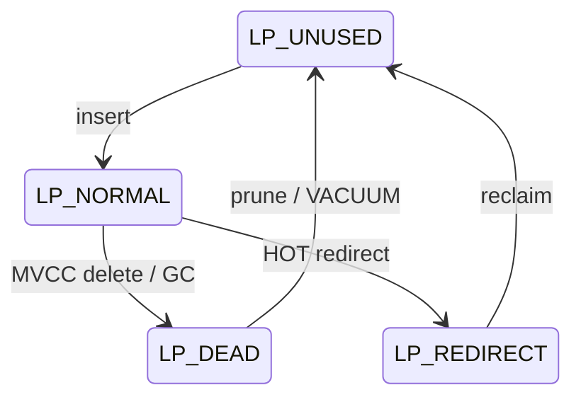
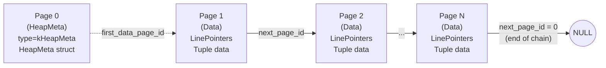
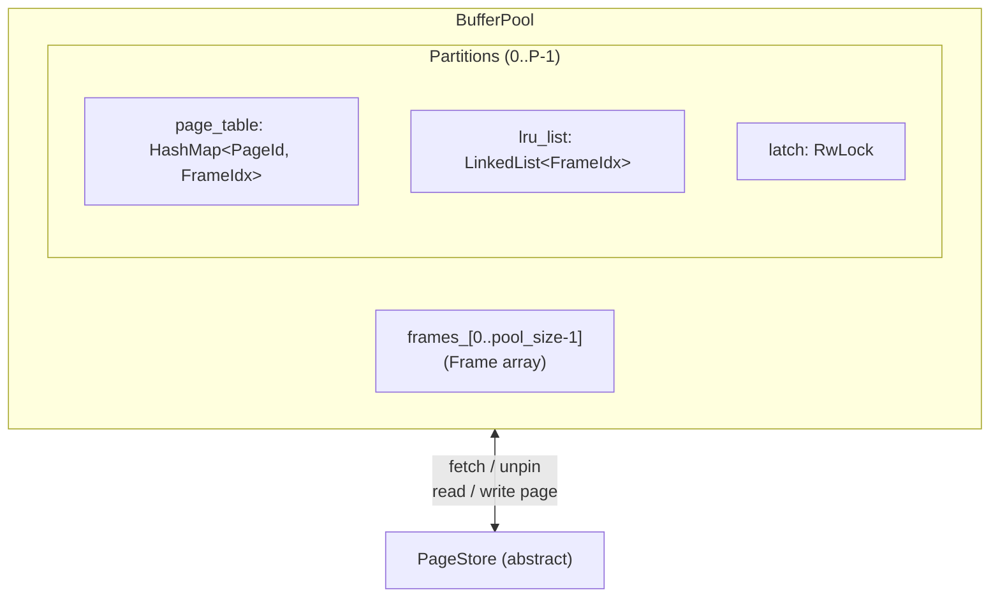
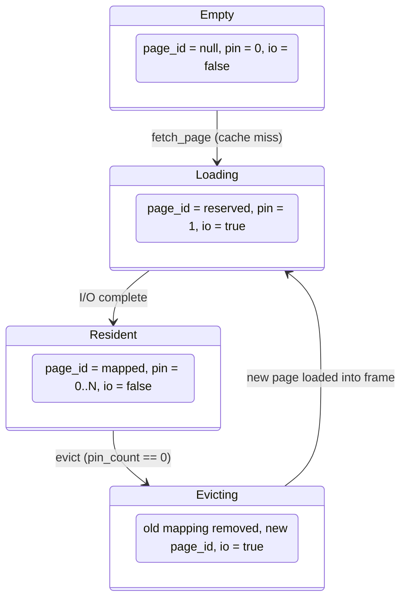
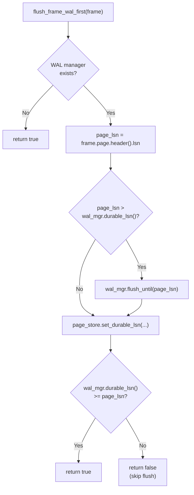
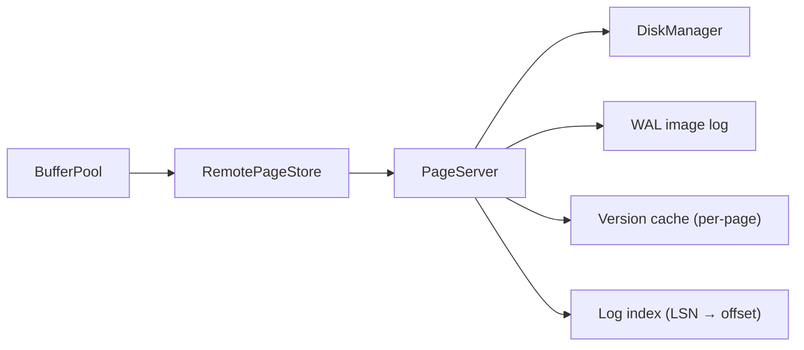

# MiniDB Storage Layer Internals

> **Audience / 目标读者**: MiniDB kernel developers and contributors.
> This document describes the byte-level on-disk and in-memory formats of the
> storage subsystem.  All sizes are in bytes unless stated otherwise.
> Source references point to `src/storage/`, `src/record/`, and `src/common/`.

---

## Table of Contents

1. [Page Format (8 KB)](#1-page-format-8-kb)
2. [Tuple Format](#2-tuple-format)
3. [Heap File Structure](#3-heap-file-structure)
4. [DiskManager](#4-diskmanager)
5. [Buffer Pool](#5-buffer-pool)
6. [PageStore Interface](#6-pagestore-interface)

---

## 1. Page Format (8 KB)

> **概述 (Chinese introduction)**:
> Page 是 MiniDB 存储引擎的最小 I/O 单元, 固定 8192 字节。布局参照 PostgreSQL
> `PageHeaderData`, 由三部分组成: 固定 24 字节头、向前增长的行指针数组、以及从
> 页尾向前增长的 Tuple 数据区。页尾保留 8 字节存储链表指针 `next_page_id`。

### 1.1 Overall Layout

```
 Offset   Size   Region
 ------   ----   ---------------------------------------------------
 0        24     PageHeader (fixed)
 24       6*N    LinePointer array  (grows forward -->)
 24+6*N   ...    Free space         (shrinks from both sides)
 ...      ...    Tuple data area    (<-- grows backward from 8184)
 8184     8      next_page_id       (tail-reserved, page linking)
 8192            End of page
```

ASCII byte-level diagram of a page with 3 tuples:

```
0                                                              8192
|-- PageHeader (24B) --|-- LinePointers (6B each) --|  free   |-------- Tuples ---------|-- tail --|
+----------------------+----+----+----+-------------+---------+--------+--------+--------+---------+
| page_id | lsn | ...  | LP0| LP1| LP2|    (free)   |  (free) | Tuple2 | Tuple1 | Tuple0 | next_pg |
+----------------------+----+----+----+-------------+---------+--------+--------+--------+---------+
^0        ^8    ^16    ^24  ^30  ^36  ^42           ^         ^                          ^8184
                                        free_space_offset     min_tuple_offset
```

Key invariants:
- `free_space_offset` (in `PageHeader`) marks the first byte after the last LinePointer.
  It equals `24 + num_tuples * 6` when there are no gaps.
- Tuple data grows backward from offset `8184` (`kPageSize - kPageTailReserved`).
- **Max usable space per page**: `8192 - 24 (header) - 8 (tail) = 8160 bytes`.
- All tuple offsets are 8-byte aligned (`MAXALIGN`): `(size + 7) & ~7`.

### 1.2 PageHeader (24 bytes)

Defined in `src/storage/page.h` with `#pragma pack(push, 1)`.

```
Offset  Size  Type  Field               Description
------  ----  ----  ------------------  ----------------------------------------
0       8     u64   page_id             Global page identifier
8       8     u64   lsn                 WAL LSN of last modification
16      2     u16   page_type           PageType discriminator (see below)
18      2     u16   free_space_offset   First free byte after LinePointer array
                                        (equivalent to PostgreSQL pd_lower)
20      2     u16   num_tuples          Tuple count (includes NORMAL + DEAD)
22      2     u16   reserved            Reserved; holds page checksum when enabled
```

Compile-time assertion: `static_assert(sizeof(PageHeader) == 24)`.

### 1.3 PageType Enum

```cpp
enum class PageType : u16 {
    kHeapData    = 1,   // Regular heap data page
    kHeapMeta    = 2,   // Heap file metadata (page 0 of each table file)
    kIndexData   = 3,   // B+Tree index data page
    kIndexMeta   = 4,   // B+Tree index metadata page
    kFreeList    = 5,   // Free-list management page
    kWalPage     = 6,   // WAL page
    kCatalogData = 7,   // System catalog page
};
```

### 1.4 LinePointer (6 bytes)

Mirrors PostgreSQL `ItemIdData`. Defined with `#pragma pack(push, 1)`.

```
Offset  Size  Type  Field    Description
------  ----  ----  ------   ------------------------------------------
0       2     u16   offset   Byte offset of the tuple within the page
2       2     u16   length   Tuple data length (unaligned)
4       2     u16   flags    State flag (see below)
```

Compile-time assertion: `static_assert(sizeof(LinePointer) == 6)`.

LinePointers are stored contiguously starting at byte 24.  The i-th
LinePointer sits at offset `24 + i * 6`.

### 1.5 LinePointer Flags

```
Value  Constant       Meaning
-----  -----------    -----------------------------------------------
0      LP_UNUSED      Slot is free, can be reused
1      LP_NORMAL      Slot is in use, points to valid tuple data
2      LP_REDIRECT    HOT redirect -- offset field holds target SlotIdx,
                      length is 0
3      LP_DEAD        Dead tuple, can be pruned/reclaimed by VACUUM
```

State transitions:



Helper predicates on `LinePointer`:
- `is_valid()`: `flags == LP_NORMAL && offset > 0 && length > 0`
- `is_dead()`: `flags == LP_DEAD`
- `is_redirect()`: `flags == LP_REDIRECT`
- `is_usable()`: `flags == LP_UNUSED || flags == LP_DEAD` (slot can receive a new tuple)

### 1.6 Free Space Calculation

Free space = `min_tuple_offset - lp_end`, where:
- `lp_end = 24 + num_tuples * 6`
- `min_tuple_offset` = smallest `offset` among all valid LinePointers (defaults
  to `8184` on an empty page)

When checking `has_enough_space(tuple_size)`, the page first checks whether any
`LP_DEAD` slot has a physical region large enough to fit the 8-byte-aligned
tuple in-place.  If not, it checks contiguous free space for a new append,
accounting for whether an `LP_UNUSED` slot can be reused (saving 6 bytes of
LinePointer overhead) or a new slot must be allocated.

### 1.7 Tuple Insertion Strategy

`Page::insert_tuple()` uses a two-strategy approach:

1. **Strategy 1 -- Reuse reclaimable slot**: Scan existing LinePointers for
   `is_usable()` slots.  If a `LP_DEAD` slot's physical region is >= the
   aligned tuple size, reuse it in-place (overwrite data, mark `LP_NORMAL`).
   Otherwise remember the first `LP_UNUSED` slot for Strategy 2.

2. **Strategy 2 -- Append**: Allocate a new tuple from the bottom of the free
   space region (growing backward from `min_tuple_offset`).  Reuse an
   `LP_UNUSED` slot if one was found, otherwise grow `num_tuples` by 1.

Returns `kNullSlot` (`0xFFFF`) if neither strategy can satisfy the request.

### 1.8 Page-Level Pruning

`Page::prune()` implements PostgreSQL-style page compaction:

1. Mark all `LP_DEAD` slots as `LP_UNUSED`.
2. Copy all remaining `LP_NORMAL` tuple data into a temporary buffer.
3. Rewrite tuple data compactly from offset 8184 downward.
4. Update each surviving LinePointer's `offset` to the new position.
5. Reset `free_space_offset` to `24 + num_tuples * 6`.

This reclaims fragmented space from dead tuples without changing slot numbering.

---

## 2. Tuple Format

> **概述**: Tuple 是 MiniDB 的行级存储单元。每个 Tuple 由 MVCC 头(事务可见性)、
> 版本链指针和列数据组成。Null 值通过 bitmap 标记, 不占用数据区空间。

### 2.1 Serialization Layout

Defined in `src/record/tuple.h` and `src/record/tuple.cpp`.

```
Offset  Size         Field            Description
------  -----------  ---------------  ----------------------------------------
0       8            xmin             Creator transaction ID (MVCC)
8       8            xmax             Deleter transaction ID (0 = live)
16      8            next_ver_page    PageId of next version (version chain)
24      2            next_ver_slot    SlotIdx of next version
26      4            num_cols         Number of columns
30      ceil(N/8)    null_bitmap      1 bit per column; bit=1 means NULL
30+BM   variable     values...        Serialized column values (non-NULL only)
```

Total header size (before null bitmap): **30 bytes** (`kTupleHeaderSize`).

### 2.2 MVCC Header

| Field  | Offset | Size | Description |
|--------|--------|------|-------------|
| `xmin` | 0      | 8B   | Transaction ID that created this tuple version |
| `xmax` | 8      | 8B   | Transaction ID that deleted/updated this tuple (0 = live, visible) |

A tuple is considered **live** when `xmax == 0`.  An MVCC delete stamps `xmax`
with the deleting transaction's ID; the tuple remains physically present until
GC/VACUUM.

### 2.3 Version Chain (HOT Chains)

| Field             | Offset | Size | Description |
|-------------------|--------|------|-------------|
| `next_ver_page`   | 16     | 8B   | PageId of the next version in the chain |
| `next_ver_slot`   | 24     | 2B   | SlotIdx of the next version |

When `next_ver_page == kNullPageId` (0), the tuple is the end of the chain.
For Heap-Only Tuples (HOT), the new version is inserted on the **same page**
as the old version, and the old tuple's `next_ver_page` points to the same
page ID.  The original LinePointer can then be converted to `LP_REDIRECT` by
the GC/pruning pass to skip the dead old version.

Boundary conditions:
- Maximum version chain hops: `kMaxPageChainHops = 1,000,000` (safety limit).
- `kNullPageId = 0`, `kNullSlot = 0xFFFF`.

### 2.4 Null Bitmap

- Size: `ceil(num_cols / 8)` bytes, immediately after `num_cols`.
- Bit `i` (bit `i%8` of byte `i/8`): `1` = column `i` is NULL, `0` = not NULL.
- NULL columns are **not serialized** in the values area, saving space.

Example for 5 columns where columns 1 and 4 are NULL:

```
Byte 0:  0b00010010
             ^^^^^ bits 0-4 for columns 0-4
             |   |
             |   +-- bit 1 = 1 (col 1 is NULL)
             +------ bit 4 = 1 (col 4 is NULL)
```

### 2.5 Value Serialization

Each non-NULL value is serialized as `[type_id 1B] [data]`.  Defined in
`src/record/value.h` and `src/record/value.cpp`.

```
TypeId     Enum Value   Data Size   Wire Format
--------   ----------   ---------   --------------------------------
BOOL       0            1B          type_id(1) + u8 (0 or 1)
INT32      1            4B          type_id(1) + i32 (little-endian)
INT64      2            8B          type_id(1) + i64 (little-endian)
FLOAT      3            4B          type_id(1) + IEEE 754 float
DOUBLE     4            8B          type_id(1) + IEEE 754 double
VARCHAR    5            variable    type_id(1) + u32 len + raw bytes
NULL       255          0B          type_id(1) only (but NULLs are
                                    normally elided via null_bitmap)
```

`serialized_size()` returns:
| Type    | Size            |
|---------|-----------------|
| BOOL    | 2 (1+1)         |
| INT32   | 5 (1+4)         |
| INT64   | 9 (1+8)         |
| FLOAT   | 5 (1+4)         |
| DOUBLE  | 9 (1+8)         |
| VARCHAR | 1 + 4 + strlen  |
| NULL    | 1               |

### 2.6 Deserialization Safeguards

`deserialize_from_page()` performs bounded reads:
- Every value read checks `buf + N > end` before accessing memory.
- `num_cols` is capped at `kMaxTupleColumns = 4096`.
- Missing columns (from `ADD COLUMN` schema evolution) are padded with default values.
- Projected deserialization (`deserialize_projected_from_page`) skips
  unneeded columns with `skip_value_bounded()` to avoid allocating unnecessary
  `Value` objects.

### 2.7 Complete Tuple Example

A tuple with schema `(INT32, VARCHAR, BOOL)` and values `(42, "hello", NULL)`:

```
Byte offset   Content                  Description
-----------   -----------------------  -----------------------
0-7           xmin (8B)                Creator txn ID
8-15          xmax (8B)                0 = live
16-23         next_ver_page (8B)       0 = no next version
24-25         next_ver_slot (2B)       0xFFFF = none
26-29         num_cols = 3 (4B)        3 columns
30            0b00000100 (1B)          null bitmap: bit 2 set (col 2 is NULL)
31            0x01 (type BOOL=INT32)   -- wait, col 0 is INT32:
31            0x01                     type_id = kInt32 (1)
32-35         0x2A000000               i32 value = 42
36            0x05                     type_id = kVarchar (5)
37-40         0x05000000               u32 length = 5
41-45         "hello"                  raw string bytes
                                       (col 2 is NULL, skipped)
Total = 46 bytes (before MAXALIGN)
```

---

## 3. Heap File Structure

> **概述**: HeapFile 管理一个逻辑表的所有数据页。第 0 页是元数据页 (HeapMeta),
> 数据页通过尾部 `next_page_id` 构成单向链表。支持 WAL-first 两阶段插入、
> HOT 同页版本链、以及事务回滚操作。

### 3.1 File Organization



Data pages form a **singly-linked list** via the `next_page_id` stored in the
last 8 bytes of each page (offset 8184).  `next_page_id = 0` (`kNullPageId`)
marks the end of the chain.

### 3.2 HeapMeta Structure

Stored at `page->data() + kPageHeaderSize` (offset 24) of page 0.
Defined with `#pragma pack(push, 1)`.

```
Offset  Size  Type  Field                Description
------  ----  ----  -------------------  -----------------------------------
0       4     u32   table_id             Table identifier
4       4     u32   reserved             Reserved for future use
8       8     u64   first_data_page_id   PageId of the first data page
16      8     u64   last_data_page_id    PageId of the last data page
24      4     u32   num_data_pages       Total number of data pages
28      8     u64   num_tuples           Live tuple count
36      8     u64   num_deleted_tuples   Tuples marked deleted (MVCC)
```

Total: 44 bytes.

HeapMeta is cached in memory (`meta_`) and flushed lazily -- dirty metadata
is written back to disk after every 1024 mutations (`note_meta_changed()`),
or explicitly via `flush_meta()`.

### 3.3 PageId Construction

Page IDs for a table with `table_id = T`:
- Meta page: `make_page_id(T, 0)` -- file_id=T, page_num=0
- Data pages: `make_page_id(T, 1)`, `make_page_id(T, 2)`, ...
- New page allocation: `make_page_id(T, num_data_pages + 1)`

### 3.4 Insert Path

**Direct insert** (`insert_tuple`):

1. Ensure meta is loaded.  If no data pages exist, allocate page 1.
2. Fetch the last data page.
3. **Prune** dead tuples on that page to reclaim space.
4. If the page has enough space, insert and return `(page_id, slot_idx)`.
5. If full: allocate a new page, link the old last page's `next_page_id` to it,
   insert the tuple on the new page, update `meta_.last_data_page_id`.

**WAL-first insert** (two-phase):

Phase 1 -- `prepare_insert(length)`:
- Acquires `latch_` (held across both phases).
- Determines whether the last page has room (after pruning).
- If room exists: predicts the slot index via `predict_slot()` without mutation.
- If no room: pre-allocates a new PageId.
- Returns `InsertPlan { page_id, is_new_page, predicted_slot }`.

Phase 2 -- `commit_insert(page_id, is_new_page, predicted_slot, data, length, lsn)`:
- Uses `insert_tuple_at()` to place the tuple at exactly the predicted slot.
- Stamps the page LSN.
- If `is_new_page`: initializes the page, links it into the chain.
- Releases `latch_`.

This separation allows the WAL record to be written between the two phases,
ensuring the WAL entry is durable before the page is mutated (WAL-first protocol).

### 3.5 HOT Insert (Same-Page Version Chain)

`insert_tuple_in_page(page_id, data, length)`:
- Targets a **specific page** (the same page as the old version).
- Prunes dead tuples, then calls `Page::insert_tuple()`.
- Returns `kPageFull` if the page cannot accommodate the new version.

WAL-first variant: `prepare_insert_in_page()` + `commit_insert_in_page()`.

### 3.6 MVCC Operations

| Operation | Method | Effect |
|-----------|--------|--------|
| Soft-delete | `mark_deleted(page_id, slot, xmax)` | Stamps `xmax` at tuple offset+8 |
| Set creator | `set_xmin(page_id, slot, xmin)` | Stamps `xmin` at tuple offset+0 |
| Set version chain | `set_next_version(page_id, slot, next_page, next_slot)` | Writes at offset+16 and offset+24 |
| Atomic old-tuple update | `commit_old_tuple(page_id, slot, next_page, next_slot, xmax, lsn)` | Sets next_version + xmax + LSN in one pinned operation |
| GC mark dead | `mark_dead(page_id, slot)` | Sets LinePointer to LP_DEAD |
| Prune obsolete | `prune_obsolete_version(...)` | Converts to LP_REDIRECT (same-page) or LP_DEAD |

### 3.7 Rollback

- **`rollback_insert(page_id, slot_idx)`**: Calls `Page::reclaim_slot()` to
  mark the LinePointer as `LP_UNUSED`.  Decrements `meta_.num_tuples`.

- **`rollback_delete(page_id, slot_idx)`**: Clears `xmax` to 0, resets
  `next_ver_page` to `kNullPageId` and `next_ver_slot` to 0.  The tuple
  becomes visible again as if the delete never happened.

### 3.8 Recovery

`recover_insert_at()`:
- Detects uninitialized pages (first 64 bytes all-zero) and initializes them.
- Checks page LSN against the log record LSN to skip already-applied records.
- Links recovered pages into the metadata chain.

`recover_update()`:
- Calls `recover_insert_at()` for the new version.
- Calls `mark_deleted()` + `set_next_version()` for the old version.
- On partial failure, rolls back the new version insert.

---

## 4. DiskManager

> **概述**: DiskManager 负责 PageId 到物理文件的映射和底层 I/O。支持双写缓冲
> (doublewrite buffer) 防止 torn page, 以及页级校验和 (page checksum) 检测
> 数据损坏。

### 4.1 PageId Physical Layout

A `PageId` is a 64-bit integer encoding both file identity and page number:

```
 63                   32 31                    0
 +----------------------+----------------------+
 |      file_id (u32)   |    page_num (u32)    |
 +----------------------+----------------------+
```

Helper functions (`src/common/defs.h`):
```cpp
u32 file_id_from_page(PageId pid)       // pid >> 32
u32 page_num_from_page(PageId pid)      // pid & 0xFFFFFFFF
PageId make_page_id(u32 fid, u32 pnum)  // (fid << 32) | pnum
```

### 4.2 File Path Mapping

`file_id` determines the physical file path under `db_path_`:

| file_id Range | Directory            | File Extension | Purpose          |
|---------------|----------------------|----------------|------------------|
| 1             | `catalog/`           | `.cat`         | System catalog   |
| 2 -- 999      | `tables/`            | `.heap`        | Heap table files |
| >= 1000       | `indexes/`           | `.btree`       | B+Tree index files |

Within each file, the page is at byte offset `page_num * 8192`.

Directory structure created on initialization:
```
db_path/
  catalog/
  tables/
  indexes/
  wal/
  doublewrite.bin
```

### 4.3 Doublewrite Buffer

Protects against **torn pages** -- a crash during a partial 8KB write.

Write protocol:
1. Compute page checksum, store in `PageHeader::reserved`.
2. Write a `DoubleWriteHeader` + full page image to `doublewrite.bin`, then `fsync`.
3. Write the page to its final location in the data file.
4. Clear the `DoubleWriteHeader` in `doublewrite.bin`, then `fsync`.

`DoubleWriteHeader` (packed):
```
Offset  Size  Type    Field       Description
------  ----  ------  ---------   -----------------------
0       8     u64     magic       0x4D44425752495445 ("MDBWRITE")
8       8     PageId  page_id     Target page
16      2     u16     checksum    Page body checksum
18      2     u16     reserved    (padding)
20      4     u32     page_size   Expected 8192
```

**Recovery** (`recover_double_write`): On startup, if `doublewrite.bin` contains
a valid header (magic matches, checksum validates), the saved page image is
replayed to its target file location with `fsync`.

### 4.4 Page Checksum

Algorithm (when `page_checksum_enabled_ == true`):
1. Seed: `0xA5A5`.
2. Iterate over all 8192 bytes, skipping bytes 22-23 (the `reserved` field where
   the checksum itself is stored).
3. Accumulate: `sum = (sum + byte) & 0xFFFF`, then rotate left by 1 bit:
   `sum = ((sum << 1) | (sum >> 15)) & 0xFFFF`.
4. If the final sum is 0, use 1 instead (so zero means "no checksum computed").

On read, if the stored checksum does not match the computed checksum, the page
buffer is zeroed out -- callers see an empty page rather than corrupted data.

### 4.5 File Descriptor Cache

- `fd_cache_`: `HashMap<String, int>` mapping file paths to open fds.
- Configurable limit: `fd_cache_limit_` (default 1024).
- When the cache is full, **all** cached fds are closed and the map is cleared
  (simple flush strategy).
- All I/O uses `pread`/`pwrite` for thread safety (no `lseek` + `read/write`).
- `flush()` calls `fsync` on every cached fd.

---

## 5. Buffer Pool

> **概述**: Buffer Pool 是内存中的页缓存, 采用分区 LRU 替换策略。支持顺序扫描
> 反污染 (anti-pollution)、WAL-first 脏页刷盘、以及 pin_count 原子操作优化。
> 设计参照 PostgreSQL Shared Buffers。

### 5.1 Architecture



### 5.2 Partitioning

- Default: 16 partitions (configurable).
- Partition assignment: `page_id % partition_count`.
- Each partition has its own `RwLock`, `HashMap`, and `LinkedList`.
- Reduces lock contention on multi-threaded workloads.
- Constraint: `partition_count <= pool_size`.

### 5.3 Frame State Machine

Each frame in the pool transitions through these states:



| State     | `page_id`        | `pin_count` | `is_io_in_progress` |
|-----------|------------------|-------------|---------------------|
| Empty     | `kNullPageId`    | 0           | false               |
| Loading   | reserved in map  | 1           | true                |
| Resident  | mapped           | 0..N        | false               |
| Evicting  | new page reserved| 1           | true                |

State transitions that touch `page_id`/`page_table`/`lru_node`/`is_dirty`/io flag
are protected by the partition's `latch` in **write mode**.  The `pin_count` is
`std::atomic<u32>` so `unpin` can complete under a **read latch** without
promoting to a write lock.

### 5.4 Frame Structure

```cpp
struct Frame {
    Page    page;           // 8192 bytes of page data
    PageId  page_id;        // kNullPageId if empty
    atomic<u32> pin_count;  // reference count
    bool    is_dirty;       // modified since last flush?
    bool    is_io_in_progress; // disk I/O underway?
    u32     partition_idx;  // which partition owns this frame
    LinkedList<FrameIdx>::Node* lru_node; // position in LRU list
};
```

### 5.5 fetch_page Algorithm

The `fetch_page(page_id, is_sequential)` method uses a two-phase lock pattern
to minimize contention:

**Fast path (read lock)**:
1. Acquire partition read latch.
2. Lookup `page_id` in `page_table`.
3. If found and not `is_io_in_progress`: increment `pin_count` atomically,
   record hit, return page pointer.

**Slow path (write lock)**:
1. Acquire partition write latch.
2. Double-check lookup (another thread may have loaded it).
3. If still missing: call `find_victim_frame()` to select an evictable frame.
4. Record eviction metadata, set `is_io_in_progress = true`.
5. **Release write lock**.
6. Perform disk I/O outside the lock:
   - If victim was dirty: flush WAL first (if needed), then write victim page.
   - Read the requested page from PageStore.
7. Re-acquire write lock, update mappings, set state to Resident.

**Sequential scan anti-pollution**:
- When `is_sequential = true` (or auto-detected by consecutive page_num), newly
  loaded pages are inserted at the **LRU tail** instead of head.
- This prevents full-table scans from evicting frequently-accessed hot pages.
- Auto-detection heuristic: same `file_id` and `page_num` increments by 1.

### 5.6 Victim Selection

`find_victim_frame(partition, partition_idx)`:
1. First pass: look for an **empty** frame (`page_id == kNullPageId`, not in I/O).
2. Second pass: iterate from LRU **tail** (least recently used) for a frame with
   `pin_count == 0` and not in I/O.
3. Returns `kNullFrame` if no evictable frame found (caller waits or fails).

### 5.7 WAL-First Flush Protocol

Before evicting a dirty page, the buffer pool ensures the WAL is durable up to
the page's LSN:



This guarantees the WAL-first invariant: **no dirty page reaches disk before
its WAL record is durable**.

### 5.8 unpin_page

```cpp
void unpin_page(PageId page_id):
  // Only needs read latch (pin_count is atomic)
  ReadGuard(partition.latch)
  frame = find_page_mapping(page_id)
  atomic_decrement(frame.pin_count)
  if pin_count dropped to 0:
    notify_buffer_available()  // wake waiters
```

### 5.9 Statistics

```cpp
struct BufferPoolStats {
    u64 hits;             // page found in cache
    u64 misses;           // page not in cache, required disk I/O
    u32 waiters;          // threads currently waiting for a free frame
    u64 wait_timeouts;    // waiter timed out
    u64 wait_rejections;  // waiter rejected (max_waiters exceeded)
    u32 dirty_pages;      // currently dirty frames (computed on demand)
    u32 partitions;       // number of partitions
};
```

### 5.10 Configuration Parameters

| Parameter          | Type | Default  | Description |
|--------------------|------|----------|-------------|
| `pool_size`        | u32  | 256      | Total frames (`kDefaultPoolFrames`) |
| `partitions`       | u32  | 1        | Number of LRU partitions |
| `wait_timeout_ms`  | u64  | 5000     | Max wait time for a free frame (ms) |
| `max_waiters`      | u32  | 1024     | Max concurrent waiters |
| `flush_batch_size` | u32  | 64       | Pages per batch write in `flush_all()` |

Max pool size: `kMaxPoolFrames = 65536`.

---

## 6. PageStore Interface

> **概述**: PageStore 是一个抽象接口, 解耦了 Buffer Pool 和底层存储实现。
> 提供本地磁盘 (LocalPageStore)、进程内 PageServer (RemotePageStore)、
> 以及独立进程 TCP PageServer (RemotePageStoreClient) 三种实现。

### 6.1 Abstract Interface

```cpp
class PageStore {
    virtual Result<void> read_page(PageId page_id, byte* page_data) = 0;
    virtual Result<void> write_page(PageId page_id, const byte* page_data, LSN page_lsn) = 0;
    virtual Result<void> flush() = 0;
    virtual Result<void> delete_file(const String& filename) = 0;

    // Batch operations (default: sequential loop)
    virtual Vector<PageIOResult> read_pages(const Vector<PageReadRequest>& pages);
    virtual Vector<PageIOResult> write_pages(const Vector<PageWriteRequest>& pages);

    // LSN tracking for shared-storage mode
    virtual void set_durable_lsn(LSN durable_lsn);
    virtual LSN durable_lsn() const;
    virtual bool is_remote() const;
};
```

All methods return `Result<void>` for uniform error propagation.

### 6.2 Batch I/O Structures

```cpp
struct PageReadRequest {
    PageId page_id;
    byte*  data;         // output buffer (must be kPageSize bytes)
};

struct PageWriteRequest {
    PageId      page_id;
    const byte* data;    // input buffer
    LSN         page_lsn;
};

struct PageIOResult {
    PageId page_id;
    Status status;       // per-page success/failure
    bool ok() const;
};
```

### 6.3 Implementation: LocalPageStore

Wraps `DiskManager` for direct file I/O on a single node.


- `read_page()`: delegates to `DiskManager::read_page()` (with checksum validation).
- `write_page()`: delegates to `DiskManager::write_page()` (with doublewrite + checksum).
- `flush()`: calls `DiskManager::flush()` (fsync all cached fds).
- `is_remote()`: returns `false`.

### 6.4 Implementation: RemotePageStore

Wraps an in-process `PageServer` for shared-storage architecture.



Constructor parameters:
- `server`: pointer to PageServer
- `read_only`: if true, reads use `read_lsn` for time-travel queries
- `read_lsn`: LSN ceiling for read-only replicas
- `batch_size`: max pages per batch operation

Key behaviors:
- **Read-only mode**: calls `PageServer::read_page(page_id, read_lsn)` to get
  a page image as of a specific LSN.  If the requested LSN is ahead of the
  server's durable LSN, the server falls back to the latest available version.
- **Write rejection**: the PageServer rejects writes with `page_lsn <= durable_lsn`
  (stale writes from lagging replicas).
- `is_remote()`: returns `true`.

PageServer internals:
- **64 shards** for concurrent access (`kShardCount = 64`), each with its own mutex.
- Per-page **version cache**: up to `cached_versions_per_page` (default 32) recent
  page images for serving time-travel reads without hitting disk.
- **WAL image log**: sequential file storing full page images, indexed by
  `PageLogIndexEntry { lsn, wal_offset }`.
- Replica support: optional vector of replica `DiskManager` instances.

### 6.5 Implementation: RemotePageStoreClient

TCP client that communicates with a standalone `PageServerTcpService` process.


Constructor parameters:
- `host`, `port`: server address
- `read_only`, `read_lsn`: same semantics as RemotePageStore
- `batch_size`: max pages per RPC batch (default 64)
- `connect_timeout_ms`: connection timeout (default 1000ms)
- `io_timeout_ms`: per-operation timeout (default 5000ms)
- `retry_count`: automatic retries on failure (default 2)
- `max_connections`: connection pool size (default 8)

#### 6.5.1 RPC Wire Protocol

Binary protocol defined in `src/storage/page_server_rpc.h`.

**Request header** (`PageRpcHeader`, packed):
```
Offset  Size  Type  Field          Description
------  ----  ----  -----------    -----------------------------------
0       4     u32   magic          0x4D445250 ("MDRP")
4       2     u16   version        Protocol version (currently 1)
6       2     u16   op             Operation code (PageRpcOp enum)
8       4     u32   count          Number of pages in batch
12      4     u32   name_len       Length of filename (for delete_file)
16      8     u64   read_lsn       LSN for read-only queries
24      8     u64   durable_lsn    Client's durable LSN
```

**Response header** (`PageRpcResponse`, packed):
```
Offset  Size  Type  Field          Description
------  ----  ----  -----------    -----------------------------------
0       4     u32   magic          0x4D445250 ("MDRP")
4       2     u16   version        Protocol version
6       2     u16   status         PageRpcStatus (kOk=0, kError=1, kRejected=2)
8       4     u32   count          Number of result pages
12      4     u32   reserved       (padding)
16      8     u64   durable_lsn    Server's durable LSN
24      8     u64   value          Auxiliary value (e.g., stats)
```

**Per-page reference** (`PageRpcPageRef`, packed):
```
Offset  Size  Type    Field      Description
------  ----  ------  --------   -------------------
0       8     PageId  page_id    Page identifier
8       8     LSN     page_lsn   Page LSN
```

**Operations**:

| Op Code | Name            | Request Body                      | Response Body                   |
|---------|-----------------|-----------------------------------|---------------------------------|
| 1       | kReadBatch      | N x PageRpcPageRef                | N x (PageRpcPageRef + 8KB data) |
| 2       | kWriteBatch     | N x (PageRpcPageRef + 8KB data)   | N x PageRpcPageRef              |
| 3       | kFlush          | (none)                            | (none)                          |
| 4       | kDeleteFile     | filename (name_len bytes)         | (none)                          |
| 5       | kSetDurableLsn  | (durable_lsn in header)           | (none)                          |
| 6       | kStats          | (none)                            | value = serialized stats        |

#### 6.5.2 Connection Pool

- Maintains a pool of up to `max_connections` idle TCP sockets.
- `borrow_connection()`: returns an idle fd or creates a new connection.
- `release_connection(fd, reusable)`: returns fd to pool if reusable, else closes.
- Automatic retry with reconnection on transient failures.

#### 6.5.3 Client Statistics

```cpp
struct RemotePageStoreClientStats {
    u64 read_batches;    // total read batch RPCs
    u64 write_batches;   // total write batch RPCs
    u64 retries;         // automatic retries
    u64 reconnects;      // new connections after failure
    u64 failures;        // unrecoverable failures
};
```

---

## Appendix A: Key Constants

| Constant              | Value        | Source File       |
|-----------------------|--------------|-------------------|
| `kPageSize`           | 8192         | `common/config.h` |
| `kPageHeaderSize`     | 24           | `common/config.h` |
| `kLinePointerSize`    | 6            | `common/config.h` |
| `kPageTailReserved`   | 8            | `common/config.h` |
| `kNullPageId`         | 0            | `common/defs.h`   |
| `kNullLsn`            | 0            | `common/defs.h`   |
| `kNullSlot`           | 0xFFFF       | `common/defs.h`   |
| `kNullFrame`          | 0xFFFFFFFF   | `common/defs.h`   |
| `kDefaultPoolFrames`  | 256          | `common/config.h` |
| `kMaxPoolFrames`      | 65536        | `common/config.h` |
| `kMaxPageChainHops`   | 1,000,000    | `common/config.h` |
| `kPageRpcMagic`       | 0x4D445250   | `storage/page_server_rpc.h` |
| `kDoubleWriteMagic`   | 0x4D44425752495445 | `storage/disk_manager.cpp` |
| `kChecksumSeed`       | 0xA5A5       | `storage/disk_manager.cpp` |
| `kMaxTupleColumns`    | 4096         | `record/tuple.cpp` |
| `kTupleHeaderSize`    | 30           | `record/tuple.cpp` |

## Appendix B: Type Aliases

| Alias      | Underlying Type | Description              |
|------------|-----------------|--------------------------|
| `PageId`   | `u64`           | 64-bit page identifier   |
| `LSN`      | `u64`           | Log Sequence Number      |
| `SlotIdx`  | `u16`           | Tuple slot index in page |
| `FrameIdx` | `u32`           | Buffer pool frame index  |
| `TxnId`    | `u64`           | Transaction identifier   |
| `byte`     | `uint8_t`       | Raw byte                 |

## Appendix C: Error Codes

Defined in `src/common/status.h`:

| Code              | Value | Typical Trigger |
|-------------------|-------|-----------------|
| `kOk`             | 0     | Success |
| `kNotFound`       | 1     | Page/tuple not found |
| `kAlreadyExists`  | 2     | Duplicate key/page |
| `kInvalidArgument`| 3     | Null pointer, bad page_id |
| `kIOError`        | 4     | Disk read/write failure |
| `kOutOfMemory`    | 5     | Allocation failure |
| `kBufferFull`     | 6     | No evictable frame in buffer pool |
| `kPageFull`       | 7     | No room for tuple on page |
| `kCorruption`     | 8     | Checksum mismatch |
| `kNotImplemented` | 9     | Stub |
| `kInternal`       | 10    | Internal error |
| `kAborted`        | 11    | Transaction aborted |
| `kDeadlock`       | 12    | Deadlock detected |
| `kLockConflict`   | 13    | Lock acquisition conflict |
| `kTxnConflict`    | 14    | Transaction serialization conflict |
