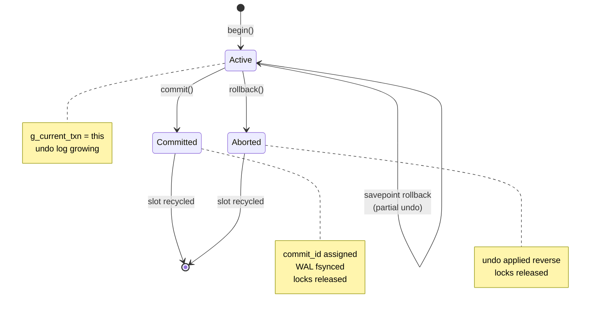
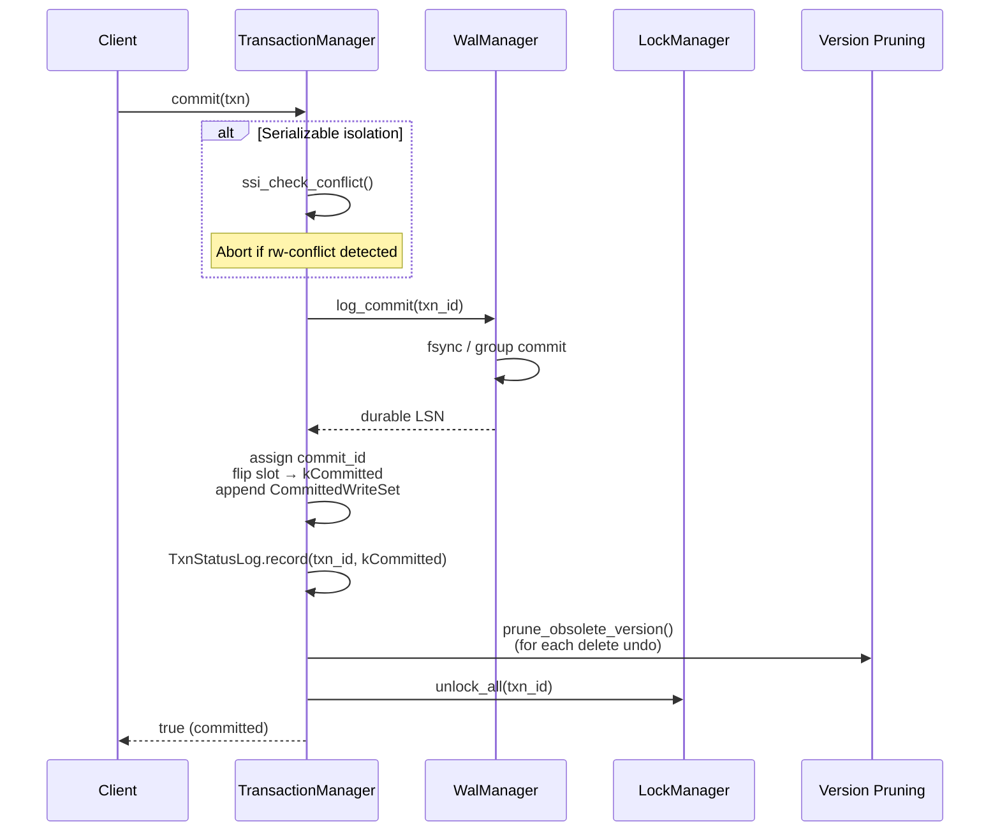
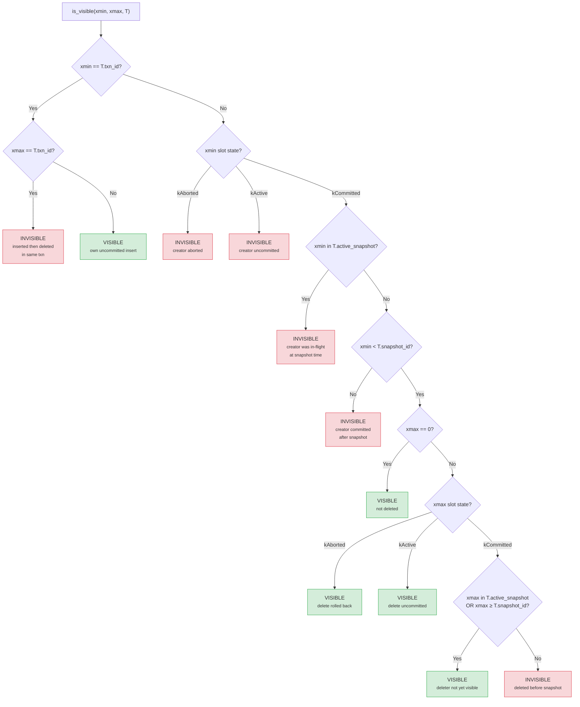
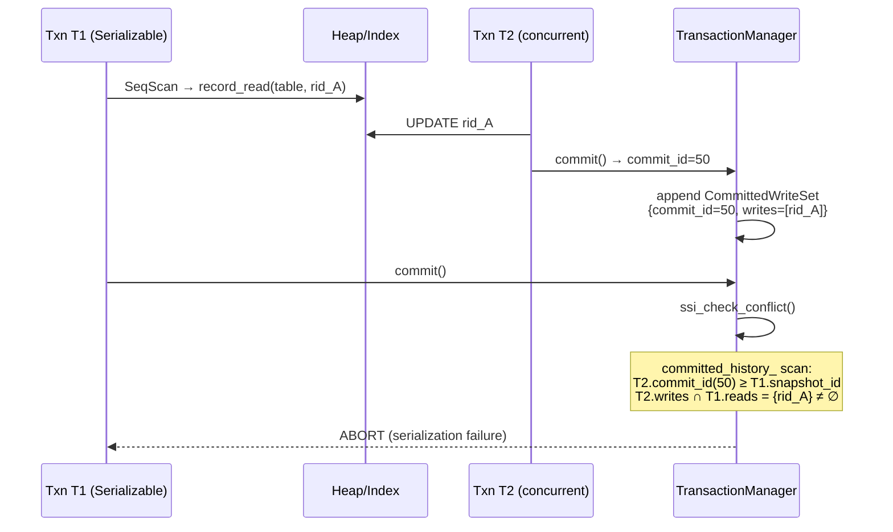
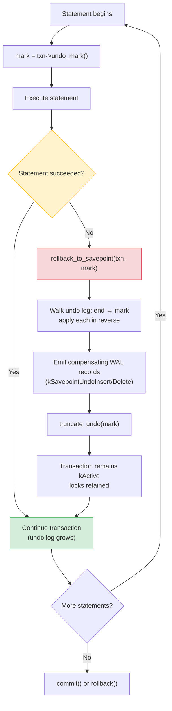
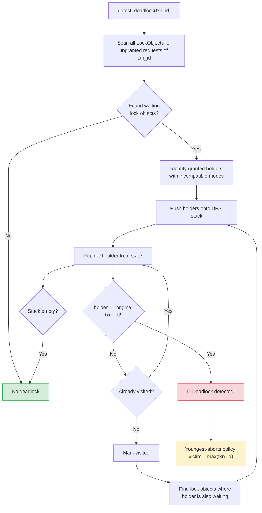

# Transaction Management and MVCC

This document describes the transaction lifecycle, multi-version concurrency
control (MVCC) visibility rules, isolation levels, undo/rollback machinery,
lock manager, and resource admission control implemented in MiniDB. All
references point to the C++ source under `src/`.

---

## 1. Transaction Lifecycle

### Core Types

```
enum class TxnState : u8 { kActive = 0, kCommitted = 1, kAborted = 2 };
```

### Transaction State Machine



Each in-flight transaction occupies one **TxnSlot**:

| Field         | Type      | Description                                                    |
|---------------|-----------|----------------------------------------------------------------|
| `txn_id`      | `u64`     | Monotonically increasing transaction identifier                |
| `snapshot_id` | `u64`     | Upper bound: all versions committed before this ID are visible |
| `commit_id`   | `u64`     | Assigned at commit time; 0 while uncommitted                   |
| `state`       | `TxnState`| Current state of the slot                                      |
| `home_page`   | `PageId`  | Reserved for page-level lock metadata (future use)             |

The slot array is allocated once in `TransactionManager::TransactionManager`
with size `DbConfig::max_active_transactions` (default 256). Slots whose
`txn_id == kInvalidTxnId (0)` or whose `state != kActive` are considered
free and may be reused by the next `begin()` call.

### Thread-Local Current Transaction

```cpp
thread_local Transaction* g_current_txn = nullptr;   // transaction.cpp:11
```

Every connection thread has at most one active transaction at a time. The
`TransactionManager::current()` accessor returns `g_current_txn`. `begin()`
sets it; `commit()` and `rollback()` clear it.

### begin()

1. If `g_current_txn` is already set, return `nullptr` (nested transactions
   are not supported at the API level; statement-level atomicity uses
   savepoints instead).
2. Call `ResourceManager::acquire_transaction()`. If the active-transaction
   limit is reached, the call blocks up to
   `transaction_slot_wait_timeout_ms` (default 5 000 ms) before returning
   `false`.
3. Acquire the `TransactionManager` latch and scan the slot array for a free
   entry (`txn_id == kInvalidTxnId || state != kActive`). If no free slot
   exists, release the resource and return `nullptr`.
4. Assign `txn_id = next_txn_id_++` (monotonic counter, never reused).
5. Set `snapshot_id = next_txn_id_` (the value *after* the increment). This
   means the transaction sees every version whose committing transaction had
   `commit_id < snapshot_id`.
6. Capture the **active snapshot**: iterate the slot array and collect the
   `txn_id` of every slot in `kActive` state. This vector is stored on the
   `Transaction` object and used later by the visibility predicate to
   exclude versions created by transactions that were in-flight at the time
   the snapshot was taken (even if those transactions commit before this one
   reads the data).
7. Populate the slot, write a `kTxnBegin` WAL record, inherit the
   `default_isolation_` level, set `g_current_txn`, and return the
   `Transaction*`.

### commit()



1. Guard: `txn != nullptr && txn == g_current_txn`.
2. **SSI check** (serializable transactions only): call
   `ssi_check_conflict()`. If a rw-conflict is detected, abort via
   `rollback()` and return `false`.
3. **Durability**: call `WalManager::log_commit(txn_id)` which writes a
   `kTxnCommit` record and fsyncs the WAL (or group-commits). If the WAL
   write fails (returns LSN 0), the transaction falls back to the rollback
   path.
4. **Publish** (under latch):
   - Assign `commit_id = next_txn_id_++`.
   - Flip the slot to `kCommitted`.
   - Compute `oldest_active` across all slots for GC pruning.
   - Copy the transaction's undo records into a `CommittedWriteSet` entry
     appended to `committed_history_` (used by SSI).
   - Call `prune_committed_history()` to discard entries no longer reachable
     by any active snapshot.
5. **DDL deferred deletes**: if the transaction performed DDL (DROP TABLE,
   DROP INDEX), call `Database::commit_ddl_deferred()` to unlink the
   physical heap/index files that were kept alive for rollback safety.
6. **TxnStatusLog**: append `(txn_id, kCommitted)` and fsync.
7. **Version pruning**: for every `kDelete`/`kHotDelete` undo record, call
   `HeapFile::prune_obsolete_version()` to physically reclaim the old
   version if it is no longer visible to any active transaction.
8. **Lock release**: `LockManager::unlock_all(txn_id)`.
9. Release the `Transaction` resource, delete the object, clear
   `g_current_txn`.

Ordering invariant: the WAL commit record is fsynced *before* the slot flips
to `kCommitted`. A crash between the WAL write and the slot flip will be
treated as if the transaction never committed; recovery will see the commit
record and redo accordingly.

### rollback()

1. Under latch: flip the slot to `kAborted`, write `kTxnAbort` WAL record.
2. Release all locks via `unlock_all()`.
3. Walk the undo log in **reverse** order (last-to-first). For each record,
   call `apply_undo_record()`:
   - `kInsert` / `kHotInsert`: delete index entries, then
     `HeapFile::rollback_insert()` which marks the slot `LP_UNUSED`.
   - `kDelete` / `kHotDelete`: `HeapFile::rollback_delete()` which clears
     `xmax`, restoring visibility.
   - DDL types (`>= 10`): dispatch to `Database::undo_create_table`,
     `undo_drop_table`, `undo_create_index`, `undo_drop_index`,
     `undo_alter_add_column`, `undo_alter_drop_column`, or
     `undo_alter_rename_column`.
4. Set `Transaction::state_` to `kAborted`, delete the object, clear
   `g_current_txn`.
5. Append `(txn_id, kAborted)` to `TxnStatusLog` *after* the slot is freed.
   This ensures that even if the slot is immediately reused, a crash will
   not lose the abort record.
6. Release the resource-manager transaction slot.

**Important**: DDL undo functions must never call `checkpoint()`. A
checkpoint acquires the WAL latch, but rollback already holds the
TransactionManager latch; acquiring the WAL latch while another thread
holds it and waits for the TransactionManager latch would deadlock.

---

## 2. MVCC Visibility Rules

The visibility predicate is implemented in
`TransactionManager::is_visible(u64 xmin, u64 xmax, const Transaction& txn)`.

Every heap tuple carries two transaction stamps:

- **xmin**: the `txn_id` of the transaction that created (inserted) the
  version.
- **xmax**: the `txn_id` of the transaction that deleted (or replaced) the
  version, or `kInvalidTxnId (0)` if the version has not been deleted.

### Visibility Decision Flowchart



### Formal Rule

A version V is **visible** to transaction T if and only if:

```
Rule 1 (creator committed and visible):
    V.xmin is committed
    AND V.xmin was NOT in T's active snapshot
    AND V.xmin < T.snapshot_id

Rule 2 (not yet validly deleted):
    V.xmax == 0                              (not deleted)
    OR V.xmax is aborted                     (delete rolled back)
    OR V.xmax is still active (uncommitted)  (delete not committed)
    OR V.xmax was in T's active snapshot     (deleter in-flight at snapshot)
    OR V.xmax >= T.snapshot_id               (delete committed after snapshot)
```

Both rules must hold simultaneously.

### Special Cases

- **Own inserts**: if `xmin == T.txn_id`, the version is visible unless the
  transaction has also stamped `xmax == T.txn_id` (inserted-then-deleted
  within the same transaction).
- **Own deletes**: if `xmin` is committed and `xmax == T.txn_id`, the
  version is *not* visible (the current transaction deleted it).

### Determining Transaction State

The visibility predicate needs to answer "is xmin committed?" for
potentially old transaction IDs. It resolves the state in two stages:

1. **TxnSlot table scan** (under latch): look up the slot whose `txn_id`
   matches. If found, read its `state` field.
2. **TxnStatusLog fallback**: if no slot matches (the slot was recycled),
   query the persistent log. If the log records `kAborted`, the version is
   treated as invisible. If the log records `kCommitted` or the xid is not
   found at all, it is treated as a long-since-committed transaction.

Both xmin and xmax slot states are snapshotted under a single latch
acquisition to avoid a TOCTOU race where a slot is recycled between the two
reads.

### Active Snapshot Check

Even if xmin's slot shows `kCommitted`, the version is invisible if `xmin`
appears in `T.active_snapshot`. This handles the case where the inserting
transaction committed *after* T took its snapshot but *before* T reads the
tuple. The active-snapshot vector is a linear scan; it stays small because
it only contains transactions that were in-flight at `begin()` time.

---

## 3. TxnStatusLog (CLOG Equivalent)

**File**: `src/transaction/txn_status_log.h`, `src/transaction/txn_status_log.cpp`

### Purpose

The in-memory TxnSlot array has a fixed number of entries
(`max_active_transactions`). Once a slot is reused by a newer transaction,
the old transaction's final state is lost. For committed transactions this
is benign -- visibility logic treats "slot not found" as committed. For
**aborted** transactions it is a correctness bug: a stale `xmin` left
behind by an aborted transaction would be misread as committed, surfacing
phantom rows.

TxnStatusLog closes this hole by persisting every transaction's final state
to an append-only file.

### On-Disk Format

```
File: <db_dir>/wal/txn_status.log

Record layout (packed, 9 bytes each):
  u64  xid     -- transaction id
  u8   state   -- 1 = kCommitted, 2 = kAborted
```

The file is opened with `O_RDWR | O_CREAT | O_APPEND`. Every `record()`
call writes 9 bytes and immediately `fsync()`s.

### Startup Recovery

The constructor opens a separate read-only fd and sequentially reads
fixed-size records into `HashMap<u64, u8> states_`. An incomplete trailing
record (torn write) is silently dropped -- the live transaction will
re-record its final state on the next commit or abort attempt.

### State Enum

```cpp
enum class TxnFinalState : u8 {
    kCommitted = 1,
    kAborted   = 2,
};
```

`kActive` is never persisted; only terminal states are recorded.

### Concurrency

All access is serialized by `Mutex latch_`. The `status()` method is
`const`-qualified and takes a `mutable` latch so visibility checks from
multiple threads are safe.

---

## 4. Isolation Levels

```cpp
enum class IsolationLevel : u8 {
    kSnapshot     = 0,
    kSerializable = 1,
};
```

The default isolation level is `kSnapshot`. New transactions inherit the
`TransactionManager::default_isolation_` setting, which can be changed via:

```sql
SET ISOLATION_LEVEL = SNAPSHOT;
SET ISOLATION_LEVEL = SERIALIZABLE;
```

This command is wired in both the network server (`server.cpp`) and the
interactive REPL (`repl.cpp`).

### Snapshot Isolation (default)

- Reads see a consistent snapshot as of `BEGIN` time (the active-snapshot
  vector + `snapshot_id` upper bound).
- Write-write conflicts are detected by the lock manager: two concurrent
  transactions cannot hold `kRowExclusive` on the same record
  simultaneously.
- **Write skew is possible.** Two transactions can each read a row the
  other modifies and both commit successfully because their write sets do
  not overlap.

### Serializable Snapshot Isolation (SSI-lite)



When `isolation == kSerializable`, the engine adds read-set tracking and a
commit-time conflict check:

1. **Read tracking** (`Transaction::record_read`): every scan operator
   (SeqScan, IndexScan) calls `record_read(table_id, rid)` for each
   visible tuple it emits. This is a no-op for `kSnapshot` transactions.
   The read set is de-duplicated by a linear scan (sufficient because read
   sets are bounded by result-set sizes in practice).

2. **Committed write-set history** (`TransactionManager::committed_history_`):
   when a transaction commits, its undo records are reduced to a compact
   `(table_id, rid)` vector and appended to a `Vector<CommittedWriteSet>`.
   Each entry carries the `commit_id` and `txn_id` of the committer.

3. **Conflict detection** (`ssi_check_conflict()`): invoked at commit time,
   before the commit record is written. Under latch, it iterates every
   `CommittedWriteSet` whose `commit_id >= txn.snapshot_id` (transactions
   that committed during our lifetime) and checks whether any of their
   writes intersect with our read set. If *any* `(table_id, rid)` match is
   found, the function returns `true` and the committing transaction is
   aborted.

   This is more conservative than full SSI (which only aborts on dangerous
   rw-antidependency cycles) but is provably serializable: the surviving
   transactions serialize in commit-id order.

4. **Pruning** (`prune_committed_history()`): called at every commit. Finds
   the `oldest_snapshot` across all active slots. Any `CommittedWriteSet`
   with `commit_id < oldest_snapshot` is unreachable by future conflict
   checks and is discarded. If no transactions are active, the entire
   history is cleared.

---

## 5. Undo Log

### Undo Types

```cpp
enum class UndoType : u8 {
    kInsert              = 0,   // undo = mark slot LP_UNUSED
    kDelete              = 1,   // undo = clear xmax
    kHotInsert           = 2,   // undo = mark slot LP_UNUSED (HOT chain)
    kHotDelete           = 3,   // undo = clear xmax (HOT chain)
    kDdlCreateTable      = 10,  // undo = drop table + auto-indexes + files
    kDdlDropTable        = 11,  // undo = restore catalog entries from saved schema
    kDdlCreateIndex      = 12,  // undo = drop index + file
    kDdlDropIndex        = 13,  // undo = restore index + rebuild from heap
    kDdlAlterAddColumn   = 14,  // undo = remove added column
    kDdlAlterDropColumn  = 15,  // undo = clear is_dropped flag
    kDdlAlterRenameColumn= 16,  // undo = rename column back
};
```

Types `>= 10` are DDL undos. This numeric boundary is used in the code to
branch between DML and DDL undo logic (`static_cast<u8>(rec.type) >= 10`).

### UndoRecord

```cpp
struct UndoRecord {
    UndoType type;
    u32      table_id;
    RecordId rid;            // DML undo: the affected row (page_id, slot_idx)
    u32      ddl_info_idx;   // DDL undo: index into Transaction::ddl_undo_infos_
};
```

### DdlUndoInfo

DDL undo records carry a richer metadata structure stored in a parallel
vector (`Transaction::ddl_undo_infos_`). The `UndoRecord::ddl_info_idx`
indexes into it.

```cpp
struct DdlUndoInfo {
    String                table_name;
    Schema                saved_schema;        // DROP TABLE: original schema
    Vector<DdlSavedIndex> saved_indexes;       // DROP TABLE: indexes to restore
    Vector<u32>           auto_index_ids;      // CREATE TABLE: auto-created index IDs
    DdlSavedIndex         single_index;        // CREATE/DROP single INDEX
    u32                   column_position;      // ALTER: column ordinal
    String                rename_from;          // ALTER RENAME: original name
    Vector<String>        deferred_deletes;    // files to unlink on COMMIT
};
```

### DML Undo Mechanics

- **rollback_insert**: calls `HeapFile::rollback_insert()` which sets the
  line pointer flags to `LP_UNUSED`. Before that, index entries for the
  inserted tuple are deleted from all indexes on the table.
- **rollback_delete**: calls `HeapFile::rollback_delete()` which clears
  `xmax` on the tuple header. No index re-insert is needed because MiniDB
  uses lazy index cleanup -- the index entry was never removed at delete
  time. Clearing xmax restores visibility.

### DDL Undo Mechanics

Each DDL type dispatches to a dedicated `Database::undo_*` method:

| Undo Type                | Method Called                    |
|--------------------------|----------------------------------|
| `kDdlCreateTable`        | `undo_create_table()`            |
| `kDdlDropTable`          | `undo_drop_table()`              |
| `kDdlCreateIndex`        | `undo_create_index()`            |
| `kDdlDropIndex`          | `undo_drop_index()`              |
| `kDdlAlterAddColumn`     | `undo_alter_add_column()`        |
| `kDdlAlterDropColumn`    | `undo_alter_drop_column()`       |
| `kDdlAlterRenameColumn`  | `undo_alter_rename_column()`     |

**Deadlock constraint**: DDL undo functions must never call `checkpoint()`.
During rollback, the TransactionManager latch is held. Checkpoint acquires
the WAL latch. If another thread holds the WAL latch and is waiting for the
TransactionManager latch, a deadlock results.

### Rollback Order

Both full rollback and savepoint rollback apply undo records in strict
**reverse** order (last-to-first). This is essential for correctness: an
UPDATE that is represented as (delete-old, insert-new) must be undone as
(rollback-insert-new, rollback-delete-old) to restore the original version.

---

## 6. Statement-Level Savepoints

MiniDB supports statement-level atomicity within explicit `BEGIN..COMMIT`
blocks using an undo-log mark/restore mechanism. There is no user-visible
`SAVEPOINT name` command; the engine uses this internally so that a failing
statement does not poison the entire transaction.

### API

```cpp
u32 undo_mark() const;                            // returns current undo log length
bool rollback_to_savepoint(Transaction* txn, u32 mark);
```

### Workflow



1. Before executing a statement inside an explicit transaction, the executor
   calls `txn->undo_mark()` to capture the current undo-log position.
2. If the statement fails (constraint violation, lock timeout, etc.), the
   executor calls `TransactionManager::rollback_to_savepoint(txn, mark)`.
3. `rollback_to_savepoint` walks the undo log from the end back to `mark`
   (exclusive), applying each record in reverse via `apply_undo_record()`
   with `for_savepoint = true`.
4. After all records past the mark are undone, `Transaction::truncate_undo(mark)`
   shrinks both the `undo_records_` and `ddl_undo_infos_` vectors to their
   state at the mark.
5. The transaction remains in `kActive` state. No locks are released. No WAL
   abort record is written. The transaction can continue executing further
   statements and eventually commit or rollback normally.

### Compensating WAL Records

When `for_savepoint = true`, each undo application emits a **compensating
WAL record** so that crash recovery can reproduce the partial rollback:

| WAL Type                  | Value | Payload                              |
|---------------------------|-------|--------------------------------------|
| `kSavepointUndoInsert`    | 50    | `u32 table_id, u64 page_id, u16 slot_idx` |
| `kSavepointUndoDelete`    | 51    | `u32 table_id, u64 page_id, u16 slot_idx` |

During recovery, the WAL replayer processes the original `kInsert`/`kDelete`
record (which applies the write) and then the compensating
`kSavepointUndoInsert`/`kSavepointUndoDelete` record (which reverses it).
The net effect is that the heap is left in exactly the state the live
database had at commit time.

Full rollback (`for_savepoint = false`) does **not** emit compensating
records. The `kTxnAbort` WAL record tells recovery to skip the entire
transaction.

### LSN Handling

Savepoint rollback passes `abort_lsn = 0` to `apply_undo_record()`. This
keeps the heap pages' on-disk LSNs unchanged, which is correct because the
transaction has not crossed a commit boundary yet -- the pages' existing
LSNs are still valid.

---

## 7. Lock Manager

**File**: `src/concurrency/lock_manager.h`, `src/concurrency/lock_manager.cpp`

### Lock Modes

```cpp
enum class LockMode : u8 {
    kAccessShare     = 0,  // SELECT (read)
    kRowExclusive    = 1,  // INSERT / UPDATE / DELETE
    kExclusive       = 2,  // CREATE INDEX
    kAccessExclusive = 3,  // DROP TABLE / ALTER TABLE
};
```

### Compatibility Matrix

|                 | AccessShare | RowExclusive | Exclusive | AccessExclusive |
|-----------------|:-----------:|:------------:|:---------:|:---------------:|
| **AccessShare**     | yes | yes | yes | no  |
| **RowExclusive**    | yes | yes | no  | no  |
| **Exclusive**       | yes | no  | no  | no  |
| **AccessExclusive** | no  | no  | no  | no  |

Defined as a `static const bool kLockCompatibility[4][4]` array.

### Lock Types

The lock manager supports three lock granularities:

1. **Table locks** (`lock_table`): keyed by `u32 table_id`. Stored in
   `HashMap<u32, LockObject> lock_table_`.
2. **Record locks** (`lock_record`): keyed by a 64-bit hash of
   `(table_id, RecordId)`. Stored in `HashMap<u64, LockObject> record_locks_`.
   The hash uses a multiplicative + xorshift scheme to avoid collisions.
3. **Key locks** (`lock_key`): keyed by a 64-bit hash of
   `(table_id, String key)`. Internally delegates to `lock_record` with a
   pseudo `RecordId` derived from the key hash.

### Lock Object and Wait Queue

```cpp
struct LockObject {
    u32                 table_id;
    Vector<LockRequest> requests;      // ordered wait queue
    LockMode            granted_mask;  // strongest currently granted mode
};

struct LockRequest {
    u64      txn_id;
    LockMode mode;
    bool     granted;
    bool     waiting;
};
```

When a lock cannot be granted immediately, the request is appended to the
`requests` vector with `granted = false, waiting = true`. The requesting
thread blocks on a condition variable (`cond_`) with a timeout of
`kLockWaitTimeoutMs = 2000` ms.

After each wake-up, `grant_pending()` is called to check whether any
waiting requests can now be granted given the current set of held locks.

### Lock Upgrades

If a transaction already holds a lock on a table at a weaker mode than
requested, the lock manager attempts an in-place upgrade: it checks
compatibility of the new mode against every *other* granted request. If
compatible, the mode is upgraded immediately. If not, a `kLockConflict`
error is returned (no blocking -- upgrade waits could cause deadlocks).

### Deadlock Detection



`detect_deadlock(u64 txn_id)` performs a depth-first search on the
**wait-for graph**:

1. For the given waiter, scan all `LockObject`s in `lock_table_` to find
   objects where the waiter has an ungranted request. For each such object,
   identify the granted holders whose mode is incompatible with the waiter's
   requested mode.
2. Push those holders onto a DFS stack. If any path leads back to the
   original `txn_id`, a cycle is detected.
3. A `HashMap<u64, bool> seen` prevents infinite loops.

When a deadlock is detected in table-lock acquisition, the lock wait is
aborted and `kLockConflict` is returned.

For record locks, the timeout handler applies a **youngest-aborts** policy:
it identifies the highest `txn_id` among the granted holders and the
waiter, and the youngest transaction is selected as the victim. If the
current transaction is the victim, its request is removed and an error is
returned. Otherwise, the victim's granted request is forcibly removed from
the lock object to break the deadlock, and the current transaction retries.

### unlock_all()

Called on both commit and rollback. Two-phase release:

1. Under latch, copy the list of table IDs from `txn_locks_[txn_id]`.
2. Release each table lock individually (this re-acquires the latch per
   table -- avoids holding the latch across the entire unlock sweep).
3. Under latch, iterate `txn_record_locks_[txn_id]` and remove all record
   lock requests for this transaction. Call `grant_pending()` on each
   affected lock object to wake waiters.
4. Erase both the `txn_locks_` and `txn_record_locks_` entries for this
   `txn_id`. Broadcast the condition variable.

---

## 8. Resource Manager

**File**: `src/common/resource_manager.h`, `src/common/resource_manager.cpp`

The resource manager provides global **admission control** to prevent the
database from being overwhelmed by concurrent load. All operations are
serialized under a single `Mutex latch_` with a `CondVar cond_` for
blocking waiters.

### Controlled Resources

| Resource             | Config Field                        | Default       |
|----------------------|-------------------------------------|---------------|
| Connections          | `max_connections`                   | `kMaxConnections` |
| Active queries       | `max_active_queries`                | 64            |
| Active write queries | `max_active_write_queries`          | 8             |
| Active transactions  | `max_active_transactions`           | 256           |
| Query memory         | `query_memory_limit`                | 512 MB        |
| Temp-file bytes      | `temp_file_limit_bytes`             | 10 GB         |
| Admission queue depth| `admission_queue_size`              | 1024          |
| Admission timeout    | `admission_queue_timeout_ms`        | 5000 ms       |
| Transaction slot wait| `transaction_slot_wait_timeout_ms`  | 5000 ms       |

A limit value of 0 disables the corresponding check (unlimited).

### Admission Flow

**Connections**: `acquire_connection()` is a simple counter check -- if
`active_connections >= max_connections`, the call returns `false`
immediately (no blocking). Rejections are counted in
`stats_.rejected_connections`.

**Queries**: `acquire_query(is_write, memory_reservation)` is a blocking
call. The caller is first admitted to the wait queue (bounded by
`admission_queue_size`; overflow returns `false` immediately). The thread
then loops on the condition variable, checking three conditions each
wake-up:
- Total active queries under limit
- Active write queries under limit (if the query is a write)
- Reserved memory plus the new reservation under `query_memory_limit`

If none of the conditions are met within `admission_queue_timeout_ms`, the
request is rejected.

**Transactions**: `acquire_transaction()` blocks up to
`transaction_slot_wait_timeout_ms` waiting for
`active_transactions < max_active_transactions`.

**Memory / Temp**: `reserve_memory(bytes)` and `reserve_temp(bytes)` are
non-blocking. They return `false` if the reservation would exceed the
configured limit.

### RAII Guards

```cpp
class ConnectionResourceGuard {
    // Constructor calls acquire_connection(); destructor calls release_connection()
    bool acquired() const;
};

class QueryResourceGuard {
    // Constructor calls acquire_query(is_write, memory_reservation)
    // Destructor calls release_query(is_write, memory_reservation)
    bool acquired() const;
};
```

These guards ensure resources are released even on exception or early
return. The `acquired()` method lets the caller check whether admission
was granted before proceeding.

### Snapshot

```cpp
ResourceSnapshot snapshot() const;
```

Returns a point-in-time copy of all counters (under latch). Used by
`SHOW STATUS` and monitoring endpoints. The snapshot includes both current
levels and cumulative rejection/timeout counters.

```cpp
struct ResourceSnapshot {
    u32 active_connections;
    u32 active_queries;
    u32 active_write_queries;
    u32 waiting_queries;
    u64 memory_reserved;
    u64 temp_bytes_used;
    u64 rejected_connections;
    u64 rejected_queries;
    u64 admission_timeouts;
    u32 active_transactions;
    u32 waiting_transactions;
    u64 transaction_timeouts;
};
```

---

## Appendix: Key Invariants

1. **WAL-before-state**: The `kTxnCommit` record is fsynced before the
   TxnSlot flips to `kCommitted`. A crash between WAL write and state flip
   means recovery replays the commit; a crash before the WAL write means
   the transaction is treated as aborted.

2. **Monotonic IDs**: `txn_id`, `snapshot_id`, and `commit_id` are all
   drawn from the same monotonically increasing counter (`next_txn_id_`).
   This total ordering is what makes `snapshot_id` comparisons meaningful.

3. **Slot recycling safety**: A recycled slot whose previous occupant was
   aborted could be misread as committed by a visibility check. The
   TxnStatusLog provides the ground truth for recycled slots.

4. **No nested transactions**: `begin()` returns `nullptr` if
   `g_current_txn` is already set. Statement-level atomicity is provided
   by savepoints instead.

5. **Savepoint compensation**: Compensating WAL records
   (`kSavepointUndoInsert`, `kSavepointUndoDelete`) ensure that crash
   recovery can reproduce partial statement rollbacks within a transaction
   that eventually commits.

6. **DDL + checkpoint deadlock**: DDL undo functions must never call
   `checkpoint()`. Rollback holds the TransactionManager latch; checkpoint
   acquires the WAL latch. If another thread holds the WAL latch while
   waiting for the TransactionManager latch, the system deadlocks.
