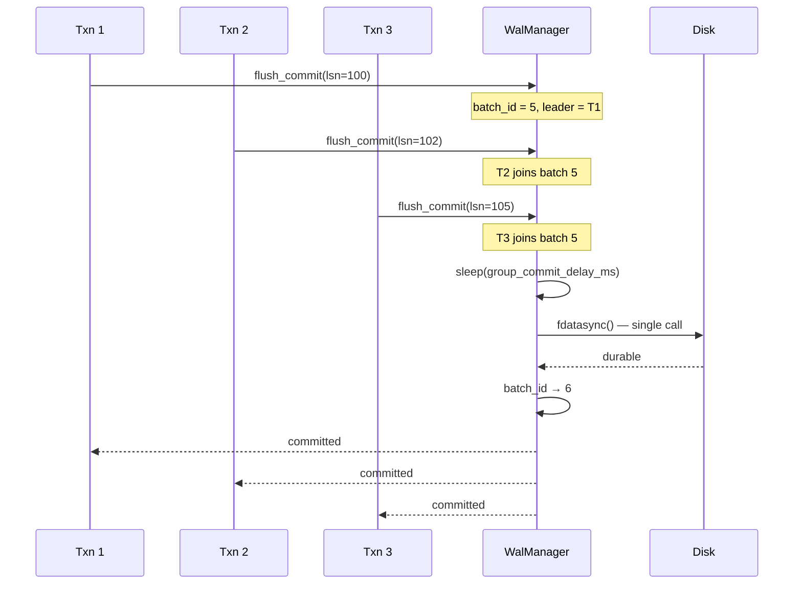
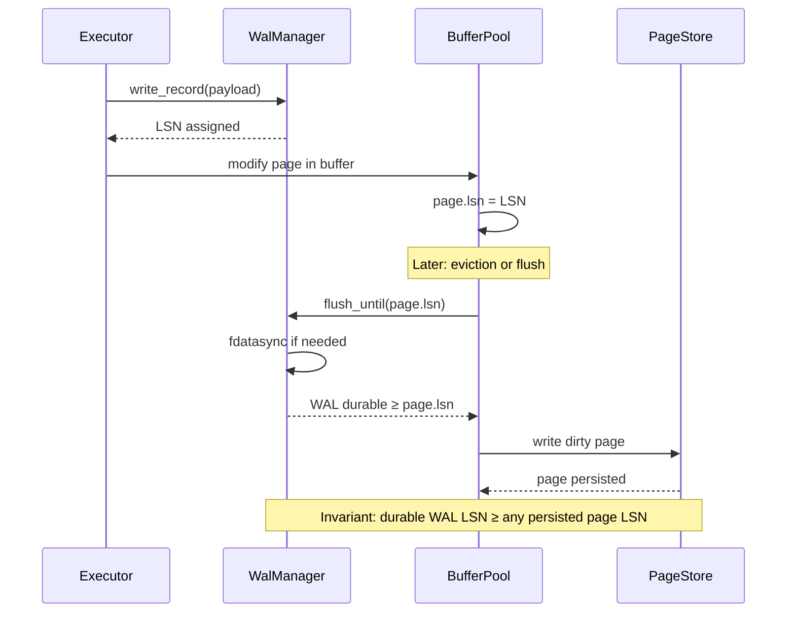
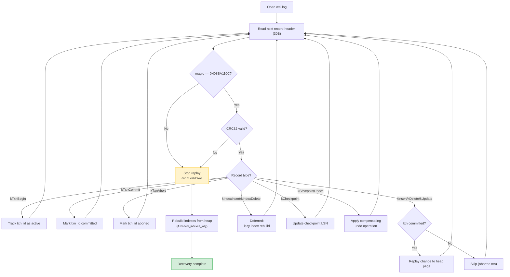

# WAL and Recovery Protocol

MiniDB uses write-ahead logging for heap/index changes and enforces the
WAL-first rule before dirty pages reach the page store.

---

## WAL Record Format

Every WAL record starts with a 30-byte header:

```
 Offset   Size   Field
 ──────   ────   ─────────────────────────────────────
 0        4      magic        (u32, == 0xD8BA110C)
 4        4      crc          (u32, CRC32 over header-with-crc-zeroed + payload)
 8        8      lsn          (u64, Log Sequence Number)
 16       8      txn_id       (u64)
 24       2      type         (u16, WalType enum)
 26       4      data_len     (u32, payload bytes following header)
 ─── 30 B ────────────────────────────────────────────
 30       var    payload      (data_len bytes)
```

**Integrity checks:**

- **Magic** (`0xD8BA110C`): Detects torn or wild writes that overwrite
  part of the log. Recovery stops cleanly when the first 4 bytes of a
  record do not match the magic constant.
- **CRC32**: Computed over the header (with `crc` field zeroed) and the
  payload. Detects bit-level corruption that the magic alone would miss.
  Recovery rejects any record whose computed CRC does not match.

## WAL Record Types

| WalType | Value | Payload |
|---------|-------|---------|
| `kTxnBegin` | 1 | — |
| `kTxnCommit` | 2 | — |
| `kTxnAbort` | 3 | — |
| `kInsert` | 10 | table_id(u32) + page_id(u64) + slot_idx(u16) + tuple_data |
| `kDelete` | 11 | table_id(u32) + page_id(u64) + slot_idx(u16) |
| `kUpdate` | 12 | table_id(u32) + old_page(u64) + old_slot(u16) + new_page(u64) + new_slot(u16) + new_tuple_data |
| `kIndexInsert` | 13 | index_id(u32) + key_len(u16) + key_data + rid(page_id u64 + slot u16) |
| `kIndexDelete` | 14 | index_id(u32) + key_len(u16) + key_data + rid(page_id u64 + slot u16) |
| `kPageAlloc` | 20 | page_id(u64) |
| `kCheckpoint` | 30 | — |
| `kDdl` | 40 | op(u8, DdlOp) + table_id(u32) + aux(u32) + name_len(u16) + name_data |
| `kSavepointUndoInsert` | 50 | table_id(u32) + page_id(u64) + slot_idx(u16) |
| `kSavepointUndoDelete` | 51 | table_id(u32) + page_id(u64) + slot_idx(u16) |

**DDL audit markers** (`kDdl`): Written on successful DDL execution.
The `aux` field carries the column index for ALTER, the index_id for
CREATE/DROP INDEX, or 0 otherwise. Recovery does not act on these records
today, but they provide a durable trail for a future repair pass.

**Savepoint compensating records** (`kSavepointUndoInsert/Delete`):
Written during statement-level savepoint rollback inside an explicit
transaction. Recovery replays the original INSERT/DELETE record AND then
the compensating record, leaving the heap in the same state as the live
database at commit time.

## WAL Buffer and Flush

- **Write buffer**: 8 KB in-memory buffer (`write_buf_[kWalBufferSize]`).
- Records smaller than buffer capacity are appended to the buffer.
- Records exceeding buffer capacity are written directly (buffer flushed first).
- **Flush triggers**: buffer full, commit record, explicit `flush()`.
- **Group commit**: When `wal_group_commit = true`, commit fsyncs are
  batched with a configurable delay (`wal_group_commit_delay_ms`, default 2 ms).
  Multiple transactions waiting for fsync share a single fdatasync call.
  `commit_batch_id_` monotonically increments so followers notice batch closure.


- **LSN assignment**: `next_lsn_` incremented per record under WAL latch.
- **Durable LSN**: `durable_lsn_` updated after successful fsync.

## LSN Monotonicity Across Restart

On clean shutdown, the WAL is truncated after checkpoint. Without care,
`next_lsn_` would reset to 1 on restart, but pages on disk carry higher
LSNs from prior sessions. The Database constructor reads the persisted
`checkpoint_lsn` from the control file and calls
`wal.ensure_next_lsn_at_least(checkpoint_lsn)` to keep LSNs globally
monotonic. Without this, a post-restart checkpoint could write a
kCheckpoint record with an LSN smaller than existing page LSNs,
triggering a `flush_until()` recursion and deadlock.

## Ordering Rules



1. Each logical change receives an LSN from `WalManager::write_record`.
2. The modified page records the latest page LSN in its page header.
3. Before `BufferPool` evicts, flushes, or batches a dirty page, it calls `WalManager::flush_until(page_lsn)`.
4. The page store durable LSN is updated only after WAL flush succeeds.
5. If WAL cannot be flushed to at least the page LSN, the dirty page write is skipped and eviction fails with an I/O error.

This means a persistent page never contains an LSN newer than durable WAL.

## Commit Rules

Commit records are flushed through `WalManager::flush_commit`. Group commit may delay the fsync by the configured window, but commit durability still depends on WAL becoming durable, not on data page flush.

## Replay Rules



Recovery scans `wal.log`, records committed and aborted transaction state, replays committed changes, and rebuilds index state when needed. Large or malformed records are bounded during replay to avoid reading arbitrary lengths from a corrupt WAL file.

## Current Boundaries

- WAL segments are represented by the active `wal.log` file plus configured truncation/checkpoint behavior.
- Record payloads are bounded during replay.
- Index WAL keys are dynamically buffered and support keys larger than the WAL page buffer as long as the per-record key length fits the on-disk `u16` key length field.

## PageServer Remote WAL Recovery

In compute/storage separation mode, the independent `PageServer` process manages durable page versions using a dedicated WAL format for page reconstructions:

1. **Remote WAL Images (`remote_wal_images.bin`)**:
   - Each entry contains a `RemoteWalImageHeader` containing a magic number, page ID, LSN, page size, and an `image_checksum`.
   - Each entry is ended by a `RemoteWalImageTrailer` containing a matching trailer magic number, page ID, LSN, checksum, and total record size.
   - During PageServer restart/load, the index reconstruction loop reads these records sequentially. If a record fails checksum validation or contains a mismatched trailer, recovery stops immediately, preventing truncated or partially-written pages from contaminating the LogIndex.

2. **PageServer Metadata (`page_server.meta`)**:
   - Durable LSN and byte offset are written atomically to `page_server.meta.tmp` and renamed to `page_server.meta` with an explicit `fsync` call.
   - The metadata file is serialized with a FNV-like metadata `checksum` and an explicit `end=1` marker.
   - If the file is partially written or corrupted upon restart, the checksum mismatch causes the PageServer to safely ignore the corrupt entry and recover state from the remote WAL image files.

